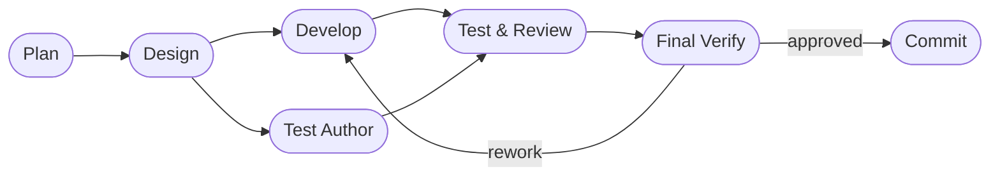

# DASHBOARD

## Actual Progress

- Goal: <!-- dormammu:goal_source=/home/hjhun/.dormammu/goals/tizenclaw_improve.md -->
- Prompt-driven scope: All 5 PLAN.md items complete — ClawHub integration + Telegram UX cleanup + ROADMAP.md
- Active roadmap focus: complete
- Current workflow phase: complete
- Last completed workflow phase: evaluate
- Supervisor verdict: `approved`
- Escalation status: `approved`
- Resume point: n/a — all phases complete

## Workflow Phases

## In Progress

- None. All phases complete.

## Progress Notes

- This file should show the actual progress of the active scope.
- workflow_state.json remains machine truth.
- PLAN.md should list prompt-derived development items in phase order.
- Repository rules to follow: AGENTS.md
- Relevant repository workflows: .github/workflows/ci.yml, .github/workflows/release-host-bundle.yml

## Risks And Watchpoints

- Do not overwrite existing operator-authored Markdown.
- Keep JSON merges additive so interrupted runs stay resumable.
- Keep session-scoped state isolated when multiple workflows run in parallel.

---

## 2026-04-16 — Sixth rework cycle (reviewer NEEDS_WORK resolution)

**Stage**: Test/Review rework — both reviewer findings resolved.

### Changes applied

| Finding | Severity | File | Fix |
|---------|----------|------|-----|
| `clawhub_install` wrote lock file without verifying `SKILL.md` exists | High | `clawhub_client.rs:154` | Added `validate_extracted_skill()` helper; called after extraction; cleans up staging dir and returns error if `SKILL.md` is absent |
| Atomic replace deleted live install before rename, losing old version on failure | Medium | `clawhub_client.rs:156` | Replaced remove-then-rename with `atomic_replace_dir()`: backs up live install → renames staging → removes backup; restores backup on rename failure |
| `atomic_install_staging_then_rename` test only covered happy path | Medium | `clawhub_client.rs` tests | Replaced with four targeted tests: `atomic_replace_dir_installs_fresh_skill`, `atomic_replace_dir_preserves_existing_on_rename_failure` (simulates failure via absent staging dir), `atomic_replace_dir_removes_stale_backup`, plus `validate_extracted_skill_accepts_dir_with_skill_md` and `validate_extracted_skill_rejects_dir_without_skill_md` |

### Validation

`./deploy_host.sh --test`:
- **744 passed / 0 failed** (14 clawhub_client tests, including all 4 new ones)
- `atomic_replace_dir_preserves_existing_on_rename_failure` proves old install is restored when rename fails
- `validate_extracted_skill_rejects_dir_without_skill_md` proves malformed archives are rejected before lock write
- Host validation gate exit code: 0

**Status**: RESOLVED — both reviewer findings addressed, `deploy_host.sh --test` passes.
