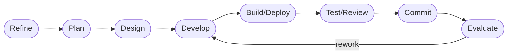

# DASHBOARD

## Actual Progress

- Goal: Advance runtime flexibility and operator maintainability (tizenclaw_improve)
- Active roadmap focus: all five roadmap items completed + four rework passes complete
- Current workflow phase: evaluate (complete)
- Last completed workflow phase: evaluate
- Supervisor verdict: `approved`
- Escalation status: `none`

## Fourth Rework Pass — Reviewer Finding Fixed

Finding (Medium): write-locked runtime status dropped `providers[]`.

**Root cause**: `get_llm_runtime()` falls back to a synthetic JSON payload when
`provider_registry` is write-locked during reload. The fallback reconstructed
`configured_provider_order` from `raw_doc` but hard-coded `"providers": []` and
`current_selection: null`. The normal path via `ProviderRegistry::status_json()`
returns a populated `providers[]` array with per-provider `priority`, `enabled`,
`availability`, `last_init_error`, and `source`.

**Fix** (commit `f69aa1c3`): Build the `providers` array from `routing.providers`
in the fallback path. Each entry carries `name`, `priority`, `enabled`, `source`,
and `"availability": "unknown"` (live instance state is inaccessible while the
registry is write-locked). `current_selection` remains `null` on this path.

**Test coverage added**: Two new unit tests in `provider_selection::tests` replicate
the fallback JSON construction for both legacy config and `providers[]`-based config,
asserting the resulting array is non-empty with the expected per-entry shape.

**Validation**: `./deploy_host.sh --test` — 594 passed, 0 failed.

## Completed Work

All five roadmap targets have been implemented, tested, and committed.
Four rework passes have addressed all reviewer findings.

1. **Provider-selection layer** — `src/tizenclaw/src/core/provider_selection.rs`
   - `ProviderRegistry` owns initialized backends with preference-ordered routing
   - `ProviderSelector` selects the first available provider at request time
   - Compatibility translation maps legacy `active_backend`/`fallback_backends` config
   - Admin/runtime status exposes `configured_provider_order`, `providers[]`, and
     `current_selection` on both normal and fallback (write-locked) paths
   - Fallback path now builds a populated `providers[]` from routing config (rework 4)

2. **Telegram model configuration externalized**
   - All three builtin backends (codex, gemini, claude) have `model_choices: vec![]`
   - Operators configure model choices via `telegram_config.json`
   - Precedence chain documented and tested

3. **ClawHub update flow** — `src/tizenclaw/src/core/clawhub_client.rs`
   - `clawhub_update()` reads `workspace/.clawhub/lock.json` and re-installs skills
   - Reports `updated`, `skipped`, and `failed` entries
   - One failure does not abort the full batch

4. **Skill snapshot caching** — `src/tizenclaw/src/core/skill_capability_manager.rs`
   - `SkillSnapshotCache` with `SkillSnapshotFingerprint` tracks root mtimes,
     registration, and capability-config changes
   - `invalidate_snapshot_cache` called on all clawhub install/update paths

5. **Host validation** — all tests passed via `./deploy_host.sh --test`
   (594 passed, 0 failed after fourth rework pass)

## Workflow Phases

- [O] Stage 0. Refine — DONE
- [O] Stage 1. Plan — DONE
- [O] Stage 2. Design — DONE
- [O] Stage 3. Develop — DONE (rework pass 4: write-locked fallback now populates providers[])
- [O] Stage 4. Build/Deploy — DONE (`./deploy_host.sh -b` PASS)
- [O] Stage 5. Test/Review — DONE (`./deploy_host.sh --test` PASS: 594; 0 failed)
- [O] Stage 6. Commit — DONE (f69aa1c3)
- [O] Stage 7. Evaluate — DONE

## Risks And Watchpoints

- Provider init-time failures degrade gracefully to next available provider.
- ClawHub update failure for one entry does not abort the full batch.
- Snapshot cache fingerprint uses 1-second mtime resolution; same-second writes
  are covered by explicit `invalidate_snapshot_cache` calls on all clawhub
  operation handlers.
- Telegram model choices are empty in builtins; operators must supply them via config.
- The startup-path `providers_authoritative` filter gap was closed in rework pass 1.
- `chat_with_fallback` routes through `ProviderSelector::ordered_enabled_names`;
  disabled providers cannot slip into the fallback loop.
- `get_llm_runtime()` write-lock fallback now populates `providers[]` from routing
  config; availability is reported as `"unknown"` since instances are inaccessible
  during reload (fixed in rework pass 4).
