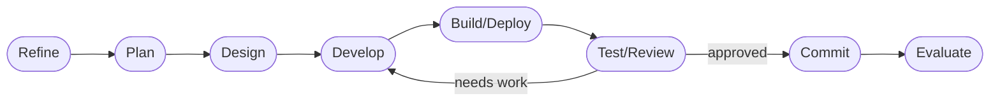

# DASHBOARD

## Actual Progress

- Goal: <!-- dormammu:goal_source=/home/hjhun/.dormammu/goals/tizenclaw_dir.md -->
- Prompt-driven scope: Standardize the TizenClaw runtime layout to the
  OpenClaw-style contract and capture the validated 2026-04-15 runtime-layout
  slice in a scope-limited commit.
- Active roadmap focus: Commit only the validated runtime-layout files and
  keep the `.dev` state aligned with the accepted review and evaluation
  evidence for this slice.
- Current workflow phase: commit
- Last completed workflow phase: test/review
- Supervisor verdict: `accepted_with_residual_risk`
- Escalation status: `none`
- Resume point: Stage only the validated runtime-layout scope and create the
  requested commit.

## Workflow Phases

## In Progress

- Commit preparation is in progress for the validated runtime-layout slice.

## Progress Notes

- Direct `bash` execution matches the repository environment rule from
  `.agent/rules/shell-detection.md`.
- `./deploy_host.sh --test` was rerun on 2026-04-15 for the accepted
  validation pass.
  Result:
  - the script completed in the foreground as required
  - the shared `framework::paths` runtime-layout tests passed, including
    host, Tizen, compatibility, and directory-provisioning coverage
  - the canonical Rust workspace tests, reconstruction parity harness, and
    documentation-driven architecture verification passed
  - the broader `tizenclaw` crate still reports the same five unrelated test
    failures already tracked in this task:
    `completed_file_management_targets_accept_prediction_market_briefing_after_rate_limited_search`,
    `completed_file_management_targets_accept_prediction_market_decimal_odds`,
    `output_lacks_numeric_market_fact_accepts_real_price_and_iso_date`,
    `project_email_summary_shortcut_records_transcript_and_completes`,
    and `summarize_recent_news_result_prefers_reputable_recent_sources`
- `./deploy.sh --dry-run` was rerun on 2026-04-15 and showed
  provisioning of `/home/owner/.tizenclaw` with `owner:users`.
- The validated scope includes the runtime-root and packaged-root separation
  across the shared path layer, deployment and packaging scripts, service
  environment defaults, the standard container flow, and CLI/documentation
  references.
- The accepted evaluation for the latest validation pass is recorded in
  `.dev/07-evaluator/20260415_20260415_tizenclaw_dir_resume_validation.md`
  with `DECISION: ACCEPTED_WITH_RESIDUAL_RISK`.
- The commit phase for this slice was explicitly requested after validation,
  so the next action is a scope-limited staging pass and `git commit -F
  .tmp/commit_msg.txt`.

## Risks And Watchpoints

- `./deploy_host.sh --test` still surfaces five non-layout `tizenclaw` test
  failures, so the host script does not provide a globally clean suite even
  though the runtime-layout slice passed.
- Tizen validation is still packaging-level for this slice; there was no live
  device or emulator execution after install.
- The repository worktree remains dirty outside this layout slice, so any
  commit must stay narrowly scoped.
