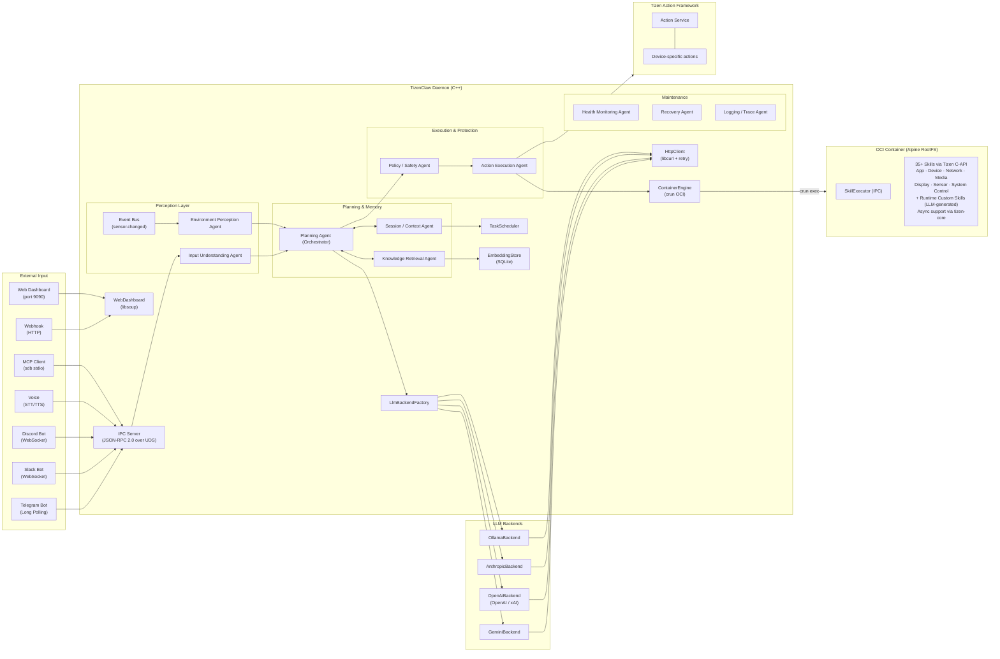

# TizenClaw Project Analysis

> **Last Updated**: 2026-03-16

---

## 1. Project Overview

**TizenClaw** is a **Native C++ AI Agent system daemon** running on the Tizen Embedded Linux platform.

It interprets natural language prompts through multiple LLM backends (Gemini, OpenAI, Claude, xAI, Ollama), executes Python skills inside OCI containers (crun) and device actions via the **Tizen Action Framework**, and controls the device. It autonomously performs complex tasks through a Function Calling-based iterative loop (Agentic Loop). The system supports 7 communication channels, encrypted credential storage, structured audit logging, scheduled task automation, semantic search (RAG), a web-based admin dashboard, multi-agent orchestration (supervisor pattern, skill pipelines, A2A protocol), health monitoring, and OTA updates.



---

## 2. Project Structure

```
tizenclaw/
├── src/                             # Source and headers
│   ├── tizenclaw/                   # Daemon core (151 files across 7 subdirectories)
│   │   ├── core/                    # Main daemon, agent core, policies (55 files)
│   │   │   ├── tizenclaw.cc/hh      # Daemon main, IPC server, signal handling
│   │   │   ├── agent_core.cc/hh     # Agentic Loop, skill dispatch, session mgmt
│   │   │   ├── agent_factory.cc/hh  # Agent creation factory
│   │   │   ├── agent_role.cc/hh     # Agent role management
│   │   │   ├── action_bridge.cc/hh  # Tizen Action Framework bridge
│   │   │   ├── tool_policy.cc/hh    # Risk-level + loop detection
│   │   │   ├── tool_dispatcher.cc/hh# Modular tool dispatch (O(1) lookup)
│   │   │   ├── tool_indexer.cc/hh   # Tool index generation
│   │   │   ├── capability_registry.cc/hh # Unified capability registry
│   │   │   ├── event_bus.cc/hh      # Pub/sub event bus
│   │   │   ├── event_adapter.hh     # Event adapter interface
│   │   │   ├── event_adapter_manager.cc/hh # Event adapter lifecycle
│   │   │   ├── perception_engine.cc/hh # Environment perception & analysis
│   │   │   ├── context_fusion_engine.cc/hh # Multi-source context fusion
│   │   │   ├── device_profiler.cc/hh# Device state profiling
│   │   │   ├── proactive_advisor.cc/hh # Proactive device advisory
│   │   │   ├── system_context_provider.cc/hh # System context for LLM
│   │   │   ├── system_event_collector.cc/hh # System event collection
│   │   │   ├── system_cli_adapter.cc/hh # System CLI tool adapter
│   │   │   ├── autonomous_trigger.cc/hh # Event-driven autonomous actions
│   │   │   ├── workflow_engine.cc/hh# Deterministic workflow execution
│   │   │   ├── pipeline_executor.cc/hh # Skill pipeline engine
│   │   │   ├── skill_repository.cc/hh # Skill manifest v2 & marketplace
│   │   │   ├── skill_plugin_manager.cc/hh # RPK skill plugin management
│   │   │   ├── skill_verifier.cc/hh # Skill verification & validation
│   │   │   ├── skill_watcher.cc/hh  # inotify skill hot-reload
│   │   │   ├── cli_plugin_manager.cc/hh # CLI tool plugin management
│   │   │   └── auto_skill_agent.cc/hh # LLM-driven auto skill generation
│   │   ├── llm/                     # LLM backend providers (14 files)
│   │   │   ├── llm_backend.hh       # Unified LLM interface
│   │   │   ├── llm_backend_factory.cc # Backend factory pattern
│   │   │   ├── gemini_backend.cc/hh # Google Gemini API
│   │   │   ├── openai_backend.cc/hh # OpenAI / xAI (Grok) API
│   │   │   ├── anthropic_backend.cc/hh # Anthropic Claude API
│   │   │   ├── ollama_backend.cc/hh # Ollama local LLM
│   │   │   ├── plugin_llm_backend.cc/hh # RPK LLM plugin backend
│   │   │   └── plugin_manager.cc/hh # LLM plugin lifecycle management
│   │   ├── channel/                 # Communication channels (23 files)
│   │   │   ├── channel.hh           # Channel abstract interface
│   │   │   ├── channel_registry.cc/hh # Channel lifecycle management
│   │   │   ├── channel_factory.cc/hh# Config-driven creation
│   │   │   ├── plugin_channel.cc/hh # Dynamic SO plugin wrapper
│   │   │   ├── telegram_client.cc/hh# Telegram Bot (native)
│   │   │   ├── slack_channel.cc/hh  # Slack Bot (libwebsockets)
│   │   │   ├── discord_channel.cc/hh# Discord Bot (libwebsockets)
│   │   │   ├── mcp_server.cc/hh     # Native MCP Server (JSON-RPC 2.0)
│   │   │   ├── webhook_channel.cc/hh# Webhook HTTP listener (libsoup)
│   │   │   ├── voice_channel.cc/hh  # Tizen STT/TTS (conditional)
│   │   │   ├── web_dashboard.cc/hh  # Admin dashboard SPA (libsoup)
│   │   │   └── a2a_handler.cc/hh    # A2A protocol handler
│   │   ├── storage/                 # Data persistence (8 files)
│   │   │   ├── session_store.cc/hh  # Markdown conversation persistence
│   │   │   ├── memory_store.cc/hh   # Persistent memory (long/episodic/short-term)
│   │   │   ├── embedding_store.cc/hh# SQLite RAG vector store + FTS5
│   │   │   └── audit_logger.cc/hh   # Markdown audit logging
│   │   ├── infra/                   # Infrastructure (28 files)
│   │   │   ├── container_engine.cc/hh # OCI container lifecycle (crun)
│   │   │   ├── http_client.cc/hh    # libcurl HTTP Post (retry, timeout, SSL)
│   │   │   ├── key_store.cc/hh      # Encrypted API key storage
│   │   │   ├── health_monitor.cc/hh # Prometheus-style metrics
│   │   │   ├── fleet_agent.cc/hh    # Enterprise fleet management
│   │   │   ├── ota_updater.cc/hh    # OTA skill updates
│   │   │   ├── tunnel_manager.cc/hh # Secure ngrok tunneling
│   │   │   ├── app_lifecycle_adapter.cc/hh  # App lifecycle event adapter
│   │   │   ├── recent_app_adapter.cc/hh     # Recent app event adapter
│   │   │   ├── package_event_adapter.cc/hh  # Package event adapter
│   │   │   ├── tizen_system_event_adapter.cc/hh # System event adapter
│   │   │   ├── vconf_event_adapter.cc/hh    # Vconf settings event adapter
│   │   │   ├── pkgmgr_client.cc/hh  # Package manager client
│   │   │   └── pkgmgr_event_args.cc/hh # Package event argument types
│   │   ├── embedding/               # On-device ML embedding (5 files)
│   │   │   ├── on_device_embedding.cc/hh # ONNX Runtime inference
│   │   │   ├── wordpiece_tokenizer.cc/hh # BERT WordPiece tokenizer
│   │   │   └── onnxruntime_c_api.h  # ONNX Runtime C API header
│   │   └── scheduler/               # Task automation (2 files)
│   │       └── task_scheduler.cc/hh # Cron/interval/once/weekly tasks
│   ├── libtizenclaw/                # C-API client library (SDK)
│   │   ├── tizenclaw_client.cc      # Client implementation
│   │   └── inc/                     # Public headers (tizenclaw.h)
│   ├── libtizenclaw-core/           # Core library (curl, LLM backend)
│   │   ├── tizenclaw_curl.cc        # Curl wrapper
│   │   └── tizenclaw_llm_backend.cc # LLM backend C-API
│   ├── pkgmgr-metadata-plugin/      # Metadata parser plugins
│   │   ├── cli/                     # CLI tool plugin parser
│   │   ├── llm-backend/             # LLM backend plugin parser
│   │   └── skill/                   # Skill plugin parser
│   └── tools/
│       └── tizenclaw_cli.cc         # tizenclaw-cli tool
│   └── common/                      # Common utilities (logging, nlohmann JSON)
├── tools/skills/                    # Python skills (35 directories)
│   ├── common/tizen_capi_utils.py   # ctypes-based Tizen C-API wrapper
│   ├── skill_executor.py            # Container-side IPC skill executor
│   ├── list_apps/                   # List installed apps
│   ├── send_app_control/            # Launch app (explicit app_id or implicit intent)
│   ├── terminate_app/               # Terminate an app
│   ├── get_device_info/             # Device info query
│   ├── get_battery_info/            # Battery status query
│   ├── get_wifi_info/               # Wi-Fi status query
│   ├── get_bluetooth_info/          # Bluetooth status query
│   ├── get_display_info/            # Display brightness/state
│   ├── get_system_info/             # Hardware & platform info
│   ├── get_runtime_info/            # CPU/memory usage
│   ├── get_storage_info/            # Storage space info
│   ├── get_system_settings/         # System settings (locale, font, etc.)
│   ├── get_network_info/            # Network connection info
│   ├── get_sensor_data/             # Sensor readings (accel, gyro, etc.)
│   ├── get_package_info/            # Package details
│   ├── control_display/             # Display brightness control
│   ├── control_haptic/              # Haptic vibration
│   ├── control_led/                 # Camera flash LED control
│   ├── control_volume/              # Volume level control
│   ├── control_power/               # Power lock management
│   ├── play_tone/                   # DTMF/beep tone playback
│   ├── play_feedback/               # Feedback pattern playback
│   ├── send_notification/           # Notification posting
│   ├── schedule_alarm/              # Alarm scheduling
│   ├── get_thermal_info/            # Device temperature
│   ├── get_data_usage/              # Network data usage stats
│   ├── get_sound_devices/           # Audio device listing
│   ├── get_media_content/           # Media file search
│   ├── get_mime_type/               # MIME type lookup
│   ├── get_metadata/                # Media file metadata
│   ├── scan_wifi_networks/          # WiFi scan (async, tizen-core)
│   ├── scan_bluetooth_devices/      # BT discovery (async, tizen-core)
│   ├── download_file/               # URL download (async, tizen-core)
│   └── web_search/                  # Web search (Wikipedia API)
├── scripts/                         # Container & infra scripts (9)
│   ├── run_standard_container.sh    # Daemon OCI container
│   ├── skills_secure_container.sh   # Skill execution secure container
│   ├── build_rootfs.sh              # Alpine RootFS builder
│   ├── start_mcp_tunnel.sh          # MCP tunnel via SDB
│   ├── fetch_crun_source.sh         # crun source downloader
│   ├── ci_build.sh                  # CI build script
│   ├── pre-commit                   # Git pre-commit hook
│   ├── setup-hooks.sh               # Hook installer
│   └── Dockerfile                   # RootFS build reference
├── tools/embedded/                  # Embedded tool MD schemas (17 files)
│   ├── execute_code.md              # Python code execution
│   ├── file_manager.md              # File system operations
│   ├── create_task.md               # Task scheduler
│   ├── create_pipeline.md           # Pipeline creation
│   ├── create_workflow.md           # Workflow creation
│   └── ...                          # + 12 more tool schemas
├── data/
│   ├── config/                      # Active configuration files
│   ├── devel/                       # Development configuration
│   ├── sample/                      # Sample configs (not installed to device)
│   │   ├── llm_config.json.sample
│   │   ├── telegram_config.json.sample
│   │   └── ...                      # Other sample configs
│   ├── system_cli/                  # System CLI tool descriptors
│   ├── web/                         # Dashboard SPA files
│   └── img/                         # Container rootfs images (per-arch)
│       └── <arch>/rootfs.tar.gz     # Alpine RootFS (49 MB)
├── test/
│   ├── unit_tests/                  # gtest/gmock unit tests (42 test files)
│   └── e2e/                         # End-to-end test scripts
├── packaging/                       # RPM packaging & systemd
│   ├── tizenclaw.spec               # GBS RPM build spec
│   ├── tizenclaw.service            # Daemon systemd service
│   ├── tizenclaw-skills-secure.service  # Skills container service
│   └── tizenclaw.manifest           # Tizen SMACK manifest
├── docs/                            # Documentation
├── CMakeLists.txt                   # Build system (C++20)
└── third_party/                     # crun 1.26 source
```

---

## 3. Core Module Details

### 3.1 System Core

| Module | Files | Role | Status |
|--------|-------|------|--------|
| **Daemon** | `tizenclaw.cc/hh` | systemd service, IPC server (thread pool), channel lifecycle, signal handling | ✅ |
| **AgentCore** | `agent_core.cc/hh` | Agentic Loop, streaming, context compaction, multi-session, edge memory flush (PSS) | ✅ |
| **ContainerEngine** | `container_engine.cc/hh` | crun OCI container, Skill Executor IPC, host bind-mounts, chroot fallback | ✅ |
| **HttpClient** | `http_client.cc/hh` | libcurl POST, exponential backoff, SSL CA auto-discovery | ✅ |
| **SessionStore** | `session_store.cc/hh` | Markdown persistence (YAML frontmatter), daily logs, token usage tracking | ✅ |
| **TaskScheduler** | `task_scheduler.cc/hh` | Cron/interval/once/weekly tasks, LLM-integrated execution, retry with backoff | ✅ |
| **ActionBridge** | `action_bridge.cc/hh` | Tizen Action Framework worker thread, MD schema management, event-driven updates | ✅ |
| **EmbeddingStore** | `embedding_store.cc/hh` | SQLite vector store | ✅ |
| **WebDashboard** | `web_dashboard.cc/hh` | libsoup SPA, REST API, admin auth, config editor | ✅ |
| **TunnelManager** | `infra/tunnel_manager.cc` | Secure ngrok tunneling abstraction | ✅ |
| **EventBus** | `core/event_bus.cc` | Pub/sub event bus for system events | ✅ |
| **EventAdapterManager** | `core/event_adapter_manager.cc` | Event adapter lifecycle management | ✅ |
| **PerceptionEngine** | `core/perception_engine.cc` | Environment perception & analysis | ✅ |
| **ContextFusionEngine** | `core/context_fusion_engine.cc` | Multi-source context fusion | ✅ |
| **DeviceProfiler** | `core/device_profiler.cc` | Device state profiling | ✅ |
| **ProactiveAdvisor** | `core/proactive_advisor.cc` | Proactive device advisory | ✅ |
| **SystemContextProvider** | `core/system_context_provider.cc` | System context for LLM | ✅ |
| **SystemEventCollector** | `core/system_event_collector.cc` | System event collection | ✅ |
| **SystemCliAdapter** | `core/system_cli_adapter.cc` | System CLI tool adapter | ✅ |
| **AutonomousTrigger** | `core/autonomous_trigger.cc` | Event-driven autonomous actions | ✅ |
| **WorkflowEngine** | `core/workflow_engine.cc` | Deterministic workflow execution | ✅ |
| **ToolIndexer** | `core/tool_indexer.cc` | Tool index generation for LLM | ✅ |
| **SkillPluginManager** | `core/skill_plugin_manager.cc` | RPK skill plugin management | ✅ |
| **CliPluginManager** | `core/cli_plugin_manager.cc` | CLI tool plugin management (TPK) | ✅ |
| **SkillVerifier** | `core/skill_verifier.cc` | Skill verification & validation | ✅ |
| **AutoSkillAgent** | `core/auto_skill_agent.cc` | LLM-driven auto skill generation | ✅ |
| **AgentFactory** | `core/agent_factory.cc` | Agent creation factory | ✅ |
| **AgentRole** | `core/agent_role.cc` | Agent role management | ✅ |

### 3.2 LLM Backend Layer

| Backend | Source File | API Endpoint | Default Model | Status |
|---------|-------------|-------------|---------------|--------|
| **Gemini** | `gemini_backend.cc` | `generativelanguage.googleapis.com` | `gemini-2.5-flash` | ✅ |
| **OpenAI** | `openai_backend.cc` | `api.openai.com/v1` | `gpt-4o` | ✅ |
| **xAI (Grok)** | `openai_backend.cc` (shared) | `api.x.ai/v1` | `grok-3` | ✅ |
| **Anthropic** | `anthropic_backend.cc` | `api.anthropic.com/v1` | `claude-sonnet-4-20250514` | ✅ |
| **Ollama** | `ollama_backend.cc` | `localhost:11434` | `llama3` | ✅ |

- **Abstraction**: `LlmBackend` interface → `LlmBackendFactory::Create()` factory
- **Shared structs**: `LlmMessage`, `LlmResponse`, `LlmToolCall`, `LlmToolDecl`
- **Runtime switching**: Unity queue prioritizing TizenClaw LLM Plugins, falling back to `active_backend` and `fallback_backends`.
- **Model fallback**: Unified selection queue dynamically sorts candidates by configured priority (1 by default) for robust fallback.
- **System prompt**: 4-level fallback with `{{AVAILABLE_TOOLS}}` dynamic placeholder

### 3.3 Communication & IPC

| Module | Implementation | Protocol | Status |
|--------|---------------|----------|--------|
| **IPC Server** | `tizenclaw.cc` | Abstract Unix Socket, JSON-RPC 2.0, length-prefix framing, thread pool | ✅ |
| **UID Auth** | `IsAllowedUid()` | `SO_PEERCRED` (root, app_fw, system, developer) | ✅ |
| **Telegram** | `telegram_client.cc` | Bot API Long-Polling, streaming `editMessageText` | ✅ |
| **Slack** | `slack_channel.cc` | Socket Mode via libwebsockets | ✅ |
| **Discord** | `discord_channel.cc` | Gateway WebSocket via libwebsockets | ✅ |
| **MCP Server** | `mcp_server.cc` | Native C++ stdio JSON-RPC 2.0 | ✅ |
| **Webhook** | `webhook_channel.cc` | HTTP inbound (libsoup), HMAC-SHA256 auth | ✅ |
| **Voice** | `voice_channel.cc` | Tizen STT/TTS C-API (conditional compilation) | ✅ |
| **Web Dashboard** | `web_dashboard.cc` | libsoup SPA, REST API, admin auth | ✅ |

### 3.4 Skills System

| Skill | Parameters | Tizen C-API | Status |
|-------|-----------|-------------|--------|
| `list_apps` | None | `app_manager` | ✅ |
| `send_app_control` | `app_id`, `operation`, `uri`, `mime`, `extra_data` | `app_control` | ✅ |
| `terminate_app` | `app_id` (string, required) | `app_manager` | ✅ |
| `get_device_info` | None | `system_info` | ✅ |
| `get_battery_info` | None | `device` (battery) | ✅ |
| `get_wifi_info` | None | `wifi-manager` | ✅ |
| `get_bluetooth_info` | None | `bluetooth` | ✅ |
| `get_display_info` | None | `device` (display) | ✅ |
| `control_display` | `brightness` (int) | `device` (display) | ✅ |
| `get_system_info` | None | `system_info` | ✅ |
| `get_runtime_info` | None | `runtime_info` | ✅ |
| `get_storage_info` | None | `storage` | ✅ |
| `get_system_settings` | None | `system_settings` | ✅ |
| `get_network_info` | None | `connection` | ✅ |
| `get_sensor_data` | `sensor_type` (string) | `sensor` | ✅ |
| `get_package_info` | `package_id` (string) | `package_manager` | ✅ |
| `control_haptic` | `duration_ms` (int, optional) | `device` (haptic) | ✅ |
| `control_led` | `action` (string), `brightness` (int) | `device` (flash) | ✅ |
| `control_volume` | `action`, `sound_type`, `volume` | `sound_manager` | ✅ |
| `control_power` | `action`, `resource` | `device` (power) | ✅ |
| `play_tone` | `tone` (string), `duration_ms` (int) | `tone_player` | ✅ |
| `play_feedback` | `pattern` (string) | `feedback` | ✅ |
| `send_notification` | `title`, `body` (string) | `notification` | ✅ |
| `schedule_alarm` | `app_id`, `datetime` (string) | `alarm` | ✅ |
| `get_thermal_info` | None | `device` (thermal) | ✅ |
| `get_data_usage` | None | `connection` (statistics) | ✅ |
| `get_sound_devices` | None | `sound_manager` (device) | ✅ |
| `get_media_content` | `media_type`, `max_count` | `media-content` | ✅ |
| `get_mime_type` | `file_extension`, `file_path`, `mime_type` | `mime-type` | ✅ |
| `scan_wifi_networks` | None | `wifi-manager` + `tizen-core` (async) | ✅ |

| `get_metadata` | `file_path` | `metadata-extractor` | ✅ |
| `download_file` | `url`, `destination`, `file_name` | `url-download` + `tizen-core` (async) | ✅ |
| `scan_bluetooth_devices` | `action` | `bluetooth` + `tizen-core` (async) | ✅ |
| `web_search` | `query` (string, required) | None (Wikipedia API) | ✅ |

Built-in tools (implemented in AgentCore directly):
`execute_code`, `file_manager`, `manage_custom_skill`, `create_task`, `list_tasks`, `cancel_task`, `create_session`, `list_sessions`, `send_to_session`, `ingest_document`, `search_knowledge`, `execute_action`, `action_<name>` (per-action tools from Tizen Action Framework), `execute_cli` (CLI tool plugins), `create_workflow`, `list_workflows`, `run_workflow`, `delete_workflow`, `create_pipeline`, `list_pipelines`, `run_pipeline`, `delete_pipeline`, `run_supervisor`, `remember`, `recall`, `forget` (persistent memory)

### 3.5 Security

| Component | File | Role |
|-----------|------|------|
| **KeyStore** | `key_store.cc` | Device-bound API key encryption (GLib SHA-256 + XOR) |
| **ToolPolicy** | `tool_policy.cc` | Per-skill risk_level, loop detection, idle progress check |
| **AuditLogger** | `audit_logger.cc` | Markdown table daily audit files, size-based rotation |
| **UID Auth** | `tizenclaw.cc` | SO_PEERCRED IPC sender validation |
| **Admin Auth** | `web_dashboard.cc` | Session-token + SHA-256 password hashing |
| **Webhook Auth** | `webhook_channel.cc` | HMAC-SHA256 signature validation |

### 3.6 Build & Packaging

| Item | Details |
|------|---------|
| **Build System** | CMake 3.12+, C++20, `pkg-config` (tizen-core, glib-2.0, dlog, libcurl, libsoup-2.4, libwebsockets, sqlite3, capi-appfw-tizen-action, libaurum, capi-appfw-event, capi-appfw-app-manager, capi-appfw-package-manager, aul, rua, vconf) |
| **Packaging** | GBS RPM (`tizenclaw.spec`), includes crun source build |
| **Architectures** | x86_64 (emulator), armv7l (32-bit ARM), aarch64 (64-bit ARM) — per-arch rootfs in `data/img/<arch>/` |
| **systemd** | `tizenclaw.service` (Type=simple), `tizenclaw-skills-secure.service` (Type=oneshot) |
| **Testing** | gtest/gmock (42 test files), `ctest -V` run during `%check` |

---

## 4. Completed Development Phases

| Phase | Title | Key Deliverables | Status |
|:-----:|-------|-----------------|:------:|
| 1 | Foundation Architecture | C++ daemon, 5 LLM backends, HttpClient, factory pattern | ✅ |
| 2 | Container Execution | ContainerEngine (crun OCI), dual container, unshare+chroot fallback | ✅ |
| 3 | Agentic Loop | Max 5-iteration loop, parallel tool exec, session memory | ✅ |
| 4 | Skills System | 10 skills, tizen_capi_utils.py, CLAW_ARGS convention | ✅ |
| 5 | Communication | Unix Socket IPC, SO_PEERCRED auth, Telegram, MCP | ✅ |
| 6 | IPC Stabilization | Length-prefix protocol, JSON session persistence, Telegram allowlist | ✅ |
| 7 | Secure Container | OCI skill sandbox, Skill Executor IPC, Native MCP, built-in tools | ✅ |
| 8 | Streaming & Concurrency | LLM streaming, thread pool (4 clients), tool_call_id mapping | ✅ |
| 9 | Context & Memory | Context compaction, Markdown persistence, token counting | ✅ |
| 10 | Security Hardening | Tool execution policy, encrypted keys, audit logging | ✅ |
| 11 | Task Scheduler | Cron/interval/once/weekly, LLM integration, retry backoff | ✅ |
| 12 | Extensibility Layer | Channel abstraction, system prompt externalization, usage tracking | ✅ |
| 13 | Skill Ecosystem | inotify hot-reload, model fallback, loop detection enhancement | ✅ |
| 14 | New Channels | Slack, Discord, Webhook, Agent-to-Agent messaging | ✅ |
| 15 | Advanced Features | RAG (SQLite embeddings), Web Dashboard, Voice (TTS/STT) | ✅ |
| 16 | Operational Excellence | Admin authentication, config editor, branding | ✅ |
| 17 | Multi-Agent Orchestration | Supervisor agent, skill pipelines, A2A protocol | ✅ |
| 18 | Production Readiness | Health metrics, OTA updates, Action Framework | ✅ |
| 19 | Edge & Tunneling | ngrok integration, memory trim, binary optimization | ✅ |

---

## 5. Competitive Analysis: Gap Analysis vs OpenClaw, NanoClaw & ZeroClaw

> **Analysis Date**: 2026-03-08 (Post Phase 18)
> **Targets**: OpenClaw, NanoClaw, ZeroClaw

### 5.1 Project Scale Comparison

| Item | **TizenClaw** | **OpenClaw** | **NanoClaw** | **ZeroClaw** |
|------|:---:|:---:|:---:|:---:|
| Language | C++ / Python | TypeScript | TypeScript | Rust |
| Source files | ~89 | ~700+ | ~50 | ~100+ |
| Skills | 35 + 10 built-in | 52 | 5+ (skills-engine) | TOML-based |
| LLM Backends | 5 | 15+ | Claude SDK | 5+ (trait-driven) |
| Channels | 7 | 22+ | 5 | 17 |
| Test coverage | 205+ cases | Hundreds | Dozens | Comprehensive |
| Plugin system | Channel interface | ✅ (npm-based) | ❌ | ✅ (trait-based) |
| Peak RAM | ~30MB est. | ~100MB+ | ~80MB+ | <5MB |

### 5.2 Remaining Gaps

Most gaps identified in the original analysis have been resolved through Phases 6-19. Remaining gaps:

| Area | Reference Project | TizenClaw Status | Priority |
|------|---------|-----------------|:--------:|
| **RAG scalability** | OpenClaw: sqlite-vec + ANN | Brute-force cosine similarity | 🟡 Medium |
| **Skill registry** | OpenClaw: ClawHub | Manual copy/inotify (Phase 20) | 🟢 Low |
| **Channel count** | OpenClaw: 22+ / ZeroClaw: 17 | 7 channels | 🟢 Low |

---

## 6. TizenClaw Unique Strengths

| Strength | Description |
|----------|-------------|
| **Native C++ Performance** | Lower memory/CPU vs TypeScript — optimal for embedded |
| **Edge Memory Optimization** | Aggressive idle memory reclamation using `malloc_trim` and SQLite cache flushing via PSS profiling |
| **OCI Container Isolation** | crun-based `seccomp` + `namespace` — finer syscall control |
| **Direct Tizen C-API** | ctypes wrappers for device hardware (battery, Wi-Fi, BT, haptic, etc.) |
| **Modular CAPI Export** | External library generation (`src/libtizenclaw`) enabling TizenClaw to act as a system-level AI SDK for other apps |
| **Multi-LLM Support** | 5 backends switchable at runtime with automatic fallback |
| **Lightweight Deployment** | systemd + RPM — standalone device execution without Node.js/Docker |
| **Native MCP Server** | C++ MCP server integrated into daemon — Claude Desktop controls Tizen devices |
| **RAG Integration** | SQLite-backed semantic search with multi-provider embeddings |
| **Web Admin Dashboard** | In-daemon glassmorphism SPA with config editing and admin auth |
| **Voice Control** | Native Tizen STT/TTS integration (conditional compilation) |
| **Multi-Agent Orchestration** | Supervisor pattern, skill pipelines, A2A cross-device protocol |
| **Health Monitoring** | Prometheus-style `/api/metrics` + live dashboard panel |
| **Tizen Action Framework** | Per-action LLM tools with MD schema caching, event-driven updates via `action_event_cb` |
| **Tool Schema Discovery** | Embedded + action tool schemas as MD files, auto-loaded into LLM system prompt |
| **OTA Updates** | Over-the-air skill updates with version checking and rollback |

---

## 7. Technical Debt & Improvement Areas

| Item | Current State | Improvement Direction |
|------|-------------|----------------------|
| **Monolithic Loop** | Single AgentCore processing | **Shift to highly decentralized 11-Agent MVP Set (Ongoing)** |
| **Perception** | Raw logs to LLM | **Establish Event Bus and structured schemas (Ongoing)** |
| RAG index | Brute-force cosine search | ANN index (HNSW) for large doc sets |
| Token budgeting | Post-response counting | Pre-request estimation to prevent overflow |
| Concurrent tasks | Sequential execution | Parallel with dependency graph |
| Skill output parsing | Raw stdout JSON | JSON schema validation |
| Error recovery | In-flight request loss on crash | Request journaling |
| Log aggregation | Local Markdown files | Remote syslog forwarding |
| Skill versioning | No version metadata | Manifest v2 standard (Phase 20) |

---

## 8. Code Statistics

| Category | Files | LOC |
|----------|-------|-----|
| C++ Source & Headers (`src/`) | 151 | ~34,200 |
| Python Skills & Utils | 36 | ~4,700 |
| Shell Scripts | 9 | ~950 |
| Web Frontend (HTML/CSS/JS) | 3 | ~3,700 |
| Unit Tests | 42 | ~7,800 |
| E2E Tests | 2 | ~800 |
| **Total** | ~243 | ~52,150 |
