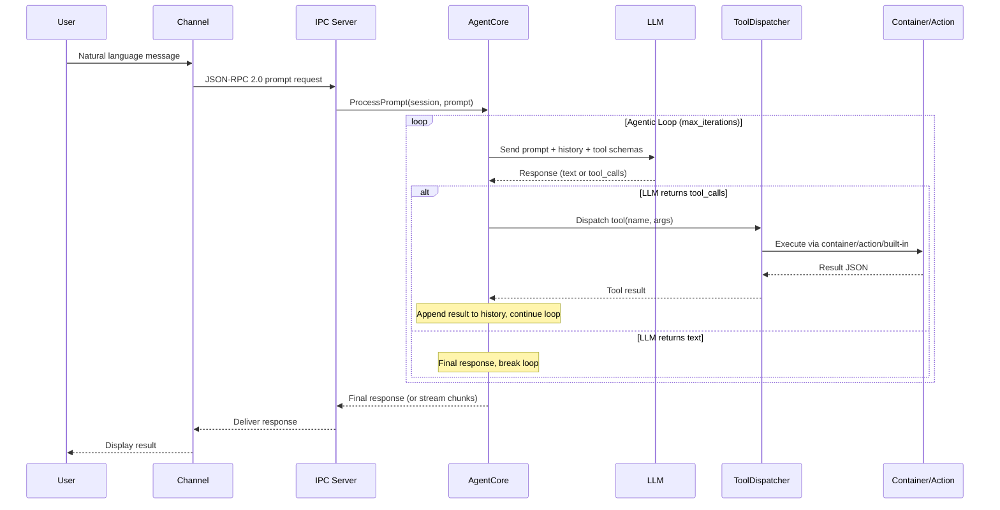
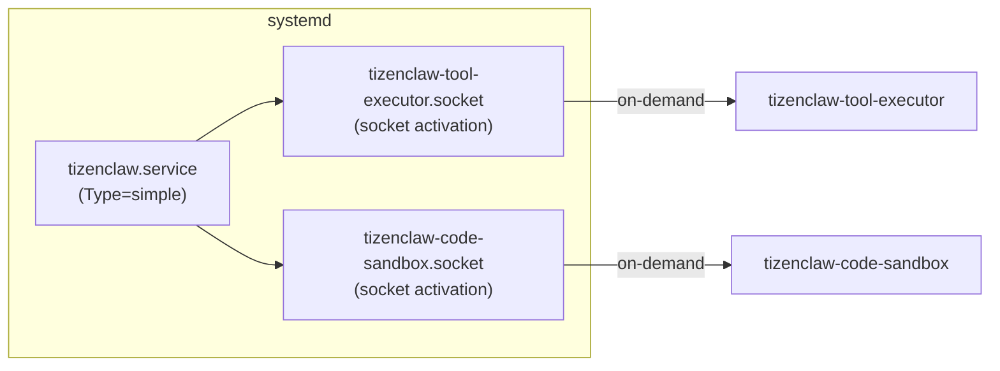
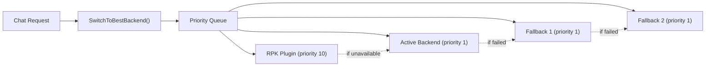
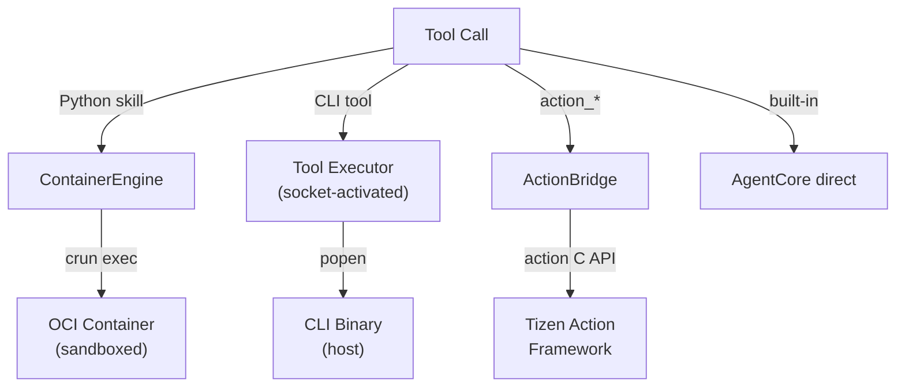
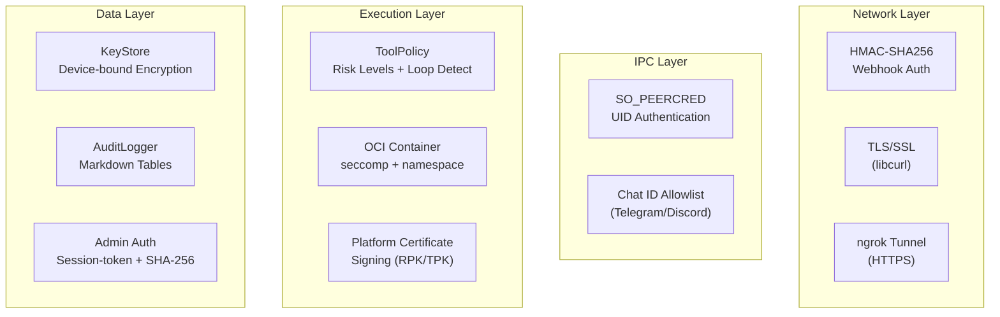
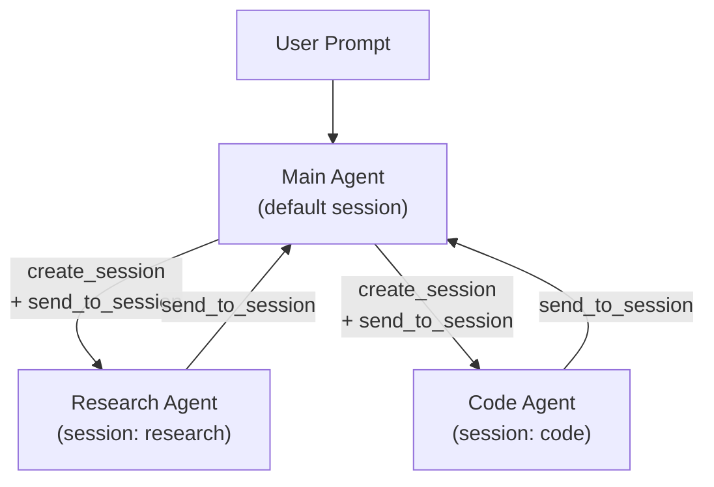
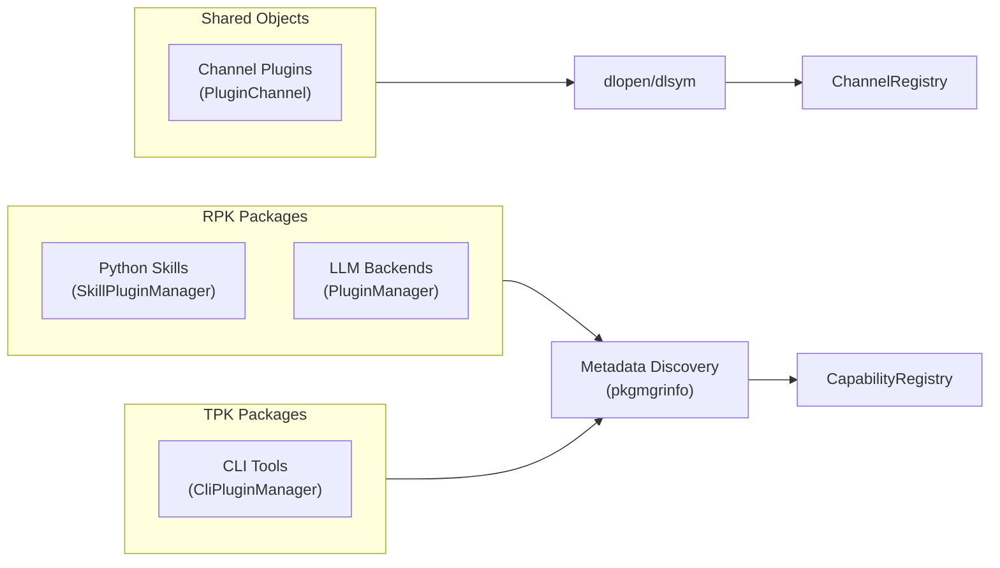

# TizenClaw System Design Document

> **Last Updated**: 2026-03-22
> **Version**: 3.0

---

## Table of Contents

- [1. Overview](#1-overview)
- [2. System Architecture](#2-system-architecture)
- [3. Core Modules](#3-core-modules)
- [4. LLM Backend Layer](#4-llm-backend-layer)
- [5. Communication Channels](#5-communication-channels)
- [6. Container & Skill Execution](#6-container--skill-execution)
- [7. Security Architecture](#7-security-architecture)
- [8. Data Persistence & Storage](#8-data-persistence--storage)
- [9. Multi-Agent System](#9-multi-agent-system)
- [10. Perception & Event System](#10-perception--event-system)
- [11. RAG & Semantic Search](#11-rag--semantic-search)
- [12. Extensibility & Plugin System](#12-extensibility--plugin-system)
- [13. Web Dashboard](#13-web-dashboard)
- [14. Infrastructure Services](#14-infrastructure-services)
- [15. Design Principles](#15-design-principles)

---

## 1. Overview

**TizenClaw** is a native C++ AI agent **daemon** optimized for the Tizen Embedded Linux platform. It runs as a **systemd service** in the background, receiving user prompts through 7+ communication channels (Telegram, Slack, Discord, MCP, Webhook, Voice, Web Dashboard), interpreting them via configurable LLM backends (Gemini, OpenAI, Anthropic, xAI, Ollama + RPK plugins), and executing device-level actions using sandboxed Python skills inside OCI containers and the **Tizen Action Framework**.

The system establishes a safe and extensible Agent-Skill interaction environment under Tizen's strict security policies (SMACK, DAC, kUEP) while providing enterprise-grade features including multi-agent coordination, streaming responses, encrypted credential storage, and structured audit logging.

### System Environment

| Property | Details |
|----------|---------|
| **OS** | Tizen Embedded Linux (Tizen 10.0+) |
| **Runtime** | systemd daemon with socket-activated companion services |
| **Security** | SMACK + DAC enforced, kUEP (Kernel Unprivileged Execution Protection) |
| **Language** | C++20 (daemon), Python 3.x (skills) |
| **Binary Size** | ~812KB stripped (armv7l) |
| **Idle Memory** | ~8.5MB PSS |

### Design Goals

1. **Low Footprint** — Minimize memory and CPU usage for embedded devices
2. **Security by Default** — Container isolation, encrypted credentials, tool policies
3. **Extensibility** — Plugin architecture for LLM backends, channels, and skills without recompilation
4. **Platform Integration** — Deep Tizen C-API access via the Action Framework and ctypes FFI
5. **Multi-Provider LLM** — Vendor-agnostic AI with automatic failover

---

## 2. System Architecture

### High-Level Architecture

```mermaid
graph TB
    subgraph External["External Channels"]
        Telegram["Telegram Bot<br/>(Long Polling)"]
        Slack["Slack Bot<br/>(Socket Mode / WebSocket)"]
        Discord["Discord Bot<br/>(Gateway WebSocket)"]
        MCP["MCP Client<br/>(Claude Desktop via sdb)"]
        Webhook["Webhook<br/>(HTTP Inbound)"]
        Voice["Voice<br/>(Tizen STT/TTS)"]
        WebUI["Web Dashboard<br/>(port 9090)"]
    end

    subgraph Daemon["TizenClaw Daemon (C++ / systemd)"]
        ChannelReg["ChannelRegistry"]
        IPC["IPC Server<br/>(JSON-RPC 2.0 over UDS)"]

        subgraph Core["Agent Core"]
            AgentCore["AgentCore<br/>(Agentic Loop)"]
            ToolDispatch["ToolDispatcher<br/>(O(1) dispatch)"]
            CapReg["CapabilityRegistry"]
            SessionStore["SessionStore<br/>(Markdown Persistence)"]
            MemoryStore["MemoryStore<br/>(Long/Episodic/Short-term)"]
            TaskSched["TaskScheduler<br/>(Cron / Interval)"]
            ToolPolicy["ToolPolicy<br/>(Risk + Loop Detection)"]
            EmbStore["EmbeddingStore<br/>(SQLite RAG + FTS5)"]
            ActionBr["ActionBridge<br/>(Action Framework)"]
            AutoTrigger["AutonomousTrigger<br/>(Event-Driven Rules)"]
        end

        subgraph LLM["LLM Backend Layer"]
            Factory["LlmBackendFactory"]
            Gemini["Gemini"]
            OpenAI["OpenAI / xAI"]
            Anthropic["Anthropic"]
            Ollama["Ollama"]
            PluginLLM["RPK Plugin<br/>(dynamic)"]
        end

        subgraph Security["Security Layer"]
            KeyStore["KeyStore<br/>(Encrypted API Keys)"]
            AuditLog["AuditLogger<br/>(Markdown Tables)"]
        end

        subgraph Infra["Infrastructure"]
            Container["ContainerEngine<br/>(crun OCI)"]
            HttpClient["HttpClient<br/>(libcurl + retry)"]
            SkillWatch["SkillWatcher<br/>(inotify)"]
            WebDash["WebDashboard<br/>(libsoup SPA)"]
            FleetMgr["FleetAgent<br/>(Enterprise Fleet)"]
            EventBus["EventBus<br/>(Pub/Sub)"]
        end

        ChannelReg --> IPC
        IPC --> AgentCore
        AgentCore --> ToolDispatch --> CapReg
        AgentCore --> Factory
        AgentCore --> Container
        AgentCore --> ActionBr
        AgentCore --> SessionStore
        AgentCore --> MemoryStore
        AgentCore --> TaskSched
        AgentCore --> ToolPolicy
        AgentCore --> EmbStore
        AgentCore --> AutoTrigger
        Factory --> Gemini & OpenAI & Anthropic & Ollama & PluginLLM
        Gemini & OpenAI & Anthropic & Ollama --> HttpClient
        AgentCore --> KeyStore
        AgentCore --> AuditLog
    end

    subgraph Sandbox["OCI Container (crun)"]
        SkillExec["Skill Executor<br/>(UDS IPC)"]
        Skills["Python Skills<br/>(sandboxed)"]
        SkillExec --> Skills
    end

    subgraph ActionFW["Tizen Action Framework"]
        ActionSvc["Action Service<br/>(on-demand)"]
        ActionList["Device-specific actions<br/>(auto-discovered)"]
        ActionSvc --- ActionList
    end

    Telegram & Slack & Discord & Voice --> ChannelReg
    MCP --> IPC
    Webhook --> WebDash
    WebUI --> WebDash
    Container -->|"crun exec"| Sandbox
    ActionBr -->|"action C API"| ActionFW
```



### Request Flow (Agentic Loop)



### Service Topology



---

## 3. Core Modules

### 3.1 Daemon Process (`tizenclaw.cc`)

The main daemon process manages the overall lifecycle:

| Responsibility | Implementation |
|---------------|---------------|
| **systemd integration** | `Type=simple` service, `SIGINT`/`SIGTERM` graceful shutdown |
| **IPC Server** | Abstract Unix Domain Socket (`\0tizenclaw.sock`), JSON-RPC 2.0, `[4-byte len][JSON]` framing |
| **Authentication** | `SO_PEERCRED`-based UID validation (root, app_fw, system, developer) |
| **Concurrency** | Thread pool with `kMaxConcurrentClients = 4` |
| **Channel Lifecycle** | `ChannelFactory` reads `channels.json` → `ChannelRegistry` manages start/stop |
| **C-API SDK** | `libtizenclaw` decoupled from internal logic for SDK distribution |

### 3.2 Agent Core (`agent_core.cc`)

The central orchestration engine implementing the **Agentic Loop**:

| Feature | Details |
|---------|---------|
| **Iterative Tool Calling** | LLM generates tool calls → execute → feed results back → repeat |
| **Fail-Fast Retry** | Tools and LLM calls fail immediately on error (max 1 retry) to prevent storms and delegate recovery to the LLM |
| **Streaming Responses** | Chunked IPC delivery (`stream_chunk` / `stream_end`) |
| **Context Compaction** | Oldest 10 turns summarized via LLM when > 15 turns (planned migration: Token-budget threshold) |
| **Edge Memory Management** | `MaintenanceLoop` calls `malloc_trim(0)` + `sqlite3_release_memory` after 5min idle |
| **Multi-Session** | Concurrent sessions with per-session system prompt and history isolation |
| **Backend Selection** | `SwitchToBestBackend()` unified priority queue (Plugin > active > fallback) |

### 3.3 Tool Dispatcher (`tool_dispatcher.cc`)

Modular tool dispatch extracted from AgentCore:

- **O(1) Lookup**: `std::unordered_map<string, ToolHandler>` for registered tools
- **Dynamic Fallback**: `starts_with` matching for `action_*` dynamically named tools
- **Thread Safety**: `std::shared_mutex` for concurrent read access
- **Capability Integration**: All tools registered in `CapabilityRegistry` with `FunctionContract`

### 3.4 Capability Registry (`capability_registry.cc`)

Unified registration for all tools (built-in, CLI plugins, RPK skills, actions):

```cpp
struct FunctionContract {
  std::string name;
  std::string category;
  nlohmann::json input_schema;
  nlohmann::json output_schema;
  SideEffect side_effect;  // kNone, kReversible, kIrreversible, kUnknown
  int max_retries;
  std::vector<std::string> required_permissions;
};
```

- 21 built-in capabilities registered at startup
- `{{CAPABILITY_SUMMARY}}` placeholder injected into LLM system prompt
- Category/side-effect/permission queries for intelligent planning

### 3.5 Tizen Action Framework Bridge (`action_bridge.cc`)

Native integration with Tizen Action Framework for device-level actions:

| Feature | Details |
|---------|---------|
| **Worker Thread** | Runs Action C API on dedicated `tizen_core_task` with `tizen_core_channel` |
| **Schema Sync** | `SyncActionSchemas()` via `action_client_foreach_action` at init |
| **Event-Driven** | `action_client_add_event_handler` for INSTALL/UNINSTALL/UPDATE events |
| **Per-Action Tools** | Each action becomes typed LLM tool (e.g., `action_<name>`) from MD cache |
| **Execution** | `action_client_execute` with JSON-RPC 2.0 model format |

### 3.6 Task Scheduler (`task_scheduler.cc`)

In-process automation with LLM integration:

| Schedule Type | Example |
|--------------|---------|
| `daily HH:MM` | `daily 09:00` |
| `interval Ns/Nm/Nh` | `interval 30m` |
| `once YYYY-MM-DD HH:MM` | `once 2026-04-01 12:00` |
| `weekly DAY HH:MM` | `weekly MON 08:00` |

- Direct `AgentCore::ProcessPrompt()` call (no IPC slot consumption)
- Markdown persistence with YAML frontmatter
- Failed task retry with exponential backoff (max 3 retries)

---

## 4. LLM Backend Layer

Provider-agnostic abstraction via `LlmBackend` interface:

| Backend | Source | Default Model | Streaming | Token Counting |
|---------|--------|---------------|:---------:|:--------------:|
| Gemini | `gemini_backend.cc` | `gemini-2.5-flash` | ✅ | ✅ |
| OpenAI | `openai_backend.cc` | `gpt-4o` | ✅ | ✅ |
| xAI (Grok) | `openai_backend.cc` | `grok-3` | ✅ | ✅ |
| Anthropic | `anthropic_backend.cc` | `claude-sonnet-4-20250514` | ✅ | ✅ |
| Ollama | `ollama_backend.cc` | `llama3` | ✅ | ✅ |

### Key Design Decisions

- **Factory Pattern**: `LlmBackendFactory::Create()` for backend instantiation
- **Unified Priority Switching**: `active_backend` and `fallback_backends` get baseline priority `1`. RPK plugin backends specify higher priority (e.g., `10`), automatically routing traffic to the plugin when installed.
- **System Prompt**: 4-level fallback (config inline → file path → default file → hardcoded)
- **Dynamic Placeholders**: `{{AVAILABLE_TOOLS}}`, `{{CAPABILITY_SUMMARY}}`, `{{MEMORY_CONTEXT}}` replaced at prompt build time

### LLM Backend Flow



---

## 5. Communication Channels

Unified `Channel` interface for all communication endpoints:

```cpp
class Channel {
 public:
  virtual std::string GetName() const = 0;
  virtual bool Start() = 0;
  virtual void Stop() = 0;
  virtual bool IsRunning() const = 0;

  // Outbound messaging (opt-in)
  virtual bool SendMessage(const std::string& text) { return false; }
};
```

### Channel Implementations

| Channel | Protocol | Outbound | Library |
|---------|----------|:--------:|---------|
| **Telegram** | Bot API Long-Polling | ✅ | libcurl |
| **Slack** | Socket Mode (WebSocket) | ✅ | libwebsockets |
| **Discord** | Gateway WebSocket | ✅ | libwebsockets |
| **MCP** | stdio JSON-RPC 2.0 | ❌ | built-in |
| **Webhook** | HTTP inbound | ❌ | libsoup |
| **Voice** | Tizen STT/TTS C-API | ✅ | conditional |
| **Web Dashboard** | libsoup SPA (port 9090) | ❌ | libsoup |
| **Plugin (.so)** | C API (`tizenclaw_channel.h`) | Optional | dlopen |

### Outbound Messaging

LLM-initiated proactive messages flow through `ChannelRegistry`:

- `SendTo(channel_name, text)` — Send to a specific channel
- `Broadcast(text)` — Send to all outbound-capable channels
- IPC method `send_to` — External triggering via `tizenclaw-cli --send-to`
- `AutonomousTrigger::Notify()` — Event-driven autonomous notifications

### Channel Plugin API

```c
// tizenclaw_channel.h — C API for shared object plugins
void TIZENCLAW_CHANNEL_INITIALIZE(tizenclaw_channel_context_h ctx);
const char* TIZENCLAW_CHANNEL_GET_NAME(void);
bool TIZENCLAW_CHANNEL_START(void);
void TIZENCLAW_CHANNEL_STOP(void);
bool TIZENCLAW_CHANNEL_SEND_MESSAGE(const char* text);  // optional
```

---

## 6. Container & Skill Execution

### Container Engine (`container_engine.cc`)

OCI-compliant skill execution environment:

| Feature | Details |
|---------|---------|
| **Runtime** | `crun` 1.26 (built from source during RPM packaging) |
| **Isolation** | PID, Mount, User namespaces |
| **Fallback** | `unshare + chroot` when cgroup unavailable |
| **Skill IPC** | Length-prefixed JSON over Unix Domain Socket |
| **Tool Executor IPC** | Abstract namespace socket (`@tizenclaw-tool-executor.sock`) |
| **Socket Activation** | systemd `LISTEN_FDS`/`LISTEN_PID` for on-demand startup |
| **Bind-Mounts** | `/usr/bin`, `/usr/lib`, `/usr/lib64`, `/lib64` for Tizen C-API |

### Execution Paths



### Tool Schema Discovery

LLM tool discovery through Markdown schema files:

| Source | Path | Description |
|--------|------|-------------|
| **Embedded Tools** | `tools/embedded/*.md` | 17 MD files for built-in tools |
| **Action Tools** | `tools/actions/*.md` | Auto-synced from Tizen Action Framework |
| **CLI Tools** | `tools/cli/*/.tool.md` | Symlinked from TPK packages |

All MD content is scanned at prompt build time and injected into `{{AVAILABLE_TOOLS}}`.

---

## 7. Security Architecture

### Security Layers



### Security Components

| Component | File | Function |
|-----------|------|----------|
| **KeyStore** | `key_store.cc` | Device-bound API key encryption (GLib SHA-256 + XOR, `/etc/machine-id`) |
| **ToolPolicy** | `tool_policy.cc` | Per-skill `risk_level`, loop detection (3x repeat block), idle progress check |
| **AuditLogger** | `audit_logger.cc` | Markdown table audit files, daily rotation, 5MB limit |
| **UID Auth** | `tizenclaw.cc` | `SO_PEERCRED` IPC sender validation |
| **Admin Auth** | `web_dashboard.cc` | Session-token + SHA-256 password hashing |
| **Webhook Auth** | `webhook_channel.cc` | HMAC-SHA256 signature validation (GLib `GHmac`) |

### Tool Policy System

```json
{
  "max_iterations": 10,
  "max_repeat_count": 3,
  "blocked_skills": ["control_power"],
  "risk_overrides": {
    "send_notification": "low"
  }
}
```

- Tools marked `risk_level: high` (e.g., `send_app_control`, `control_power`) require explicit policy
- Same tool + same args repeated 3x → blocked with explanation
- `CheckIdleProgress()` stops if last 3 outputs are identical

---

## 8. Data Persistence & Storage

All storage uses **Markdown with YAML frontmatter** (no external DB dependency except SQLite for RAG):

```
/opt/usr/share/tizenclaw/
├── sessions/{YYYY-MM-DD}-{id}.md    ← Conversation history
├── logs/{YYYY-MM-DD}.md             ← Daily skill execution logs
├── usage/
│   ├── {session-id}.md              ← Per-session token usage
│   ├── daily/YYYY-MM-DD.md          ← Daily aggregate
│   └── monthly/YYYY-MM.md           ← Monthly aggregate
├── audit/YYYY-MM-DD.md              ← Audit trail
├── tasks/task-{id}.md               ← Scheduled tasks
├── tools/
│   ├── actions/{name}.md            ← Action schema cache (auto-synced)
│   ├── embedded/{name}.md           ← Embedded tool schemas
│   └── cli/{pkgid__name}/           ← CLI tool plugins
├── memory/
│   ├── memory.md                    ← Auto-generated summary
│   ├── long-term/{date}-{title}.md  ← User preferences, persistent facts
│   ├── episodic/{date}-{skill}.md   ← Skill execution history
│   └── short-term/{session_id}/     ← Session-scoped commands
├── config/                          ← Configuration files
├── pipelines/                       ← Pipeline definitions
├── workflows/                       ← Workflow definitions
└── knowledge/embeddings.db          ← SQLite vector store (RAG)
```

### Memory System

| Type | Path | Retention | Max Size |
|------|------|-----------|----------|
| **Short-term** | `short-term/{session_id}/` | 24h, max 50 per session | - |
| **Long-term** | `long-term/{date}-{title}.md` | Permanent | 2KB/file |
| **Episodic** | `episodic/{date}-{skill}.md` | 30 days | 2KB/file |
| **Summary** | `memory.md` | Auto-regenerated on idle | 8KB |

- LLM Tools: `remember` (save), `recall` (search), `forget` (delete)
- Configuration: `memory_config.json` with per-type retention
- System Prompt: `{{MEMORY_CONTEXT}}` placeholder injects `memory.md`

---

## 9. Multi-Agent System

### 11-Agent MVP Set

TizenClaw implements a decentralized multi-agent architecture:

| Category | Agent | Responsibility |
|----------|-------|---------------|
| **Understanding** | Input Understanding | Standardizes user input across channels into unified intent |
| **Perception** | Environment Perception | Subscribes to Event Bus, maintains Common State Schema |
| **Memory** | Session / Context | Manages working, long-term, and episodic memory |
| **Planning** | Planning (Orchestrator) | Decomposes goals based on Capability Registry |
| **Execution** | Action Execution | Invokes Container Skills and Action Framework |
| **Protection** | Policy / Safety | Enforces tool policy and system safeguards |
| **Utility** | Knowledge Retrieval | RAG semantic lookups via EmbeddingStore |
| **Monitoring** | Health Monitoring | PSS memory, daemon uptime, container health |
| | Recovery | Failure analysis and error correction via LLM |
| | Logging / Trace | Centralized debugging and audit context |

### Agent Communication

Agents communicate via `create_session` / `send_to_session` tools:



### Supervisor Pattern

`SupervisorEngine` decomposes goals → delegates to specialized role agents → validates:

- `AgentRole` struct with role name, system prompt, allowed tools, priority
- Configurable via `agent_roles.json`
- Built-in tools: `run_supervisor`, `list_agent_roles`

### A2A (Agent-to-Agent) Protocol

Cross-device agent coordination via HTTP:

- A2A endpoint on WebDashboard HTTP server
- Agent Card discovery (`.well-known/agent.json`)
- Task lifecycle: `submitted` → `working` → `completed` / `failed` / `cancelled`
- Bearer token authentication via `a2a_config.json`

---

## 10. Perception & Event System

### Event Bus (`event_bus.cc`)

Pub/sub event bus for system events:

- Granular events: `sensor.changed`, `network.disconnected`, `app.started`, `action.failed`
- Avoids polling — CPU-efficient real-time state updates
- `EventAdapterManager` manages adapter lifecycle

### Event Adapters

| Adapter | Source | Events |
|---------|--------|--------|
| **App Lifecycle** | `app_lifecycle_adapter.cc` | `app.launched`, `app.terminated` |
| **Recent App** | `recent_app_adapter.cc` | `app.recent` |
| **Package** | `package_event_adapter.cc` | `package.installed`, `package.uninstalled` |
| **System Event** | `tizen_system_event_adapter.cc` | `battery.low`, `wifi.changed` |

### Autonomous Triggers (`autonomous_trigger.cc`)

Event-driven rule engine with LLM-based evaluation:

- Subscribes to EventBus for system events
- Rule definitions in `autonomous_trigger.json`
- Configurable cooldown to prevent trigger storms
- LLM evaluates context before executing autonomous actions
- Notifications via `ChannelRegistry::SendTo()` with broadcast fallback

### Perception Components

| Component | Role |
|-----------|------|
| `PerceptionEngine` | Environment perception & analysis |
| `ContextFusionEngine` | Multi-source context fusion |
| `DeviceProfiler` | Device state profiling |
| `ProactiveAdvisor` | Proactive device advisory |
| `SystemContextProvider` | System context for LLM |
| `SystemEventCollector` | System event collection |

### Common State Schemas

Normalized JSON schemas for LLM consumption:

- `DeviceState`: Active capabilities, model, name
- `RuntimeState`: Network status, memory pressure, power mode
- `UserState`: Locale, preferences, role
- `TaskState`: Current goal, active step, missing intent slots

---

## 11. RAG & Semantic Search

### Architecture

```
┌─────────────────────────────────┐    ┌─────────────────────────────────┐
│     Build Time (Host PC)        │    │      Runtime (Device)           │
│                                 │    │                                 │
│  Python + sentence-transformers │    │  C++ + ONNX Runtime (dlopen)    │
│  all-MiniLM-L6-v2 → 384-dim    │    │  all-MiniLM-L6-v2 → 384-dim    │
│           ↓                     │    │           ↓                     │
│  Pre-built knowledge databases  │    │  Query embedding generation     │
│           ↓                     │    │  Hybrid search (BM25+vector)    │
│  RPM install ──────────────────────→ /opt/usr/share/tizenclaw/rag/    │
└─────────────────────────────────┘    └─────────────────────────────────┘
```

### EmbeddingStore (`embedding_store.cc`)

| Feature | Implementation |
|---------|---------------|
| **Storage** | SQLite with FTS5 virtual table |
| **Hybrid Search** | BM25 keyword (FTS5) + vector cosine via Reciprocal Rank Fusion (RRF, k=60) |
| **Token Budget** | `EstimateTokens()` approximation (words × 1.3) |
| **FTS5 Sync** | Auto-sync triggers keep FTS5 index consistent |
| **Embedding APIs** | Gemini (`text-embedding-004`), OpenAI (`text-embedding-3-small`), Ollama |
| **On-Device** | ONNX Runtime inference for `all-MiniLM-L6-v2` (384-dim, lazy-loaded) |
| **Multi-DB** | Attach multiple knowledge databases simultaneously |
| **Fallback** | Vector-only search when FTS5 unavailable |

### Built-in RAG Tools

- `ingest_document` — Chunk text + compute embeddings + store in SQLite
- `search_knowledge` — Hybrid semantic/keyword search with RRF ranking

---

## 12. Extensibility & Plugin System

### Three Extension Points



### RPK Skill Plugins

- Managed by `SkillPluginManager`
- Auto-symlinked from RPK `lib/<skill_name>/` to skills directory
- Platform-level certificate signing required
- SKILL.md format (Anthropic standard)

### CLI Tool Plugins (TPK)

- Managed by `CliPluginManager`
- Metadata filter: `http://tizen.org/metadata/tizenclaw/cli`
- `.tool.md` descriptors injected into LLM system prompt
- Executed via `execute_cli` built-in tool through `popen()`

### LLM Backend Plugins (RPK)

- Managed by `PluginManager`
- Custom priority (e.g., `10`) overrides built-in backends
- Seamless fallback when plugin removed
- No daemon recompilation required

### Metadata Parser Plugins

Three `pkgmgr-metadata-plugin` shared objects enforce security at package install time:

| Plugin | Metadata Key | Validation |
|--------|-------------|------------|
| `tizenclaw-metadata-skill-plugin.so` | `tizenclaw/skill` | Platform cert |
| `tizenclaw-metadata-cli-plugin.so` | `tizenclaw/cli` | Platform cert |
| `tizenclaw-metadata-llm-backend-plugin.so` | `tizenclaw/llm-backend` | Platform cert |

---

## 13. Web Dashboard

Built-in administrative dashboard (`web_dashboard.cc`):

| Feature | Details |
|---------|---------|
| **Server** | libsoup `SoupServer` on port 9090 |
| **Frontend** | Dark glassmorphism SPA (HTML + CSS + JS) |
| **Admin Auth** | Session-token with SHA-256 password hashing |
| **Config Editor** | In-browser editing of 7+ configuration files with backup-on-write |

### REST API

| Endpoint | Method | Description |
|----------|--------|-------------|
| `/api/sessions` | GET | List active sessions |
| `/api/tasks` | GET | List scheduled tasks |
| `/api/logs` | GET | Retrieve execution logs |
| `/api/chat` | POST | Send prompt via web interface |
| `/api/config` | GET/POST | Read/write configuration files |
| `/api/metrics` | GET | Prometheus-style health metrics |
| `/.well-known/agent.json` | GET | A2A Agent Card |
| `/api/a2a` | POST | A2A JSON-RPC endpoint |

---

## 14. Infrastructure Services

### HTTP Client (`http_client.cc`)

- libcurl POST with exponential backoff
- SSL CA auto-discovery
- Configurable timeouts and retry limits

### Skill Watcher (`skill_watcher.cc`)

- Linux `inotify` monitoring of skills directory
- 500ms debouncing for rapid file changes
- Auto-watch for new skill subdirectories
- Thread-safe `ReloadSkills()` in AgentCore

### Fleet Agent (`fleet_agent.cc`)

Enterprise multi-device management:

- Device registration, heartbeat, remote commands
- `fleet_config.json` with `enabled` flag (disabled by default)
- Integrated into daemon lifecycle

### OTA Updater (`ota_updater.cc`)

- HTTP pull from configured repository
- Version checking against remote manifest
- Automatic rollback on update failure

### Tunnel Manager (`tunnel_manager.cc`)

- Secure ngrok tunneling for remote dashboard access
- Auto-configuration via `tunnel_config.json`

### Health Monitor (`health_monitor.cc`)

- CPU, memory, uptime, request count metrics
- Prometheus-style `/api/metrics` endpoint
- Live dashboard health panel

---

## 15. Design Principles

### Embedded-First Design

1. **Selective Context Injection** — Only provide necessary state to LLM (interpreted state, not raw data)
2. **Separation of Perception and Execution** — Perception Agent reads state, Execution Agent alters it
3. **Lazy Initialization** — Heavy subsystems (embedding model, ONNX Runtime) loaded on first use
4. **Aggressive Memory Reclamation** — `malloc_trim(0)` + SQLite cache flushing during idle

### Schema-Execution Separation

- Markdown schema files provide LLM context only
- Execution logic handled independently by ToolDispatcher
- Enables schema updates without code changes

### Config-Driven Extensibility

- Channel activation: `channels.json`
- LLM backends: `llm_config.json`
- Tool policies: `tool_policy.json`
- Agent roles: `agent_roles.json`
- All editable via Web Dashboard without recompilation

### Anthropic Standard Compliance

- Skills use `SKILL.md` format (YAML frontmatter + JSON schemas)
- Built-in MCP client for external MCP tool servers
- Built-in MCP server for Claude Desktop integration

---

## Appendix: Technology Stack

| Component | Technology |
|-----------|-----------|
| **Language** | C++20 |
| **Build System** | CMake 3.12+, GBS (RPM) |
| **HTTP** | libcurl (client), libsoup (server) |
| **WebSocket** | libwebsockets |
| **Database** | SQLite3 (RAG, FTS5) |
| **ML Inference** | ONNX Runtime (dlopen) |
| **Container** | crun 1.26 (OCI) |
| **IPC** | Unix Domain Sockets, JSON-RPC 2.0 |
| **JSON** | nlohmann/json |
| **Logging** | dlog (Tizen), Markdown audit |
| **Testing** | Google Test, Google Mock |
| **Packaging** | RPM (GBS), systemd services |
