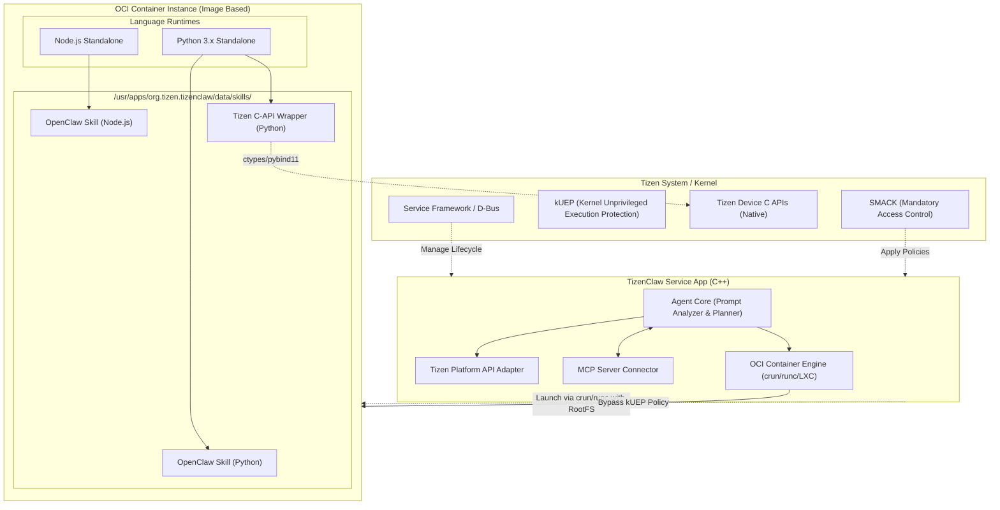

# TizenClaw 설계 문서 (System Design Document)

## 1. 개요 및 설계 목표
TizenClaw는 Native C++로 개발된 **Daemon (데몬)** 형태로 시스템 백그라운드에서 동작하며, 사용자 또는 시스템의 Prompt를 받아 동적으로 타겟 Skills를 구동하는 아키텍처를 가집니다. Tizen의 강력한 보안 정책(SMACK, DAC, kUEP) 하에서도 안전하고 확장 가능한 Agent-Skill 상호작용 환경을 구축합니다.

## 2. 시스템 아키텍처 (System Architecture)

아래는 TizenClaw의 개괄적인 시스템 아키텍처 UML입니다.

## 3. 핵심 모듈 설계

### 3.1. 구동 방식 결정: System Service App
- **결정 사항**: Tizen Application Framework 기반의 **System Service App** 형태로 구현.
- **사유**: 
  - **장점**: Tizen의 표준 패키징(.tpk)과 설치/관리 생태계에 완벽히 통합됩니다. App Manager를 통한 라이프사이클 관리, AppControl 및 Message Port를 이용한 컴포넌트 간 통신(앱-에이전트 간)이 매우 용이해집니다.
  - **권한 처리**: 일반 UI 앱과 달리 시스템 내부 동작을 위해, 해당 Service App은 **Core/Platform 레벨의 인증서로 서명(System App 권한)**되어야 합니다. 또한 Namespace나 커널 파라미터 제어가 필요할 경우 적절한 특권(Capability) 및 SMACK 예외 설정이 플랫폼 정책 레벨에서 배포/패치되어야 합니다.

### 3.2. 경량 컨테이너 (Image 기반) 및 kUEP 우회
- **제어 방식**: Docker 데몬 형태의 거대 아키텍처 대신, 가볍고 빠르며 Tizen App 생태계에 적합한 OCI 호환 명령줄 런타임(`runc` 또는 `crun`)을 백그라운드로 실행합니다. Tizen Service App 권한을 상속받아 직접 `fork/exec` 하거나 `system()` 콜을 사용합니다.
- **이미지 구성 (RootFS 탑재)**: Python 및 Node.js가 사전 설치된 경량 리눅스 이미지(예: Alpine Linux 기반 RootFS)를 압축(`tar.gz`) 형태로 보유합니다. 컨테이너 엔진이 이를 특정 경로(`/usr/apps/org.tizen.tizenclaw/data/rootfs`)에 풀거나 마운트하여 컨테이너 베이스 파일시스템으로 활용합니다. 이로 인해 호스트 환경을 어지럽히지 않고 완벽한 파일시스템 격리가 가능해집니다.
- **kUEP 및 SMACK 우회 처리**: 컨테이너 인스턴스 실행 시 OCI 스펙(`config.json`)을 통해 Capabilities 부여, Namespace 분할, kUEP 우회를 위한 예외 처리 및 SMACK 레이블을 Tizen 플랫폼 정책에 맞게 지정합니다.

### 3.3. 런타임 제공 방안 (이미지 캡슐화)
위의 Image 기반 컨테이너 아키텍처 덕분에, Tizen 10.0 호스트 환경에 Python이나 Node.js를 억지로 설치하지 않아도 됩니다. 
필요한 언어 환경 및 OpenClaw 구동 라이브러리는 모두 **Container RootFS 이미지 내부에 캡슐화**되어 제공되며, 스킬 스크립트는 외부 볼륨 마운트 방식을 통해 컨테이너 안으로 주입됩니다.

### 4. 스킬 탑재 (Dynamic Skills)
Agent의 액션 유연성을 높이기 위해 OpenClaw 호환 형태의 "독립된 스킬 파일(Python/JS 등)"을 동적 로딩합니다.
- **스킬 저장소 경로**: `/usr/apps/org.tizen.tizenclaw/data/skills/`
- **구동 구조**: AgentCore가 명령을 받으면 필요한 스킬 스크립트를 식별한 뒤, Container 내에서 `python3 skill.py` 등의 형태로 바이너리를 실행시켜 그 `stdout`(JSON) 값을 파싱합니다.
  - Tizen Device API는 우선 10.0의 C API를 기준으로 Python용 모듈(예: `pybind11`이나 `ctypes` 활용)을 작성합니다. 처음부터 전체 래퍼를 제공하기보다, **네트워크 상태 조회, 디바이스 정보 조회 등 읽기 전용 단일 API**부터 하나씩 개발하여 포팅합니다.

### 3.5. MCP (Model Context Protocol) 연동
- TizenClaw 내부의 MCP Server Connector 모듈이 소켓/파이프를 통해 외부(또는 로컬) MCP 지원 클라이언트 애플리케이션 프론트엔드/LLM과 연결됩니다.
- Agent가 도구를 호출하거나 추가적인 컨텍스트가 필요할 때 표준적인 MCP 포맷으로 데이터를 주고받아, LLM이 Native 환경을 제어할 때도 유연성을 보장합니다.

## 4. 단계별 진행 계획 (Phases)
1. **Phase 1: 기반 아키텍처 구축**: TizenClaw C++ System Service App 스켈레톤 생성, AppControl/Message Port 설계 및 Prompt Planner 구조 잡기
2. **Phase 2: 실행 환경(Container) 구축**: `crun` 또는 `runc` 기반 경량 OCI 런타임 연동 및 RootFS 이미지 탑재/실행 로직 구현
3. **Phase 3: 이미징 및 런타임 캡슐화**: Alpine 기반 + Python/Node.js 포함된 초경량 RootFS 타볼 생성 및 Tizen kUEP 제약 회피 검증
4. **Phase 4: OpenClaw 스킬 호환 및 Device API 래핑**: OpenClaw 기본 스킬셋(Node.js/Python) 구동 확인, 첫 번째 Tizen Device C-API Python 래퍼 스킬 제작 (예: DeviceInfo 스킬)
5. **Phase 5: MCP 서버 및 실증 적용**: MCP 프로토콜 연결 완료 후, 전체 파이프라인(LLM -> Tizen Agent -> Tizen API 호출 -> LLM 응답) 완성
