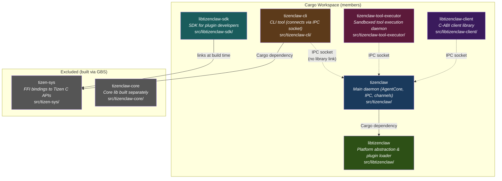

# TizenClaw Project Overview

## 1. What is TizenClaw?

TizenClaw is a **Rust-native async daemon** designed for Tizen OS that provides **agentic AI capabilities** to the platform. Rather than requiring users to navigate through traditional menus, buttons, and settings screens, TizenClaw enables **intent-driven natural language control** of the entire operating system.

A user says *"turn on Bluetooth and connect to my headphones"* and TizenClaw:

1. Receives the prompt via IPC socket or web dashboard.
2. Sends it to a cloud LLM (Gemini, OpenAI, Anthropic, Ollama, etc.).
3. The LLM decides which **tools** to call (e.g., `bluetooth_toggle`, `bluetooth_pair`).
4. TizenClaw executes those tools on the device.
5. Results flow back to the LLM for a final human-readable response.

This loop -- **Reason, Act, Observe, repeat** -- is known as a ReAct loop. TizenClaw implements it with multi-backend LLM fallback, circuit breakers, session persistence, and sandboxed tool execution.

### Key properties

| Property | Detail |
|---|---|
| Language | Rust (2021 edition) |
| Async runtime | Tokio (multi-thread) |
| IPC | Abstract Unix domain sockets, JSON-RPC 2.0 |
| LLM backends | Gemini, OpenAI/xAI, Anthropic, Ollama (pluggable) |
| Platform support | Tizen OS (via `libtizenclaw` plugin), Generic Linux fallback |
| Web UI | Built-in dashboard on port 9090 (Axum) |
| Tool execution | Subprocess-based with timeout, sandboxed executor daemon |

## 2. Why Rust Instead of C++?

TizenClaw targets resource-constrained Tizen devices (TVs, watches, appliances). The choice of Rust over C++ was deliberate and motivated by concrete engineering concerns:

### Ownership = RAII without the footguns

In C++, RAII works well -- until someone takes a raw pointer to a `unique_ptr`'s contents, or copies a `shared_ptr` into a lambda that outlives the object. Rust's ownership model enforces RAII at compile time. If code compiles, resources are freed exactly once, in the right order. No double-free, no use-after-free, no dangling pointers. Period.

### No malloc_trim hacks

Tizen C/C++ daemons frequently resort to `malloc_trim(0)` calls to return memory to the OS because `glibc` holds onto freed pages. Rust's allocator behavior, combined with `jemalloc` or the system allocator, produces tighter memory profiles. More importantly, Rust's ownership model means memory is freed deterministically at scope exit rather than accumulating in free lists.

### Tokio vs pthread pools

TizenClaw makes concurrent LLM API calls, tool executions, IPC handling, and web serving. In C++, this means hand-rolling a thread pool with `std::thread`, managing `std::mutex` hierarchies, and debugging deadlocks with `helgrind`. Rust's Tokio runtime provides M:N green-thread scheduling out of the box. The `async`/`await` syntax makes concurrent code read like sequential code, and the compiler rejects data races at build time.

### Memory safety guarantees

Every LLM response is untrusted input. Tool scripts return arbitrary data. IPC clients send arbitrary payloads. In C++, a single buffer overread in parsing code creates a CVE. In Rust, bounds checking is automatic, and `unsafe` blocks are explicit and auditable (TizenClaw uses them only for FFI calls to `libc` and signal handlers).

### Zero-cost abstractions

Rust traits, generics, and iterators compile to the same machine code as hand-written C. The `LlmBackend` trait in TizenClaw dispatches through a vtable (like a C++ virtual class), but the compiler inlines and devirtualizes where possible. Release builds use `opt-level = "s"` and `panic = "abort"` to produce binaries sized for embedded deployment.

## 3. Workspace at a Glance

TizenClaw is organized as a Cargo workspace with **6 member crates** and **2 excluded crates** (built separately for Tizen deployment via GBS).

### Crate responsibilities

| Crate | Type | Description |
|---|---|---|
| `libtizenclaw` | `cdylib` + `rlib` | Platform abstraction layer. Defines `PlatformPlugin`, `PlatformLogger`, and other traits. Loads `.so` plugins at runtime via `dlopen`. Falls back to `GenericLinuxPlatform` on non-Tizen hosts. See `src/libtizenclaw/src/lib.rs`. |
| `tizenclaw` | binary | The main daemon. Contains `AgentCore` (the agentic loop), `IpcServer` (JSON-RPC), `ToolDispatcher`, `SessionStore` (SQLite), `ChannelRegistry` (web dashboard, Telegram, Discord, etc.), `TaskScheduler`, and all LLM backends. See `src/tizenclaw/src/main.rs`. |
| `tizenclaw-cli` | binary | Command-line client. Connects to the daemon over the abstract Unix socket `\0tizenclaw.sock`. Does **not** link against `libtizenclaw` -- pure IPC. See `src/tizenclaw-cli/src/main.rs`. |
| `tizenclaw-tool-executor` | binary | Separate daemon that listens on `\0tizenclaw-tool-executor.sock`. Executes tool scripts in sandboxed subprocesses with timeouts. Validates peer credentials via `SO_PEERCRED`. See `src/tizenclaw-tool-executor/src/main.rs`. |
| `libtizenclaw-client` | `cdylib` + `rlib` | C-ABI wrapper so that C/C++ Tizen applications can call TizenClaw without writing Rust. Exports `extern "C"` functions matching `tizenclaw.h`. Thread-safe via `Arc<Mutex<...>>`. See `src/libtizenclaw-client/src/lib.rs`. |
| `libtizenclaw-sdk` | `cdylib` + `rlib` | SDK for plugin developers. Provides C FFI for LLM data types, HTTP helpers, and plugin interfaces. External `.so` plugins link against this. See `src/libtizenclaw-sdk/src/lib.rs`. |
| `tizen-sys` *(excluded)* | rlib | Raw FFI bindings to Tizen C APIs (`app_control`, `package_manager`, `dlog`, etc.). Built separately via GBS for cross-compilation. |
| `tizenclaw-core` *(excluded)* | rlib | Core library built separately via GBS to handle Tizen-specific cross-compilation constraints. |

### Why two excluded crates?

The Tizen build system (GBS/OBS) cross-compiles for ARM and uses its own sysroot. The `tizen-sys` crate wraps Tizen-specific C headers that only exist in the GBS sysroot, and `tizenclaw-core` depends on them. Including them in the workspace would break `cargo build` on developer laptops. Instead, they are built by `deploy.sh` during GBS packaging and linked into the final RPM.

## 3.5 Module Integration Inventory

Architecture as of April 2026 after a significant refactor: `AgentCore` is now a facade (`core/agent_core.rs` — 111 lines) that uses `include!` to pull in 15 subfiles from `core/agent_core/`. Most subsystems that were previously "built but not wired" are now integrated into `process_prompt`.

### AgentCore fields (core/agent_core/runtime_core.rs:9-36)

All 19 fields with their integration status:

| Field | Type | Status |
|---|---|---|
| `platform` | `Arc<PlatformContext>` | ✅ |
| `provider_registry` | `tokio::sync::RwLock<ProviderRegistry>` | ✅ Pluggable LLM provider routing |
| `session_store` | `Mutex<Option<SessionStore>>` | ✅ File-based session transcripts |
| `tool_dispatcher` | `tokio::sync::RwLock<ToolDispatcher>` | ✅ |
| `safety_guard` | `Arc<Mutex<SafetyGuard>>` | ✅ **Now wired** (check_tool at process_prompt.rs:1269) |
| `context_engine` | `Arc<SizedContextEngine>` | ✅ **New** — token-aware compaction |
| `event_bus` | `Arc<EventBus>` | ✅ **Now started** at init (runtime_core_impl.rs:1004) |
| `key_store` | `Mutex<KeyStore>` | ✅ API key storage |
| `system_prompt` | `RwLock<String>` | ✅ |
| `soul_content` | `RwLock<Option<String>>` | ✅ SOUL.md persona |
| `llm_config` | `Mutex<LlmConfig>` | ✅ |
| `circuit_breakers` | `RwLock<HashMap<String, CircuitBreakerState>>` | ✅ |
| `action_bridge` | `Mutex<ActionBridge>` | ✅ **New** — tool action routing |
| `tool_policy` | `Mutex<ToolPolicy>` | ✅ **Now wired** (policy_for check at process_prompt.rs:1252) |
| `memory_store` | `Mutex<Option<MemoryStore>>` | ✅ **Now wired** (load_relevant_for_prompt at process_prompt.rs:447-463) |
| `workflow_engine` | `tokio::sync::RwLock<WorkflowEngine>` | ✅ **Now wired** — workflows match at loop start |
| `agent_roles` | `RwLock<AgentRoleRegistry>` | ✅ **Now wired** — loaded at init |
| `session_profiles` | `Mutex<HashMap<String, SessionPromptProfile>>` | ✅ **New** — per-session role/prompt overrides |
| `prompt_hash` | `tokio::sync::RwLock<u64>` | ✅ **New** — Gemini prompt-cache invalidation key |

### Status badge meanings

- ✅ **Integrated** — field is instantiated in `initialize()` AND used in `process_prompt` or a subsystem
- ⚠️ **Built, not wired** — field may exist but no call sites drive it (rare in current codebase)
- 🔧 **Stub** — minimal implementation (e.g., `SwarmManager`)

### Note on the pre-merge docs version

Earlier drafts of this doc suite marked MemoryStore, SafetyGuard, ToolPolicy, EventBus, and AgentRoleRegistry as ⚠️ dormant. **That's no longer accurate as of April 2026** — the April merge from upstream wired them all into `process_prompt`. Specific file:line citations have been updated throughout files 11–14 to reflect the new subfile layout.

### What is still not wired

- `EmbeddingStore` — not a field; memory embeddings are handled internally by `MemoryStore` (uses model files in `data_dir/models/`)
- `ContextFusionEngine` — 🔧 Stub, superseded by `ContextEngine`/`SizedContextEngine`
- `SwarmManager` — 🔧 Stub, multi-device fleet mesh pending
- `PerceptionEngine` — ⚠️ Built, may not be called from `process_prompt` today

## 4. How to Read These Docs

> **Constants callout**: Some older files in this suite quote numeric constants such as `MAX_CONTEXT_MESSAGES = 20` or `MAX_TOOL_ROUNDS = 10` from the pre-April-2026 codebase. The current values are `MAX_CONTEXT_MESSAGES = 120` (see `agent_core.rs:79-90`) and `AgentLoopState::DEFAULT_MAX_TOOL_ROUNDS = 0` (see `core/agent_loop_state.rs:207`, where `0` is a sentinel for "no default cap"). When a file in this suite disagrees with the numbers in this overview, the current source (and this doc) is the definitive reference.

These documents are designed for different learning paths. Choose the one that matches your goal:

### "I want to understand the whole system"

1. **01 -- Overview** (this document) -- bird's-eye view
2. **03 -- Architecture Deep Dive** -- three-tier topology, boot sequence, concurrency model
3. **04 -- The Agentic Loop** -- ReAct cycle, tool calling, session management
4. **05 -- LLM Backends** -- Gemini/OpenAI/Anthropic/Ollama integration details
5. **11 -- Memory & Session Deep Dive** -- session lifecycle, memory stores (now fully wired post-April 2026)
6. **12 -- Multi-Agent Orchestration** -- roles, workflows, pipelines, delegation patterns

### "I want to extend TizenClaw with new tools or skills"

1. **15 -- Extending TizenClaw** -- extension points and wiring patterns
2. **06 -- Tools and Skills** -- tool manifest format, skill scanner, writing your first tool
3. **04 -- The Agentic Loop** -- how tools are dispatched and results fed back
4. **11 -- Memory & Session Deep Dive** -- where state lives and how to plug into it

### "I want to understand memory and sessions deeply"

1. **01 -- Overview** (this document) -- integration status context
2. **11 -- Memory & Session Deep Dive** -- MemoryStore, EmbeddingStore, session lifecycle
3. **09 -- Storage Reference** -- SQLite schemas and persistence patterns

### "I want to understand how safety works"

1. **01 -- Overview** (this document) -- what's actually wired today
2. **13 -- Safety and Policy** -- SafetyGuard, ToolPolicy, safety_bounds.json
3. **12 -- Multi-Agent Orchestration** -- role-based allowed_tools as another safety layer

### "I want to handle autonomous behavior (events, triggers)"

1. **01 -- Overview** (this document) -- EventBus/AutonomousTrigger integration status
2. **14 -- Event Bus & Triggers** -- pub/sub architecture and rule engine
3. **12 -- Multi-Agent Orchestration** -- how triggered prompts flow into role-specific agents

### "I know C++ but not Rust -- help me read this codebase"

1. **02 -- Rust for C++ Developers** -- ownership, traits, async, FFI mapped to C++ concepts
2. **01 -- Overview** (this document) -- project structure
3. **03 -- Architecture Deep Dive** -- how the pieces fit together

### "I want to integrate TizenClaw from my C/C++ Tizen app"

1. **02 -- Rust for C++ Developers**, section 7 (FFI) -- how Rust exposes C APIs
2. **08 -- C API Reference** -- `tizenclaw.h` function-by-function
3. **07 -- IPC Protocol Reference** -- JSON-RPC methods if you prefer socket-level integration

### "I need to build and deploy to a Tizen device"

1. **10 -- Build and Deploy** -- Cargo, GBS, RPM packaging, `deploy.sh`
2. **01 -- Overview** (this document) -- workspace structure for context

## 5. Key Terminology Glossary

| Term | Definition |
|---|---|
| **Agent** | An autonomous software entity that receives goals (natural language prompts), reasons about them, takes actions (tool calls), and iterates until the goal is achieved. TizenClaw's `AgentCore` (`src/tizenclaw/src/core/agent_core.rs`) is the central agent implementation. |
| **ReAct Loop** | **Re**ason + **Act**. The iterative cycle where the agent sends a prompt to the LLM, the LLM returns either a final answer or a tool call, the agent executes the tool and feeds results back, and the LLM reasons again. As of April 2026, TizenClaw has no default iteration cap (`AgentLoopState::DEFAULT_MAX_TOOL_ROUNDS = 0` is a sentinel) — finite caps come from `session_profile.max_iterations` if set. Natural termination is via goal completion, error, or LLM-emitted final answer. |
| **Tool** | An executable (shell script, binary, Python script) registered with the daemon that the LLM can invoke by name. Each tool has a JSON manifest declaring its name, description, parameter schema, timeout, and side-effect classification. Tools live under `data/tools/`. |
| **Textual Skill** | A markdown or text file (under `data/skills/`) containing domain knowledge that is injected into the system prompt. Unlike tools, skills do not execute code -- they provide context to the LLM. Scanned at boot by `textual_skill_scanner.rs`. |
| **System Prompt** | The instruction text sent to the LLM before the conversation. Built dynamically by `PromptBuilder` from `system_prompt.txt`, `SOUL.md` (persona), available tool names, and runtime context (platform, model, data directory). |
| **Circuit Breaker** | A resilience pattern that tracks consecutive LLM backend failures. After 2 consecutive failures within 60 seconds, the backend is temporarily skipped and the next fallback is tried. Implemented in `AgentCore` via `CircuitBreakerState`. |
| **Session** | A conversation context identified by a `session_id` string. Messages are persisted as append-only files (Markdown + JSONL) per session dir via `SessionStore`; SQLite holds only the session index and token-usage analytics. The agent loads up to `MAX_CONTEXT_MESSAGES = 120` messages as conversation history via `load_session_context(session_id, limit)`. |
| **LLM Backend** | An implementation of the `LlmBackend` trait (`src/tizenclaw/src/llm/backend.rs:95`) that translates TizenClaw's internal message format to a specific LLM API (Gemini, OpenAI, Anthropic, Ollama). The daemon supports one primary and multiple fallback backends. |
| **Channel** | An external-facing communication interface. Implements the `Channel` trait (`src/tizenclaw/src/channel/mod.rs:23`). Examples: web dashboard (port 9090), Telegram bot, Discord bot, webhook receiver, voice input. Channels receive messages from users and forward them to `AgentCore`. |
| **Platform Plugin** | A `.so` shared library implementing the `PlatformPlugin` trait (`src/libtizenclaw/src/lib.rs:36`). Loaded at runtime via `dlopen`. Provides platform-specific logging (`dlog` on Tizen), package management, app control, and system info. Falls back to `GenericLinuxPlatform` when no plugin is found. |
| **IPC** | Inter-Process Communication. TizenClaw uses **abstract namespace Unix domain sockets** (socket paths starting with `\0`) for zero-filesystem-footprint communication between the daemon, CLI, tool executor, and client libraries. |
| **JSON-RPC 2.0** | The wire protocol over IPC sockets. Requests are JSON objects with `jsonrpc`, `method`, `params`, and `id` fields. Responses contain `result` or `error`. TizenClaw supports methods `"prompt"` and `"get_usage"`. Messages are framed with a 4-byte big-endian length prefix. |

## 6. FAQ

**Q: Why did we add module integration badges?**
A: To make wiring status visible at a glance. A module can be "built" (the type exists and compiles) without being "wired" (its methods are actually invoked by `process_prompt` or another runtime entry point). The badges distinguish ✅ integrated, ⚠️ built-but-not-wired, and 🔧 stub so maintainers know which TODOs are real. As of April 2026, most previously-dormant subsystems (MemoryStore, SafetyGuard, ToolPolicy, EventBus, AgentRoleRegistry, WorkflowEngine) are now ✅ integrated — see the Module Integration Inventory above.

**Q: Does the orchestrator actually delegate to specialist agents?**
A: `AgentRoleRegistry` is now loaded at init and `session_profiles` (a new AgentCore field) allows per-session role/prompt overrides. See **12_MULTI_AGENT_ORCHESTRATION.md** for how roles drive system prompt selection in `process_prompt`.

**Q: What prevents a malicious LLM from calling `rm -rf /`?**
A: SafetyGuard is now wired — `safety_guard.check_tool(canonical_name, tool_call)` runs before every dispatch (`process_prompt.rs:1269`) and can return a `BlockReason` that short-circuits execution. ToolPolicy is also wired (`process_prompt.rs:1252`) and provides repeat-count / iteration-limit checks. The outer layer remains `SO_PEERCRED` validation on the tool-executor socket. See **13_SAFETY_AND_POLICY.md**.

**Q: How fresh is this documentation? Are the integration statuses accurate?**
A: Verified against source code as of April 2026 (post-merge). For current state, cross-reference with `git log` and actual code. Each ⚠️ or 🔧 badge is a TODO or design decision for maintainers.

**Q: Why is my production TizenClaw's behavior different from what these docs describe?**
A: Check your `git log` against the April 2026 merge. Some forks may still carry the pre-merge layout (single `agent_core.rs` instead of the facade + `agent_core/` subdir with 15 `include!`d files).
