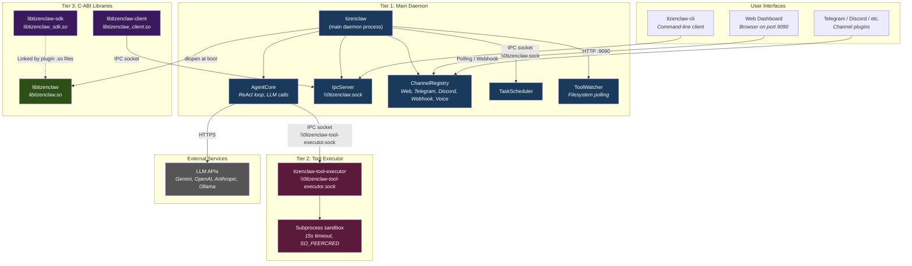
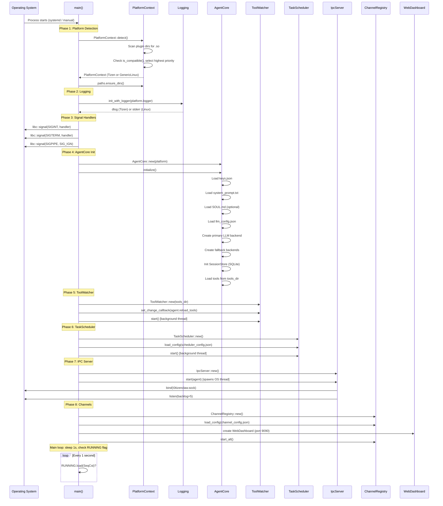
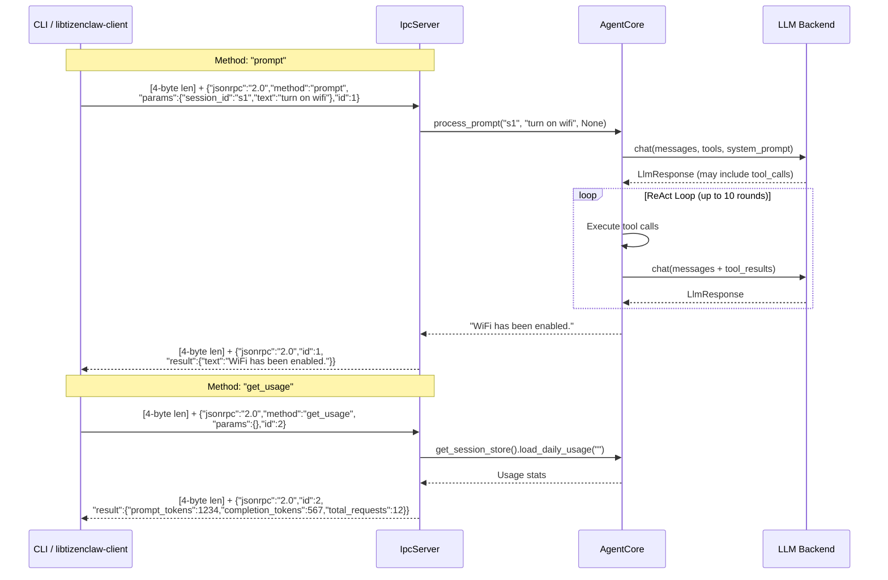
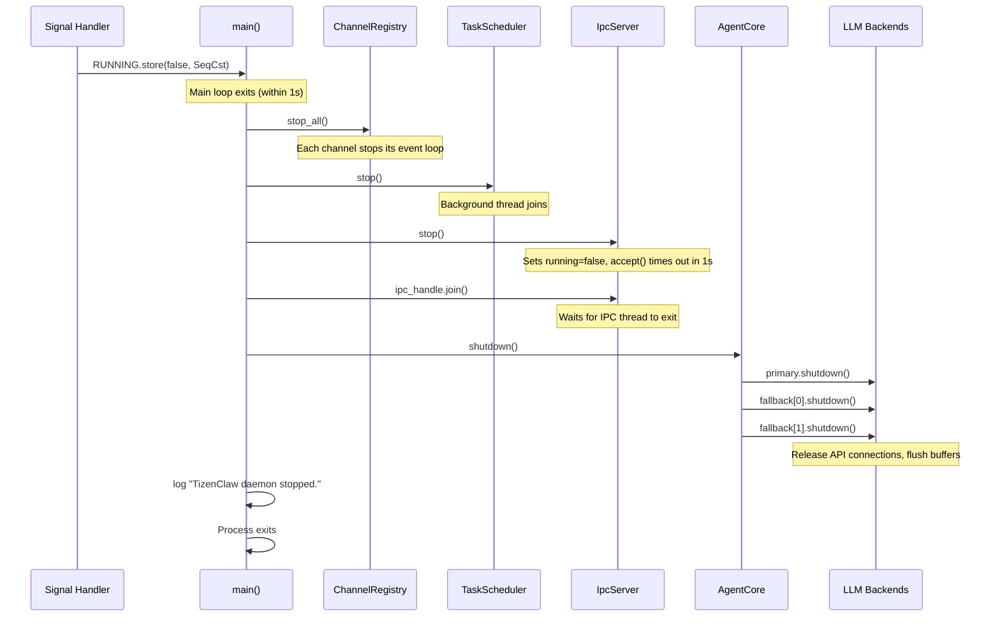

# Architecture Deep Dive

This document describes TizenClaw's runtime architecture: how the processes are arranged, how they boot, how they communicate, and how they shut down.

> **Deeper dives on specific subsystems**:
> - Memory & session lifecycle → [11_MEMORY_SESSION_DEEPDIVE.md](11_MEMORY_SESSION_DEEPDIVE.md)
> - Multi-agent orchestration → [12_MULTI_AGENT_ORCHESTRATION.md](12_MULTI_AGENT_ORCHESTRATION.md)
> - Safety & policy layers → [13_SAFETY_AND_POLICY.md](13_SAFETY_AND_POLICY.md)
> - Event bus & autonomous triggers → [14_EVENT_BUS_TRIGGERS.md](14_EVENT_BUS_TRIGGERS.md)


## 1. Three-Tier Topology

TizenClaw runs as a set of cooperating processes and libraries connected via abstract Unix domain sockets and in-process function calls.



### Why three tiers?

**Tier 1 (Main Daemon)** handles all decision-making: LLM communication, session management, tool dispatching, and channel routing. It is a single long-running Tokio process.

**Tier 2 (Tool Executor)** runs tool scripts in isolation. If a tool script hangs, leaks memory, or crashes, it does not affect the main daemon. The executor validates callers via `SO_PEERCRED` (Linux peer credentials on Unix sockets) to prevent unauthorized tool execution.

**Tier 3 (C-ABI Libraries)** allow C/C++ Tizen applications to interact with TizenClaw without writing Rust. `libtizenclaw-client` connects to the daemon via IPC. `libtizenclaw-sdk` provides data types and HTTP helpers for plugin `.so` development. `libtizenclaw` itself is the platform abstraction layer loaded by the daemon at boot.


## 2. Boot Sequence Walkthrough

The daemon boot is implemented in `src/tizenclaw/src/main.rs:30-133` as eight sequential phases.



### Phase-by-phase details

**Phase 1 -- Platform Detection** (`main.rs:33-34`, `src/libtizenclaw/src/lib.rs:162-189`). The daemon calls `PlatformContext::detect()` which scans plugin directories (`data/plugins/`, `/usr/lib/tizenclaw/plugins/`, `/usr/local/lib/tizenclaw/plugins/`) for `.so` files. Each plugin is `dlopen`-ed and queried for `is_compatible()` and `priority()`. The highest-priority compatible plugin becomes the active platform. If no plugin is found, `GenericLinuxPlatform` is used as a fallback.

**Phase 2 -- Logging** (`main.rs:38`). The logging facade (`log` crate) is initialized with the platform-specific logger. On Tizen, this routes to `dlog`. On generic Linux, it writes to stderr. All subsequent `log::info!()`, `log::error!()`, etc. calls go through this logger.

**Phase 3 -- Signal Handlers** (`main.rs:46-50`). Three POSIX signals are configured:
- `SIGINT` (Ctrl+C) and `SIGTERM` (systemd stop): set `RUNNING = false` to trigger graceful shutdown.
- `SIGPIPE`: ignored (`SIG_IGN`) to prevent the daemon from crashing when a client disconnects mid-write.

**Phase 4 -- AgentCore Init** (`main.rs:56-61`, `agent_core.rs:127-211`). This is the heaviest phase. The agent loads configuration files, initializes LLM backends, opens the SQLite database for session persistence, and loads tool declarations from the filesystem.

**Phase 5 -- ToolWatcher** (`main.rs:64-72`). A filesystem watcher that polls the `tools/` directory for changes. When a tool is added, removed, or modified, it calls `agent.reload_tools()` which rebuilds the `ToolDispatcher`.

**Phase 6 -- TaskScheduler** (`main.rs:75-79`). Loads scheduled tasks from `scheduler_config.json` and runs them on a timer in a background thread.

**Phase 7 -- IPC Server** (`main.rs:82-84`). Spawns an OS thread (not a Tokio task) that runs the `accept()` loop on `\0tizenclaw.sock`. Each client connection gets its own thread, up to `MAX_CONCURRENT_CLIENTS = 8`.

**Phase 8 -- Channels** (`main.rs:87-114`). Loads channel configurations, ensures the web dashboard is registered (port 9090), and starts all channels. Channels run their own event loops (e.g., Axum HTTP server for the dashboard, polling loops for Telegram).


## 3. Concurrency Model

TizenClaw's concurrency model is designed around one principle: **hold locks for the minimum possible duration**. The `AgentCore` struct uses fine-grained per-field locking rather than a single coarse lock.

### Lock inventory

From `src/tizenclaw/src/core/agent_core.rs:96-108`:

```rust
pub struct AgentCore {
    platform: Arc<libtizenclaw::PlatformContext>,               // (1) immutable
    backend: tokio::sync::RwLock<Option<Box<dyn LlmBackend>>>,  // (2) async RwLock
    fallback_backends: tokio::sync::RwLock<Vec<Box<dyn LlmBackend>>>,  // (3) async RwLock
    session_store: Mutex<Option<SessionStore>>,                  // (4) std Mutex
    tool_dispatcher: tokio::sync::RwLock<ToolDispatcher>,        // (5) async RwLock
    key_store: Mutex<KeyStore>,                                  // (6) std Mutex
    system_prompt: RwLock<String>,                               // (7) std RwLock
    soul_content: RwLock<Option<String>>,                        // (8) std RwLock
    backend_name: RwLock<String>,                                // (9) std RwLock
    llm_config: Mutex<LlmConfig>,                                // (10) std Mutex
    circuit_breakers: RwLock<HashMap<String, CircuitBreakerState>>,  // (11) std RwLock
}
```

| Field | Lock type | Why this lock? |
|---|---|---|
| `platform` | None (immutable `Arc`) | Set once at construction, never mutated. `Arc` allows shared ownership without locking. |
| `backend` | `tokio::sync::RwLock` | Read during LLM calls (long async operation). Must not block the Tokio runtime. Multiple concurrent reads allowed. Write only during backend hot-swap. |
| `fallback_backends` | `tokio::sync::RwLock` | Same reasoning as `backend`. Iterated during fallback attempts. |
| `session_store` | `std::sync::Mutex` | SQLite's `Connection` is `!Sync` (not thread-safe for shared references). Tokio's async RwLock requires `Sync`. Locks are held only for brief insert/query operations. |
| `tool_dispatcher` | `tokio::sync::RwLock` | Read on every prompt (to get tool declarations). Write only when tools are reloaded from disk. Reads vastly outnumber writes. |
| `key_store` | `std::sync::Mutex` | Accessed infrequently (at init and when keys are rotated). Short critical sections. |
| `system_prompt` | `std::sync::RwLock` | Read on every prompt to build the system prompt. Written only at init. |
| `circuit_breakers` | `std::sync::RwLock` | Read on every LLM call to check backend health. Written on success/failure. Entries are small (a counter and a timestamp). |

### C++ analogy

For a C++ developer, the pattern looks like:

```cpp
class AgentCore {
    // Instead of:
    //   std::mutex global_mtx_;  // one lock to rule them all

    // We have:
    std::shared_ptr<PlatformContext> platform_;            // const after init
    async_shared_mutex<unique_ptr<ILlmBackend>> backend_;  // fine-grained
    std::mutex<optional<SessionStore>> session_store_;     // per-field
    async_shared_mutex<ToolDispatcher> tool_dispatcher_;   // per-field
    // ...
};
```

This approach allows, for example, one request to be mid-LLM-call (holding `backend` read lock) while another request saves a session message (holding `session_store` lock) with zero contention.

### Thread topology at runtime

```
Main thread (Tokio runtime):
  - Tokio worker threads (N = CPU cores)
    - async tasks: process_prompt(), channel handlers, tool execution
  - ToolWatcher background thread (filesystem polling)
  - TaskScheduler background thread

IPC thread (OS thread, not Tokio):
  - accept() loop
  - Per-client threads (up to MAX_CONCURRENT_CLIENTS=8)
    - block_on(process_prompt()) bridges into Tokio

WebDashboard (Axum, runs on Tokio):
  - HTTP request handlers as async tasks
```

The IPC server intentionally uses OS threads rather than Tokio tasks because it performs blocking `libc::accept()` and `libc::recv()` calls. This isolates the IPC path from the async runtime and prevents a misbehaving IPC client from starving other async tasks.


## 4. IPC Protocol

### Wire format

All IPC communication uses a **4-byte big-endian length prefix** followed by a **UTF-8 JSON body**:

```
+--------+--------+--------+--------+-------- ... --------+
| len[3] | len[2] | len[1] | len[0] |     JSON payload     |
+--------+--------+--------+--------+-------- ... --------+
   MSB                          LSB     (len bytes total)
```

This framing is implemented in `src/tizenclaw/src/core/ipc_server.rs:131-159` (receive) and `ipc_server.rs:220-235` (send).

### Transport

| Property | Value |
|---|---|
| Socket type | `AF_UNIX`, `SOCK_STREAM` |
| Socket address | `\0tizenclaw.sock` (abstract namespace) |
| Max concurrent clients | 8 (`MAX_CONCURRENT_CLIENTS`, `ipc_server.rs:9`) |
| Max payload size | 10 MB (`MAX_PAYLOAD_SIZE`, `ipc_server.rs:10`) |
| Accept timeout | 1 second (allows shutdown flag polling) |

Abstract namespace sockets (address starting with a null byte `\0`) exist only in memory -- no filesystem path, no file permissions to manage, no cleanup on crash.

### JSON-RPC 2.0 methods



#### Method: `prompt`

Send a natural language prompt to the agent.

**Request:**
```json
{
    "jsonrpc": "2.0",
    "method": "prompt",
    "params": {
        "session_id": "user-abc-123",
        "text": "What apps are installed?"
    },
    "id": 1
}
```

**Response:**
```json
{
    "jsonrpc": "2.0",
    "id": 1,
    "result": {
        "text": "You have 42 apps installed. Here are the most recent: ..."
    }
}
```

**Parameters:**
- `session_id` (string, optional): Conversation session identifier. Defaults to `"default"`. Messages within a session share conversation history (up to 20 messages).
- `text` (string, required): The user's natural language prompt. Must not be empty.

#### Method: `get_usage`

Retrieve token usage statistics.

**Request:**
```json
{
    "jsonrpc": "2.0",
    "method": "get_usage",
    "params": {},
    "id": 2
}
```

**Response:**
```json
{
    "jsonrpc": "2.0",
    "id": 2,
    "result": {
        "prompt_tokens": 15234,
        "completion_tokens": 4567,
        "total_requests": 89
    }
}
```

#### Error responses

Standard JSON-RPC 2.0 error codes:

| Code | Message | Cause |
|---|---|---|
| -32600 | Invalid Request | Missing `jsonrpc: "2.0"` or `method` field |
| -32601 | Method not found | Unknown method name |
| -32602 | Empty prompt | `prompt` method called with empty text |
| -32000 | Server busy | `MAX_CONCURRENT_CLIENTS` (8) reached |

#### Plain text fallback

If the IPC server receives a payload that is not valid JSON, it treats the entire payload as a plain text prompt and processes it against the `"default"` session. This allows simple testing with `echo "hello" | socat - ABSTRACT-CONNECT:tizenclaw.sock`.


## 5. Configuration Files

All configuration files live under `data/config/` and are loaded at daemon boot. The `PlatformPaths` struct (`src/libtizenclaw/src/paths.rs`) resolves the actual filesystem paths based on the detected platform.

| File | Loaded by | Purpose |
|---|---|---|
| `llm_config.json` | `AgentCore::initialize()` | Primary and fallback LLM backend selection. Per-backend settings (API keys, model names, endpoints, temperature). See `agent_core.rs:157-159`. |
| `keys.json` | `AgentCore::initialize()` | API keys for LLM backends and external services. Loaded into `KeyStore`. See `agent_core.rs:132-135`. |
| `system_prompt.txt` | `AgentCore::initialize()` | Base system prompt text sent to the LLM. Augmented at runtime by `PromptBuilder` with tool names, skills, and context. See `agent_core.rs:138-143`. |
| `SOUL.md` | `AgentCore::initialize()` | Optional persona definition (tone, personality, behavioral guidelines). Injected into the system prompt if present. See `agent_core.rs:149-155`. |
| `scheduler_config.json` | `TaskScheduler` | Scheduled/periodic tasks (cron-like). Loaded at Phase 6 of boot. See `main.rs:77-78`. |
| `channel_config.json` | `ChannelRegistry` | Channel definitions (type, enabled, settings). Loaded at Phase 8 of boot. See `main.rs:91-92`. |
| `agent_roles.json` | `AgentRole` module | Named agent personas with role-specific prompts and tool restrictions. See `src/tizenclaw/src/core/agent_role.rs`. |
| `tool_policy.json` | `ToolPolicy` module | Per-tool security policies: allowed/denied, require confirmation, rate limits. See `src/tizenclaw/src/core/tool_policy.rs`. |
| `channels.json` | `ChannelRegistry` | Alternative/additional channel configuration. See `data/config/channels.json`. |
| `device_profile.json` | `DeviceProfiler` | Static device capabilities and constraints. See `data/config/device_profile.json`. |
| `fleet_config.json` | `FleetAgent` | Multi-device fleet management configuration. See `data/config/fleet_config.json`. |
| `safety_bounds.json` | `SafetyGuard` | Safety constraints and content filtering rules. See `data/config/safety_bounds.json`. |
| `autonomous_trigger.json` | `AutonomousTrigger` | Event-driven autonomous agent triggers. See `data/config/autonomous_trigger.json`. |
| `mcp_servers.json` | `McpClient` | Model Context Protocol server endpoints. See `data/config/mcp_servers.json`. |
| `memory_config.json` | Memory modules | Long-term memory and embedding store configuration. See `data/config/memory_config.json`. |
| `offline_fallback.json` | `OfflineFallback` | Fallback responses when no LLM backend is reachable. See `data/config/offline_fallback.json`. |
| `web_search_config.json` | Web search tool | Search engine API configuration. See `data/config/web_search_config.json`. |

### Example: llm_config.json

```json
{
    "active_backend": "gemini",
    "fallback_backends": ["openai", "ollama"],
    "backends": {
        "gemini": {
            "api_key": "...",
            "model": "gemini-2.0-flash"
        },
        "openai": {
            "api_key": "...",
            "model": "gpt-4o"
        },
        "ollama": {
            "endpoint": "http://localhost:11434",
            "model": "llama3"
        }
    }
}
```


## 6. Shutdown Sequence

Shutdown is triggered when `SIGINT` or `SIGTERM` sets `RUNNING = false`. The main loop detects this within 1 second (the sleep interval) and executes an orderly teardown.

From `src/tizenclaw/src/main.rs:123-133`:



### Shutdown order rationale

1. **Channels stop first** -- no new user messages can enter the system.
2. **Scheduler stops** -- no new scheduled tasks can fire.
3. **IPC stops** -- no new client connections accepted. The `accept()` loop has a 1-second `SO_RCVTIMEO` timeout, so it notices the stop flag quickly. The main thread joins the IPC thread handle to ensure all in-flight client handlers complete.
4. **Agent shuts down** -- calls `shutdown()` on all LLM backends (primary + fallbacks). This allows backends to flush any pending requests or release resources.
5. **Process exits** -- Rust's drop semantics automatically clean up all remaining resources (close SQLite connections, deallocate memory, etc.).

### Graceful handling of in-flight requests

If a `process_prompt()` call is mid-flight during shutdown:
- The LLM HTTP request will complete (or time out via `reqwest` timeout).
- The response will be sent back to the IPC client.
- The IPC client handler thread will then see the connection close.
- `ipc_handle.join()` waits for all handler threads to finish.

There is no hard kill. The daemon waits for in-flight work to complete naturally.


## FAQ

**Q: What happens if I send a prompt before `AgentCore::initialize()` completes?**
A: The IPC server starts in phase 7 (after AgentCore init in phase 4), so it's not possible to reach the agent before it's ready. If initialize fails partially (e.g., LLM backend fails), the daemon logs an error but continues — subsequent prompts will return "No LLM backend configured".

**Q: Why does the IPC server run on its own thread instead of the tokio runtime?**
A: The IPC socket accept loop uses raw `libc` calls with a 1-second `SO_RCVTIMEO` timeout, which is simpler to express in a std::thread than in a tokio task. Each accepted client is handed to `tokio::task::block_in_place` + `handle.block_on` to run async code. This hybrid design keeps the accept loop simple while allowing async downstream.

**Q: Is JSON-RPC 2.0 strictly enforced?**
A: No — the dispatcher accepts plain text too. If the input isn't valid JSON, it's treated as a prompt against session "default". This is convenient but means you can't tell from outside whether the client intended a plain string or a broken JSON object.

**Q: Can I turn off the web dashboard?**
A: Yes, edit `channel_config.json` to disable the `web_dashboard` channel. But `main.rs` currently hardcodes a fallback that auto-enables it if no channel named `web_dashboard` is registered. To fully disable, you'd need to register a disabled channel explicitly.

**Q: How do I debug a hang in the daemon?**
A: Send SIGTERM — graceful shutdown kicks in. If the daemon is deadlocked (e.g., holding a Mutex in `process_prompt`), use `gdb -p <pid>` + `thread apply all bt` to dump backtraces. The fine-grained locking in AgentCore helps, but each `Mutex<Option<SessionStore>>` acquire can still deadlock if a callback re-enters the same lock.
