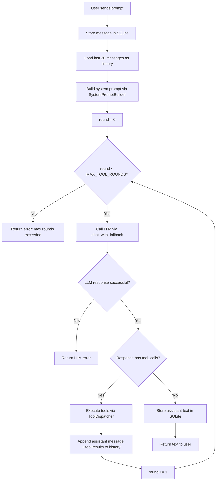
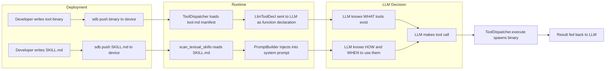
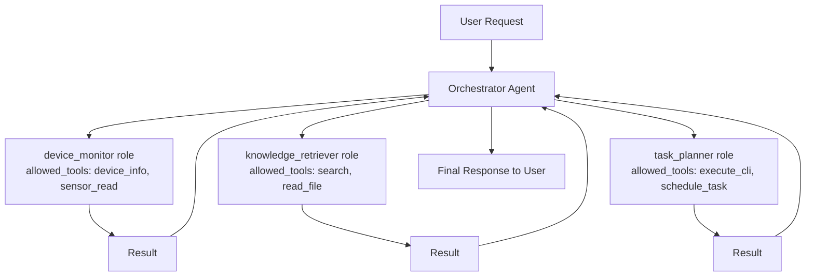
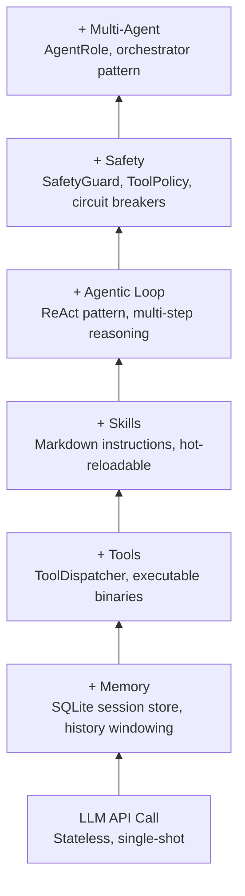

# Agentic AI Concepts in TizenClaw

This guide explains the AI agent architecture that powers TizenClaw, using the actual source code as a running example. It assumes you are comfortable with API basics (prompts, tokens, HTTP calls) but new to how an AI **agent** differs from a simple chatbot.

---

## 1. What is an AI Agent?

A traditional LLM integration is stateless question-and-answer: you send a prompt, you get text back, done. An AI **agent** adds three capabilities that turn a language model into something that can actually *do things*:

| | Simple API Call | AI Agent |
|---|---|---|
| **State** | Stateless; each call is independent | Maintains conversation history across turns |
| **Tools** | None; can only produce text | Can invoke external tools (run commands, query databases, call APIs) |
| **Reasoning** | Single-shot: one prompt, one response | Multi-step: reasons about what to do, acts, observes results, reasons again |
| **Loop** | Request-response | Perceive-reason-act loop that runs until the task is complete |

In C++ terms, a simple API call is like calling a pure function. An agent is more like an event loop with state -- it keeps running until it decides the job is done or a safety limit is hit.

TizenClaw's agent implementation lives in `AgentCore` (`src/tizenclaw/src/core/agent_core.rs`). It holds:

- An LLM backend (the "brain")
- A tool dispatcher (the "hands")
- A session store (the "memory")
- A system prompt builder (the "personality")

---

## 2. The ReAct Pattern

TizenClaw implements the **ReAct** (Reason + Act) pattern, one of the most widely-used agent architectures. The idea is simple: the LLM alternates between *reasoning* about what to do and *acting* by calling tools.

The core implementation is `process_prompt()` in `src/tizenclaw/src/core/agent_core.rs` (lines 328-477). Here is the full flow:

### Step-by-step

1. **Store the user message** in SQLite via `SessionStore::add_message()`
2. **Build conversation history** by loading the last `MAX_CONTEXT_MESSAGES = 20` messages from the database
3. **Construct the system prompt** using `SystemPromptBuilder` -- this assembles the agent's identity, available tools, loaded skills, and runtime context into a single string
4. **Enter the agentic loop** (up to `MAX_TOOL_ROUNDS = 10` iterations):
   - Call the LLM via `chat_with_fallback()` with the full message history and tool declarations
   - **If the LLM returns tool calls**: execute each tool via `ToolDispatcher::execute()`, append tool results to the message history, and loop back to step 4
   - **If the LLM returns plain text**: store it in the session and return it to the user
5. If the loop exceeds 10 rounds, return an error ("Maximum tool call rounds exceeded")

### Flowchart



### Key constants from the source

```rust
// src/tizenclaw/src/core/agent_core.rs, lines 17-18
const MAX_TOOL_ROUNDS: usize = 10;
const MAX_CONTEXT_MESSAGES: usize = 20;
```

`MAX_TOOL_ROUNDS` caps the number of reason-act cycles per prompt. Without this, a confused LLM could loop forever calling the same tool. `MAX_CONTEXT_MESSAGES` controls how much conversation history the LLM sees on each turn -- a sliding window that keeps token usage bounded.

---

## 3. System Prompts and Context Windows

Every LLM has a finite **context window** -- the maximum number of tokens it can process in a single request. The system prompt consumes part of this budget, so it must be carefully assembled to include the right information without wasting tokens.

TizenClaw uses the builder pattern to construct system prompts dynamically. The `SystemPromptBuilder` in `src/tizenclaw/src/core/prompt_builder.rs` assembles five sections:

```rust
// src/tizenclaw/src/core/prompt_builder.rs
pub struct SystemPromptBuilder {
    base_prompt: String,              // Core identity ("You are TizenClaw...")
    tool_declarations: Vec<String>,   // Names of available tools
    runtime_context: Option<RuntimeContext>,  // OS, model, working directory
    soul_content: Option<String>,     // Optional persona from SOUL.md
    available_skills: Vec<(String, String)>,  // (path, description) pairs
}
```

The builder is used in `process_prompt()` like this (simplified from agent_core.rs lines 378-407):

```rust
let system_prompt = {
    let mut builder = SystemPromptBuilder::new();
    builder = builder.set_base_prompt(base.clone());          // 1. Identity
    builder = builder.set_soul_content(soul.clone());         // 2. Persona
    builder = builder.add_tool_names(tool_names);             // 3. Tool list
    builder = builder.add_available_skills(formatted_skills); // 4. Skills
    builder = builder.set_runtime_context(                    // 5. Runtime info
        platform_name, model_name, data_dir,
    );
    builder.build()
};
```

The `build()` method concatenates these sections with Markdown headers, producing a prompt that looks like:

```
You are TizenClaw, an AI assistant running inside a Tizen OS device.

## Persona (SOUL.md)
<persona content>

## Tooling
- execute_cli
- list_apps
- device_info

## Memory & Skills Reference
<available_skills>
- skills/clear_cache/SKILL.md: Clears all system memory caches
</available_skills>

## Workspace Context & Runtime Metadata
Working Directory: /opt/usr/data/tizenclaw
Runtime Environment: os='Tizen 9.0' | active_model='gemini-2.5-flash'
```

The C++ analogy: think of `SystemPromptBuilder` as a string builder class with a fluent interface, similar to how you might construct a complex SQL query or XML document step by step.

---

## 4. Function Calling / Tool Use

Modern LLMs support **function calling** (also called "tool use"): instead of returning free-form text, the LLM can return a structured request to invoke a specific function with specific arguments.

TizenClaw defines the data types for this in `src/tizenclaw/src/llm/backend.rs`:

```rust
/// A tool call requested by the LLM.
pub struct LlmToolCall {
    pub id: String,      // Unique ID for correlating call with result
    pub name: String,    // Tool name, e.g. "execute_cli"
    pub args: Value,     // JSON arguments, e.g. {"tool_name": "ls", "arguments": "-la"}
}

/// Tool declaration for function calling -- tells the LLM what tools exist.
pub struct LlmToolDecl {
    pub name: String,           // Tool name
    pub description: String,    // Natural-language description for the LLM
    pub parameters: Value,      // JSON Schema describing expected arguments
}
```

The flow works as follows:

1. Before each LLM call, `ToolDispatcher::get_tool_declarations()` produces a `Vec<LlmToolDecl>` describing every registered tool
2. These declarations are sent to the LLM alongside the conversation messages
3. The LLM decides whether to call a tool or respond with text
4. If it calls a tool, the response contains one or more `LlmToolCall` entries instead of (or in addition to) text
5. `ToolDispatcher::execute()` runs each tool and returns a JSON result
6. The result is appended to the conversation as a `tool` role message using `LlmMessage::tool_result()`
7. The LLM is called again with the tool results, so it can interpret them and decide what to do next

The `LlmResponse` struct carries both possibilities:

```rust
pub struct LlmResponse {
    pub success: bool,
    pub text: String,                   // Text response (if any)
    pub tool_calls: Vec<LlmToolCall>,   // Tool calls (if any)
    pub prompt_tokens: i32,
    pub completion_tokens: i32,
    pub total_tokens: i32,
    pub error_message: String,
    pub http_status: u16,
}
```

The helper `has_tool_calls()` is what the agentic loop checks to decide whether to continue looping or return the final text.

---

## 5. The Tool-Skill Separation

TizenClaw splits extensibility into two tracks with fundamentally different deployment characteristics:

| | Tools | Skills |
|---|---|---|
| **What** | Executable binaries on the filesystem | Markdown files with instructions |
| **How they work** | `ToolDispatcher` spawns the binary as a subprocess | `PromptBuilder` injects the skill text into the system prompt |
| **Deployment** | Requires compilation and `sdb push` of a binary | Just `sdb push` a `.md` file |
| **Hot-reload** | Requires `reload_tools()` (triggered by `ToolWatcher`) | Loaded on each prompt via `scan_textual_skills()` |
| **What they tell the LLM** | "Here is a function you CAN call" | "Here is HOW and WHEN to use certain tools" |

### Why separate them?

A **tool** gives the agent a new *capability* -- it can now do something it could not do before (run a command, query a sensor, install a package). But the tool itself is just an executable; the LLM needs to know *when* to use it and *how* to compose tool calls to solve complex tasks.

A **skill** fills that gap. It is a Markdown document that teaches the LLM a *strategy* -- a recipe for combining tools to accomplish a goal. Skills are hot-reloadable because they are just text injected into the prompt. You can iterate on them without recompiling anything.



---

## 6. Multi-Agent Patterns

TizenClaw supports defining multiple **agent roles** via `AgentRole` in `src/tizenclaw/src/core/agent_role.rs`:

```rust
pub struct AgentRole {
    pub name: String,              // e.g. "device_monitor", "knowledge_retriever"
    pub system_prompt: String,     // Role-specific system prompt
    pub allowed_tools: Vec<String>,// Restricted tool set for this role
    pub max_iterations: usize,     // Per-role iteration limit
    pub description: String,       // Human-readable description
}
```

Each role is a specialized persona with:

- Its own system prompt (personality and instructions)
- A restricted set of tools (principle of least privilege)
- Its own iteration limit

Roles are managed by `AgentRoleRegistry`, which supports both static roles (loaded from a JSON config file via `load_roles()`) and dynamic roles (added at runtime via `add_dynamic_role()`).

### The Orchestrator Pattern

In multi-agent architectures, a **supervisor** (or orchestrator) agent delegates tasks to specialist agents. Each specialist has a narrow focus and a restricted tool set:



This pattern limits blast radius: if the `knowledge_retriever` role is compromised or confused, it cannot call `execute_cli` because that tool is not in its `allowed_tools` list. The C++ analogy is an interface segregation pattern -- each role sees only the subset of the API it needs.

---

## 7. Safety and Guardrails

TizenClaw implements defense-in-depth with multiple safety layers. Each layer operates independently, so a failure in one does not compromise the others.

### SafetyGuard (`src/tizenclaw/src/core/safety_guard.rs`)

The first line of defense. It blocks dangerous operations at the tool-call level:

- **Blocked tools**: a configurable set of tool names that are always rejected
- **Blocked argument patterns**: substring matching against dangerous commands (`rm -rf /`, `mkfs`, `dd if=`, `shutdown`, `reboot`)
- **Side effect classification**: tools are tagged as `None`, `Reversible`, or `Irreversible`. By default, irreversible tools are blocked unless explicitly allowed
- **Prompt injection detection**: scans user input for common injection patterns like "ignore previous instructions" or "you are now"

```rust
// Built-in blocked argument patterns
blocked_args.insert("rm -rf /".to_string());
blocked_args.insert("mkfs".to_string());
blocked_args.insert("dd if=".to_string());
blocked_args.insert("shutdown".to_string());
blocked_args.insert("reboot".to_string());
```

### ToolPolicy (`src/tizenclaw/src/core/tool_policy.rs`)

The second layer focuses on runtime behavior:

- **Rate limiting**: `max_repeat_count` (default: 3) blocks a tool from being called with identical arguments more than N times in a session. This prevents infinite loops where the LLM keeps calling the same tool expecting different results.
- **Idle detection**: `check_idle_progress()` maintains a sliding window of the last 3 tool outputs. If all 3 are identical, the agent is considered stuck.
- **Risk levels**: tools can be classified as `Low`, `Normal`, or `High` risk, enabling different approval flows.
- **Session isolation**: each session tracks its own call history, so one user's activity does not affect another's.

### Structural Guardrails

- **MAX_TOOL_ROUNDS = 10**: hard cap on agentic loop iterations in `agent_core.rs`
- **MAX_CONTEXT_MESSAGES = 20**: bounds conversation history to prevent unbounded token growth
- **Circuit breakers**: pause failing backends (see next section)
- **SO_PEERCRED validation**: the tool executor only accepts connections from authorized processes

---

## 8. Circuit Breakers

When an LLM backend fails (network error, rate limit, server error), retrying immediately is wasteful and can make things worse. TizenClaw uses a **circuit breaker** pattern to temporarily pause failing backends.

The state is defined in `src/tizenclaw/src/core/agent_core.rs` (lines 83-87):

```rust
#[derive(Debug, Clone)]
struct CircuitBreakerState {
    consecutive_failures: u32,
    last_failure_time: Option<std::time::Instant>,
}
```

The rules are simple:

1. Each successful call resets `consecutive_failures` to 0
2. Each failed call increments `consecutive_failures` and records the timestamp
3. When `consecutive_failures >= 2`, the backend is **paused** for 60 seconds
4. After 60 seconds, the circuit "half-opens" -- the next request is allowed through as a probe
5. If the probe succeeds, the circuit resets to healthy. If it fails, the 60-second timer restarts.

```rust
// src/tizenclaw/src/core/agent_core.rs, lines 228-239
fn is_backend_available(&self, name: &str) -> bool {
    let cb_guard = self.circuit_breakers.read().unwrap();
    if let Some(state) = cb_guard.get(name) {
        if state.consecutive_failures >= 2 {
            if let Some(last_fail) = state.last_failure_time {
                if last_fail.elapsed().as_secs() < 60 {
                    return false;  // Circuit is OPEN -- backend paused
                }
            }
        }
    }
    true  // Circuit is CLOSED -- backend available
}
```

**C++ analogy**: This is the retry-with-backoff pattern you might implement with a counter and a timer, but formalized into a state machine. The circuit breaker pattern comes from distributed systems (originally popularized by Michael Nygard in *Release It!*) and prevents cascading failures when a downstream service is unhealthy.

Each backend (primary and fallbacks) has its own independent circuit breaker, stored in a `HashMap<String, CircuitBreakerState>` on `AgentCore`.

---

## 9. Memory and Sessions

TizenClaw uses SQLite for persistent conversation memory, managed by `SessionStore` in `src/tizenclaw/src/storage/session_store.rs`.

### Database Schema

Three tables:

- **sessions**: tracks session IDs with creation/update timestamps
- **messages**: stores every message (user, assistant, tool) with its session ID, role, content, and timestamp
- **token_usage**: records prompt/completion token counts per LLM call, enabling usage tracking and cost monitoring

### Conversation History Windowing

When processing a new prompt, `AgentCore` loads the last `MAX_CONTEXT_MESSAGES = 20` messages for the current session:

```rust
// src/tizenclaw/src/core/agent_core.rs, lines 353-358
let history = {
    let ss = self.session_store.lock();
    ss.ok()
        .and_then(|s| s.as_ref().map(|store|
            store.get_messages(session_id, MAX_CONTEXT_MESSAGES)))
        .unwrap_or_default()
};
```

This sliding window ensures the LLM always has recent context without exceeding token limits. The SQL query uses `ORDER BY id DESC LIMIT ?2` to fetch the N most recent messages, then reverses them to restore chronological order.

### Token Usage Tracking

Every LLM call records its token consumption:

```rust
store.record_usage(session_id, response.prompt_tokens,
                   response.completion_tokens, &backend_name);
```

This data can be queried per-session (`load_token_usage`) or per-day (`load_daily_usage`) for monitoring and cost control.

### Performance

The session store uses SQLite WAL (Write-Ahead Logging) mode and batches writes into transactions to minimize fsync overhead -- important on embedded devices where I/O is often the bottleneck.

---

## Summary

TizenClaw's agent architecture can be understood as layers built on top of a simple LLM API call:



Each layer adds capability while the safety mechanisms ensure the agent remains controllable and predictable -- critical for an embedded system running on real hardware.
