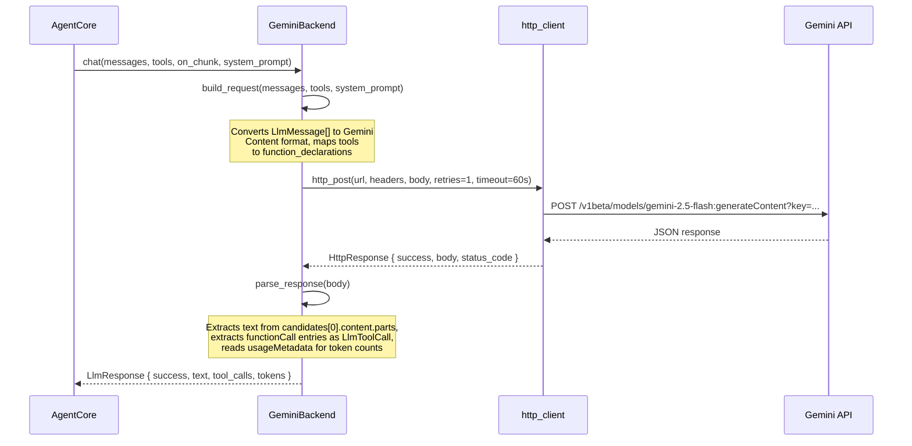
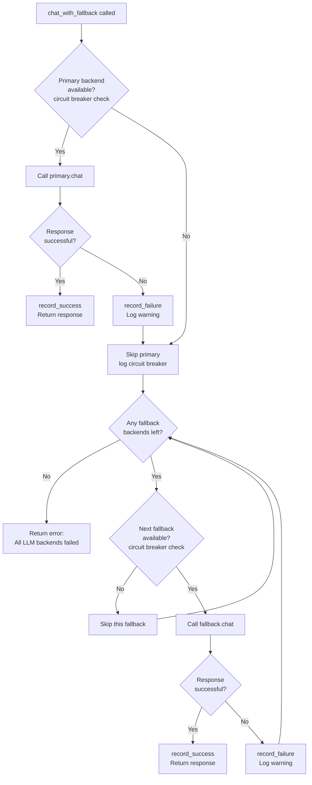
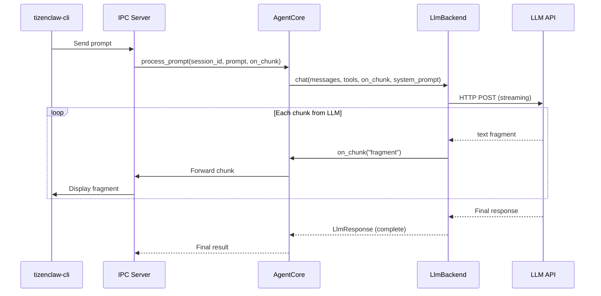
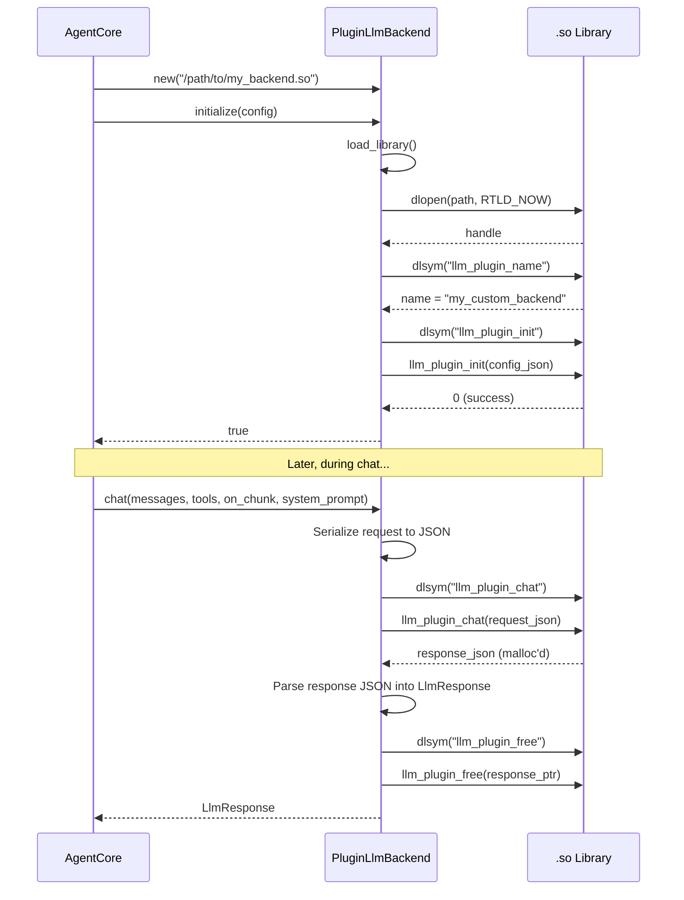
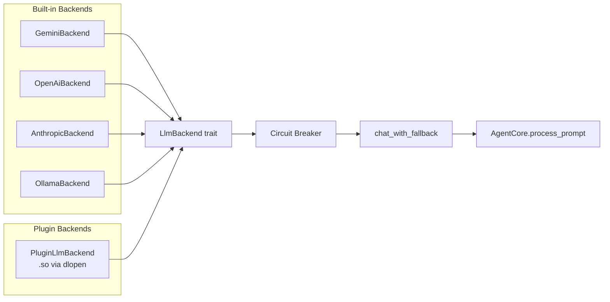

# LLM Backend System

This document is a deep dive into TizenClaw's pluggable LLM backend architecture -- how the system abstracts over multiple AI providers, routes requests, handles failures, and supports runtime extension via shared libraries.

---

## 1. The LlmBackend Trait

All LLM providers in TizenClaw implement a single Rust trait defined in `src/tizenclaw/src/llm/backend.rs` (lines 94-103):

```rust
#[async_trait::async_trait]
pub trait LlmBackend: Send + Sync {
    fn initialize(&mut self, config: &Value) -> bool;
    async fn chat(
        &self, messages: &[LlmMessage], tools: &[LlmToolDecl],
        on_chunk: Option<&(dyn Fn(&str) + Send + Sync)>, system_prompt: &str,
    ) -> LlmResponse;
    fn get_name(&self) -> &str;
    fn shutdown(&mut self) {}
}
```

**C++ analogy**: This is equivalent to a pure virtual base class (abstract interface):

```cpp
// Conceptual C++ equivalent
class ILlmBackend {
public:
    virtual bool initialize(const json& config) = 0;
    virtual LlmResponse chat(
        const std::vector<LlmMessage>& messages,
        const std::vector<LlmToolDecl>& tools,
        std::function<void(const std::string&)> on_chunk,
        const std::string& system_prompt) = 0;
    virtual const char* get_name() const = 0;
    virtual void shutdown() {}
    virtual ~ILlmBackend() = default;
};
```

### Method breakdown

| Method | Purpose |
|--------|---------|
| `initialize(&mut self, config: &Value) -> bool` | One-time setup: reads API keys, model name, endpoint URL from a JSON config object. Returns `false` if required fields (like `api_key`) are missing. |
| `chat(&self, ...) -> LlmResponse` | The main entry point. Sends conversation messages + tool declarations to the LLM and returns either text, tool calls, or an error. The `on_chunk` callback enables streaming. |
| `get_name(&self) -> &str` | Returns the backend's identifier (e.g., `"gemini"`, `"openai"`, `"anthropic"`). Used for logging, circuit breaker tracking, and usage recording. |
| `shutdown(&mut self)` | Optional cleanup. The plugin backend uses this to `dlclose()` the shared library. |

The `Send + Sync` bounds mean the backend can be shared across async tasks safely -- important because `AgentCore` holds backends behind `tokio::sync::RwLock` and multiple sessions may issue concurrent LLM calls.

---

## 2. Data Types

All data types live in `src/tizenclaw/src/llm/backend.rs`. These are the structs that flow between the agent core and any backend implementation.

### LlmMessage

A single message in a conversation:

```rust
pub struct LlmMessage {
    pub role: String,           // "user", "assistant", or "tool"
    pub text: String,           // Message content
    pub tool_calls: Vec<LlmToolCall>,  // Tool calls (for assistant messages)
    pub tool_name: String,      // Tool name (for tool result messages)
    pub tool_call_id: String,   // Correlates a tool result with its call
    pub tool_result: Value,     // JSON result from tool execution
}
```

Convenience constructors:

- `LlmMessage::user("hello")` -- creates a user message
- `LlmMessage::assistant("hi there")` -- creates an assistant message
- `LlmMessage::tool_result(call_id, name, result)` -- creates a tool result message

### LlmToolCall

A tool invocation requested by the LLM:

```rust
pub struct LlmToolCall {
    pub id: String,    // Unique ID for correlating call with result
    pub name: String,  // Tool name, e.g. "execute_cli"
    pub args: Value,   // JSON arguments
}
```

### LlmToolDecl

Declares a tool to the LLM (tells it what functions are available):

```rust
pub struct LlmToolDecl {
    pub name: String,         // Tool name
    pub description: String,  // Natural-language description
    pub parameters: Value,    // JSON Schema for expected arguments
}
```

### LlmResponse

The complete response from an LLM call:

```rust
pub struct LlmResponse {
    pub success: bool,                  // Whether the call succeeded
    pub text: String,                   // Text content (may be empty if tool calls)
    pub error_message: String,          // Error details on failure
    pub tool_calls: Vec<LlmToolCall>,   // Tool calls (may be empty if text)
    pub prompt_tokens: i32,             // Input tokens consumed
    pub completion_tokens: i32,         // Output tokens generated
    pub total_tokens: i32,              // Total tokens
    pub http_status: u16,               // HTTP status code from the API
}
```

The `has_tool_calls()` helper method is what the agentic loop uses to decide whether to continue looping or return the final response.

---

## 3. Built-in Providers

TizenClaw ships with four LLM backend implementations:

| Provider | Source File | Default Model | Default Endpoint | Auth |
|----------|-----------|---------------|-------------------|------|
| Gemini (Google) | `src/tizenclaw/src/llm/gemini.rs` | `gemini-2.5-flash` | `generativelanguage.googleapis.com/v1beta` | API key in URL |
| OpenAI | `src/tizenclaw/src/llm/openai.rs` | `gpt-4o` | `api.openai.com/v1` | Bearer token |
| xAI (Grok) | `src/tizenclaw/src/llm/openai.rs` | `grok-3-mini-fast` | `api.x.ai/v1` | Bearer token |
| Anthropic (Claude) | `src/tizenclaw/src/llm/anthropic.rs` | `claude-sonnet-4-20250514` | `api.anthropic.com/v1` | x-api-key header |
| Ollama (local) | `src/tizenclaw/src/llm/ollama.rs` | `llama3` | `localhost:11434` | None (local) |

Note that OpenAI and xAI share the same `OpenAiBackend` implementation because xAI's API is OpenAI-compatible. The constructor selects the correct endpoint and default model:

```rust
// src/tizenclaw/src/llm/openai.rs, lines 17-24
pub fn new(provider: &str) -> Self {
    let (endpoint, model) = match provider {
        "xai" => ("https://api.x.ai/v1", "grok-3-mini-fast"),
        _ => ("https://api.openai.com/v1", "gpt-4o"),
    };
    OpenAiBackend { api_key: String::new(), model: model.into(),
                    endpoint: endpoint.into(), provider_name: provider.into() }
}
```

### The Factory Function

Backends are instantiated by name via `create_backend()` in `src/tizenclaw/src/llm/backend.rs` (lines 106-114):

```rust
pub fn create_backend(name: &str) -> Option<Box<dyn LlmBackend>> {
    match name {
        "gemini" => Some(Box::new(super::gemini::GeminiBackend::new())),
        "openai" | "xai" => Some(Box::new(super::openai::OpenAiBackend::new(name))),
        "anthropic" => Some(Box::new(super::anthropic::AnthropicBackend::new())),
        "ollama" => Some(Box::new(super::ollama::OllamaBackend::new())),
        _ => None,
    }
}
```

C++ analogy: this is a simple factory function. The `Box<dyn LlmBackend>` return type is equivalent to `std::unique_ptr<ILlmBackend>` -- an owning pointer to a heap-allocated object behind a virtual dispatch table (vtable).

---

## 4. How a Request Flows Through a Backend

Using the Gemini backend (`src/tizenclaw/src/llm/gemini.rs`) as a concrete example:



### Request Building (`build_request`)

Each backend translates the generic `LlmMessage` and `LlmToolDecl` types into the provider-specific JSON format. For Gemini (lines 30-67):

- System prompt goes into `system_instruction.parts`
- Messages are mapped to `contents[]` with Gemini-specific role names (`"model"` instead of `"assistant"`, `"function"` instead of `"tool"`)
- Tool calls become `functionCall` parts; tool results become `functionResponse` parts
- Tool declarations are wrapped in `tools[].function_declarations`

### Response Parsing (`parse_response`)

The response is parsed back into the generic `LlmResponse`:

- Text is extracted from `candidates[0].content.parts[].text`
- Function calls are extracted from `candidates[0].content.parts[].functionCall`
- Token usage is read from `usageMetadata`

Each backend handles the same concern (request building + response parsing) but with different JSON shapes. This is the core value of the abstraction -- the agent core never needs to know which provider is active.

---

## 5. Multi-Backend with Fallback

TizenClaw supports configuring a primary backend plus an ordered list of fallback backends. The `chat_with_fallback()` method in `src/tizenclaw/src/core/agent_core.rs` (lines 265-322) implements the failover logic:



Key design decisions:

1. **Fine-grained locking**: The backend lock (`tokio::sync::RwLock`) is held only during the actual `chat()` call, not for the entire fallback sequence. This allows other sessions to proceed concurrently.

2. **Circuit breaker integration**: Before attempting any backend, `is_backend_available()` checks whether that backend's circuit breaker is open (2+ consecutive failures within the last 60 seconds). This avoids wasting time on backends that are known to be down.

3. **Independent circuit breakers**: Each backend (primary and every fallback) has its own `CircuitBreakerState` tracked in a `HashMap<String, CircuitBreakerState>`.

4. **Graceful degradation**: The method always returns an `LlmResponse` -- either a successful response from whichever backend worked, or an error response with "All LLM backends failed".

---

## 6. Configuration

Backend configuration is stored in `llm_config.json` in the config directory. The `LlmConfig` struct in `src/tizenclaw/src/core/agent_core.rs` (lines 22-26) parses it:

```json
{
  "active_backend": "gemini",
  "fallback_backends": ["openai", "anthropic"],
  "backends": {
    "gemini": {
      "api_key": "AIza...",
      "model": "gemini-2.5-flash"
    },
    "openai": {
      "api_key": "sk-...",
      "model": "gpt-4o"
    },
    "anthropic": {
      "api_key": "sk-ant-...",
      "model": "claude-sonnet-4-20250514"
    },
    "ollama": {
      "model": "llama3",
      "endpoint": "http://localhost:11434"
    }
  }
}
```

### Configuration fields

| Field | Type | Description |
|-------|------|-------------|
| `active_backend` | string | Name of the primary backend. Must match a key in `backends`. Default: `"gemini"` |
| `fallback_backends` | string[] | Ordered list of fallback backend names. Tried in order when primary fails. |
| `backends.<name>.api_key` | string | API key for the provider. Required for cloud providers, not needed for Ollama. |
| `backends.<name>.model` | string | Model identifier. Each provider has its own default if omitted. |
| `backends.<name>.endpoint` | string | Base URL override. Useful for proxies, custom deployments, or OpenAI-compatible APIs. |

### Loading flow

During `AgentCore::initialize()`:

1. `LlmConfig::load()` reads and parses the JSON file (falls back to defaults if missing)
2. `create_and_init_backend_static()` calls `create_backend()` (the factory) and then `initialize()` with the backend-specific config section
3. The primary backend is stored in `self.backend`
4. Each fallback backend is initialized and stored in `self.fallback_backends`

---

## 7. Streaming

The `chat()` method accepts an optional `on_chunk` callback:

```rust
async fn chat(
    &self, messages: &[LlmMessage], tools: &[LlmToolDecl],
    on_chunk: Option<&(dyn Fn(&str) + Send + Sync)>,  // <-- streaming callback
    system_prompt: &str,
) -> LlmResponse;
```

When provided, backends can call `on_chunk` with each text fragment as it arrives from the LLM, enabling real-time streaming to the user. The full flow:



The callback signature `&(dyn Fn(&str) + Send + Sync)` ensures:
- `Fn(&str)`: can be called multiple times with string slices
- `Send + Sync`: safe to use across async task boundaries

Note: The current built-in backends do not implement streaming internally (they wait for the full response). The callback infrastructure is in place for future streaming implementations or plugin backends that support it.

---

## 8. Plugin LLM Backends

For providers not built into TizenClaw, the `PluginLlmBackend` in `src/tizenclaw/src/llm/plugin_llm_backend.rs` enables loading custom backends from shared libraries (`.so` files) at runtime.

### C ABI Interface

A plugin `.so` must export four C-compatible functions:

```c
// Required
int llm_plugin_init(const char* config_json);
char* llm_plugin_chat(const char* request_json);

// Optional
const char* llm_plugin_name(void);
void llm_plugin_free(char* ptr);
```

| Function | Purpose |
|----------|---------|
| `llm_plugin_init` | Receives the backend config as JSON. Returns 0 on success. |
| `llm_plugin_chat` | Receives the full request (messages, tools, system_prompt) as JSON. Returns a JSON response string allocated with `malloc()`. |
| `llm_plugin_name` | Returns the plugin's display name. If not provided, the filename stem is used. |
| `llm_plugin_free` | Frees the string returned by `llm_plugin_chat`. If not provided, the memory is not freed (potential leak -- implement this). |

### Loading Flow



### Request JSON Format

The request passed to `llm_plugin_chat` has this structure:

```json
{
  "messages": [
    {"role": "user", "text": "Hello", "tool_calls": [], ...},
    {"role": "assistant", "text": "Hi!", ...}
  ],
  "tools": [
    {"name": "execute_cli", "description": "...", "parameters": {...}}
  ],
  "system_prompt": "You are TizenClaw..."
}
```

### Expected Response JSON

The plugin must return JSON matching this structure:

```json
{
  "success": true,
  "text": "Here is my response",
  "error": "",
  "tool_calls": [
    {"id": "call_1", "name": "execute_cli", "args": {"tool_name": "ls"}}
  ],
  "prompt_tokens": 150,
  "completion_tokens": 42,
  "total_tokens": 192
}
```

### Safety

- `unsafe impl Send for PluginLlmBackend` and `unsafe impl Sync for PluginLlmBackend` are explicitly declared because the raw `dlopen` handle is not automatically Send/Sync in Rust. The safety justification (documented in the source) is that `dlopen` handles are process-global and all function calls go through shared references.
- The `Drop` implementation calls `shutdown()` which does `dlclose()` to unload the library cleanly.
- C++ developers will recognize this pattern as similar to a plugin system using `LoadLibrary`/`dlopen` with `GetProcAddress`/`dlsym`.

### Writing a Plugin in C/C++

A minimal plugin:

```c
#include <stdlib.h>
#include <string.h>
#include <stdio.h>

int llm_plugin_init(const char* config_json) {
    // Parse config, set up your backend
    return 0;
}

const char* llm_plugin_name(void) {
    return "my_custom_llm";
}

char* llm_plugin_chat(const char* request_json) {
    // Parse request_json, call your LLM, build response
    const char* response = "{\"success\":true,\"text\":\"Hello from plugin!\"}";
    char* result = strdup(response);
    return result;
}

void llm_plugin_free(char* ptr) {
    free(ptr);
}
```

Compile with: `gcc -shared -fPIC -o libmy_custom_llm.so my_plugin.c`

---

## Summary

The backend system is designed around a few principles:

1. **Single trait, multiple implementations**: Every provider implements `LlmBackend`, so the agent core never knows or cares which provider is active.
2. **Fail gracefully**: Circuit breakers + ordered fallback ensure the system degrades rather than crashes when a provider goes down.
3. **Extend without recompiling**: The plugin system lets you add new providers via `.so` files at runtime.
4. **Track everything**: Token usage is recorded per-call for cost monitoring.


