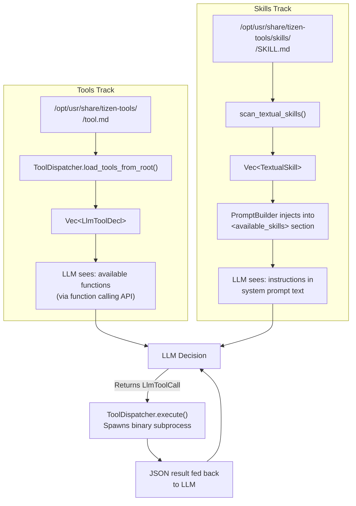
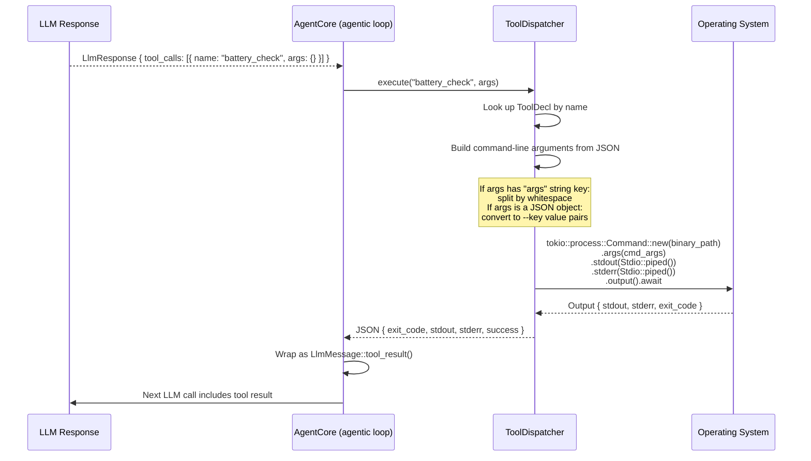

# Tools and Skills Guide

A practical guide to extending TizenClaw with new capabilities. This covers the two-track extensibility architecture: executable **tools** and Markdown **skills**.

---

## 1. Two-Track Architecture

TizenClaw uses two complementary extension mechanisms that serve different purposes and have different deployment characteristics.



**Tools** give the agent new capabilities (the "what") -- they are executable binaries that the LLM can call via function calling. **Skills** teach the agent strategies (the "how") -- they are Markdown documents injected into the system prompt that tell the LLM when and how to use tools.

---

## 2. Creating an Executable Tool

### Directory Structure

Tools live under `/opt/usr/share/tizen-tools/` on the device. Each tool is a directory containing a `tool.md` manifest:

```
/opt/usr/share/tizen-tools/
    battery_check/
        tool.md              # Manifest declaring the tool
    wifi_scan/
        tool.md
    system_info/
        tool.md
```

### The tool.md Manifest

The manifest is a simple key-value file (YAML-like frontmatter) that declares the tool's name, description, binary path, and timeout:

```
name: battery_check
description: "Reports current battery level and charging status"
binary: /usr/bin/battery_check
timeout: 10
```

| Field | Required | Default | Description |
|-------|----------|---------|-------------|
| `name` | No | Directory name | Tool name as seen by the LLM |
| `description` | No | Empty | Natural-language description for the LLM |
| `binary` | No | `/usr/bin/<name>` | Absolute path to the executable |
| `timeout` | No | `30` | Maximum execution time in seconds |

### The ToolDecl Struct

Internally, each tool manifest is parsed into a `ToolDecl` in `src/tizenclaw/src/core/tool_dispatcher.rs` (lines 11-19):

```rust
pub struct ToolDecl {
    pub name: String,
    pub description: String,
    pub parameters: Value,       // JSON Schema for arguments
    pub binary_path: String,     // Absolute path to executable
    pub timeout_secs: u64,
    pub side_effect: String,     // "none", "reversible", or "irreversible"
}
```

The `parameters` field defaults to a generic schema accepting an `args` string:

```json
{"type": "object", "properties": {"args": {"type": "string"}}}
```

This means the LLM can pass arguments as a single string (like CLI arguments) or as a structured JSON object with named fields.

---

## 3. Tool Execution Flow

When the LLM decides to call a tool, `ToolDispatcher::execute()` (`src/tizenclaw/src/core/tool_dispatcher.rs`, lines 139-186) handles the entire execution:



### Argument building

The dispatcher supports two argument formats:

**String arguments** (when args JSON has an `"args"` key):
```json
{"args": "-l --all /tmp"}
```
Splits by whitespace into `["-l", "--all", "/tmp"]`.

**Object arguments** (when args is a JSON object):
```json
{"path": "/tmp", "recursive": true}
```
Converts to `["--path", "/tmp", "--recursive", "true"]`.

### Return format

Every tool execution returns a JSON object:

```json
{
    "exit_code": 0,
    "stdout": "Battery: 87%, charging",
    "stderr": "",
    "success": true
}
```

On failure to spawn the process:

```json
{
    "error": "Failed to execute: No such file or directory"
}
```

---

## 4. The Tool Executor Sandbox

For certain tool calls (particularly `execute_code` and `execute_cli`), TizenClaw routes execution through a separate sandboxed daemon: `tizenclaw-tool-executor` (`src/tizenclaw-tool-executor/src/main.rs`).

### Purpose

The tool executor runs as a separate process, providing isolation between the agent daemon and the actual command execution. This separation means:

- The agent daemon does not need elevated privileges to run tools
- Tool crashes do not bring down the agent
- Process-level auditing is possible via standard OS mechanisms

### SO_PEERCRED Validation

The executor listens on a Linux abstract namespace Unix domain socket (`@tizenclaw-tool-executor.sock`). Before accepting any command, it validates the connecting process using `SO_PEERCRED` (`src/tizenclaw-tool-executor/src/peer_validator.rs`):

```rust
// Reads /proc/{peer_pid}/comm and checks against allowlist
pub fn validate(stream: &UnixStream, allowed: &[&str]) -> bool {
    // ... getsockopt(fd, SOL_SOCKET, SO_PEERCRED, &cred, &len) ...
    let comm_path = format!("/proc/{}/comm", cred.pid);
    let name = std::fs::read_to_string(&comm_path)?;
    allowed.iter().any(|a| *a == name.trim())
}
```

Only processes named `tizenclaw` or `tizenclaw-cli` are allowed to connect. All other callers receive "Permission denied: caller not authorized".

C++ developers: `SO_PEERCRED` is a Linux-specific socket option that returns the PID, UID, and GID of the peer process. Combined with `/proc/{pid}/comm`, it provides a lightweight process authentication mechanism without certificates or tokens.

### Wire Protocol

The protocol uses a simple 4-byte big-endian length prefix followed by a UTF-8 JSON body:

```
[4 bytes: payload length (big-endian)] [N bytes: JSON payload]
```

Maximum payload size: 10 MB (`MAX_PAYLOAD = 10 * 1024 * 1024`).

### Supported Commands

| Command | Fields | Timeout |
|---------|--------|---------|
| `execute_code` | `code`: shell code to run | `CODE_EXEC_TIMEOUT = 15s` (configurable per-request) |
| `execute_cli` | `tool_name`, `arguments` | 10s default |
| `install_package` | `type`, `name` | N/A (not supported in shell mode) |
| `diag` | (none) | Immediate |
| Default | `tool`, `args` -- runs a script from the skills directory | N/A |

### Example Request

```json
{
    "command": "execute_cli",
    "tool_name": "ls",
    "arguments": "-la /opt/usr/data",
    "timeout": 10
}
```

### Example Response

```json
{
    "status": "ok",
    "output": "{\"tool\":\"ls\",\"output\":\"total 8\\ndrwxr-xr-x 2 root root 4096 ...\",\"exit_code\":0,\"timeout\":10}"
}
```

---

## 5. Writing a Textual Skill

Skills are Markdown files that teach the LLM *how* to accomplish tasks. They are injected into the system prompt as text, not compiled or executed.

### SKILL.md Format

A skill lives at `skills/<skill_name>/SKILL.md` under the tools directory. The format uses YAML frontmatter for metadata:

```markdown
---
description: "Clears all system memory caches"
---
When the user asks to clear memory or free up RAM, run `execute_cli` with:
- tool_name: `sh`
- arguments: `-c "echo 3 > /proc/sys/vm/drop_caches"`

Always confirm with the user before running this command, as it requires root privileges
and may briefly impact system performance.
```

### Frontmatter Fields

| Field | Required | Description |
|-------|----------|-------------|
| `description` | No | One-line description shown in the `<available_skills>` list. If omitted, defaults to "Custom skill: `<skill_name>`". |

### Directory Structure

```
/opt/usr/share/tizen-tools/skills/
    clear_cache/
        SKILL.md              <-- This is loaded as a skill
    wifi_diagnostics/
        SKILL.md
    deploy_app/
        SKILL.md
    random_notes.md           <-- IGNORED (loose file, not in a subdirectory)
```

**Security rule**: Only files at `<skills_dir>/<subdirectory>/SKILL.md` are loaded. Loose `.md` files at the root of the skills directory are explicitly ignored. This prevents accidentally loading arbitrary Markdown files (e.g., READMEs, documentation, or user-uploaded content) as agent instructions.

### The TextualSkill Struct

Skills are parsed into `TextualSkill` in `src/tizenclaw/src/core/textual_skill_scanner.rs`:

```rust
pub struct TextualSkill {
    pub file_name: String,       // Skill directory name (e.g., "clear_cache")
    pub absolute_path: String,   // Full path to SKILL.md
    pub description: String,     // From YAML frontmatter or fallback
}
```

---

## 6. How Skills Are Loaded

The `scan_textual_skills()` function in `src/tizenclaw/src/core/textual_skill_scanner.rs` walks the skills directory:

1. Read all entries in the skills root directory
2. For each entry that is a **directory**, check if it contains a `SKILL.md` file
3. If found, read the file and parse the YAML frontmatter to extract the `description` field
4. Return a `Vec<TextualSkill>`

The `SystemPromptBuilder` then injects these into the system prompt during `process_prompt()`:

```rust
// src/tizenclaw/src/core/agent_core.rs, lines 391-396
let textual_skills = crate::core::textual_skill_scanner::scan_textual_skills(&skills_dir);
let formatted_skills = textual_skills.into_iter()
    .map(|s| (s.absolute_path, s.description))
    .collect();
builder = builder.add_available_skills(formatted_skills);
```

The resulting system prompt includes a section like:

```
<available_skills>
- /opt/usr/share/tizen-tools/skills/clear_cache/SKILL.md: Clears all system memory caches
- /opt/usr/share/tizen-tools/skills/wifi_diagnostics/SKILL.md: Diagnoses WiFi connectivity issues
</available_skills>
```

When the LLM sees a user request that matches a skill description, the system prompt instructs it to read the SKILL.md file (using file-reading tools) and follow its instructions. This is a two-step process: the skill listing tells the LLM *which* skill exists, and the LLM reads the full skill content on demand. This keeps the system prompt compact -- only descriptions are included, not full skill bodies.

---

## 7. Hot-Reloading

TizenClaw monitors tool and skill directories for changes using `ToolWatcher` (`src/tizenclaw/src/core/tool_watcher.rs`).

### How it works

The watcher uses filesystem polling (every 3 seconds) rather than inotify, for maximum portability across Tizen device configurations:

1. On startup, record the modification time of every file in the watched directories
2. Every 3 seconds, re-scan and compare modification times
3. If any file is new or has a newer modification time, fire the change callback
4. The callback triggers `AgentCore::reload_tools()`, which reinitializes the `ToolDispatcher`

```rust
// src/tizenclaw/src/core/agent_core.rs, lines 498-505
pub async fn reload_tools(&self) {
    {
        let mut td = self.tool_dispatcher.write().await;
        *td = ToolDispatcher::new();
        td.load_tools_from_root(&self.platform.paths.tools_dir.to_string_lossy());
    }
    log::info!("Tools reloaded from {:?}", self.platform.paths.tools_dir);
}
```

### Zero-downtime updates

Because skills are scanned on every `process_prompt()` call (not cached), skill updates take effect immediately -- no reload needed. For tools, the ToolWatcher detects changes and triggers a reload automatically.

To push a new skill to a running device:

```bash
# From your development machine
sdb push skills/my_new_skill/SKILL.md /opt/usr/share/tizen-tools/skills/my_new_skill/SKILL.md
```

No daemon restart is required. The next user prompt will pick up the new skill.

---

## 8. Step-by-Step: Create Your First Tool

This walkthrough creates a tool that reports device memory usage.

### 1. Create the tool directory on the device

```bash
sdb shell mkdir -p /opt/usr/share/tizen-tools/memory_usage
```

### 2. Write the tool script

Create a file `memory_usage.sh` on your development machine:

```bash
#!/bin/bash
# Reports memory usage in a JSON-friendly format
free -m | awk 'NR==2{printf "{\"total_mb\":%d,\"used_mb\":%d,\"free_mb\":%d,\"usage_percent\":%.1f}", $2,$3,$4,($3/$2)*100}'
```

### 3. Write the tool.md manifest

Create `tool.md` on your development machine:

```
name: memory_usage
description: "Reports current system memory usage including total, used, free memory in MB and usage percentage"
binary: /opt/usr/share/tizen-tools/memory_usage/memory_usage.sh
timeout: 5
```

### 4. Push to the device

```bash
sdb push memory_usage.sh /opt/usr/share/tizen-tools/memory_usage/memory_usage.sh
sdb push tool.md /opt/usr/share/tizen-tools/memory_usage/tool.md
sdb shell chmod +x /opt/usr/share/tizen-tools/memory_usage/memory_usage.sh
```

### 5. Verify the tool loads

The `ToolWatcher` should detect the new files within 3 seconds and reload tools automatically. Check the daemon logs:

```bash
sdb dlog -s tizenclaw
# Look for: "Tools reloaded from ..."
```

### 6. Test it

From the CLI or any connected client:

```
> What is the current memory usage?
```

The LLM should see `memory_usage` in its available tools, call it, parse the JSON output, and present the results in natural language.

### What happens under the hood

1. `ToolDispatcher::load_tools_from_root()` finds `memory_usage/tool.md` and parses it into a `ToolDecl`
2. `get_tool_declarations()` includes `memory_usage` in the `Vec<LlmToolDecl>` sent to the LLM
3. The LLM returns `LlmToolCall { name: "memory_usage", args: {} }`
4. `ToolDispatcher::execute()` spawns `memory_usage.sh` via `tokio::process::Command`
5. The JSON output is captured from stdout and returned to the LLM
6. The LLM interprets the JSON and responds with a human-readable summary

---

## 9. Step-by-Step: Create Your First Skill

This walkthrough creates a skill that teaches the LLM how to diagnose slow device performance.

### 1. Create the skill directory on the device

```bash
sdb shell mkdir -p /opt/usr/share/tizen-tools/skills/performance_check
```

### 2. Write the SKILL.md

Create `SKILL.md` on your development machine:

```markdown
---
description: "Diagnoses slow device performance by checking CPU, memory, and top processes"
---

# Performance Diagnostic Procedure

When the user reports slow performance, lag, or asks "why is my device slow?", follow these steps:

## Step 1: Check memory pressure
Call `execute_cli` with tool_name `free` and arguments `-m`.
If used memory is above 80%, report this as a likely cause.

## Step 2: Check CPU-heavy processes
Call `execute_cli` with tool_name `top` and arguments `-b -n 1 | head -20`.
Identify any process using more than 30% CPU.

## Step 3: Check disk usage
Call `execute_cli` with tool_name `df` and arguments `-h /`.
If usage is above 90%, flag this as a contributing factor.

## Step 4: Summarize findings
Present a clear summary with:
- The most likely cause of slowness
- Specific processes or resources that are stressed
- Recommended actions (e.g., "close app X", "clear cache", "free disk space")

Do NOT suggest restarting the device unless all other options are exhausted.
```

### 3. Push to the device

```bash
sdb push SKILL.md /opt/usr/share/tizen-tools/skills/performance_check/SKILL.md
```

### 4. Verify it loads

Skills are scanned on every prompt, so no restart or reload is needed. You can verify by checking the system prompt in debug logs, or simply by testing.

### 5. Test it

```
> My device feels really slow today, what's going on?
```

The LLM will:
1. See `performance_check` in the `<available_skills>` list
2. Read the full SKILL.md content
3. Follow the multi-step diagnostic procedure
4. Call `execute_cli` three times (free, top, df)
5. Summarize the findings based on the skill's instructions

### What happens under the hood

1. `scan_textual_skills()` finds `performance_check/SKILL.md` and extracts the description
2. `SystemPromptBuilder` adds it to the `<available_skills>` section:
   ```
   - /opt/usr/share/tizen-tools/skills/performance_check/SKILL.md: Diagnoses slow device performance by checking CPU, memory, and top processes
   ```
3. The system prompt instructs the LLM: "If a skill clearly applies, read its .md file and follow it"
4. The LLM reads the SKILL.md content using file-reading capabilities
5. The LLM follows the step-by-step procedure, making tool calls as instructed

### Tips for writing good skills

- **Be specific about which tools to use**: Name exact tool names and argument formats
- **Include decision logic**: Tell the LLM what thresholds or conditions to check
- **Set boundaries**: Explicitly state what NOT to do (like the "do not suggest restarting" line above)
- **Keep it focused**: One skill per task. If a procedure is too broad, split it into multiple skills
- **Use Markdown structure**: Headers, lists, and code blocks help the LLM parse instructions reliably

---

## Summary

| I want to... | Use a... | Key file | Deployment |
|---------------|----------|----------|------------|
| Give the agent a new executable capability | Tool | `<tool_dir>/<name>/tool.md` + binary | Compile + push binary + manifest |
| Teach the agent a new strategy or procedure | Skill | `skills/<name>/SKILL.md` | Push a single Markdown file |
| Load a tool from a shared library | Plugin backend | `.so` with C ABI | Push `.so` + configure |

The tool-skill split means you can iterate on agent behavior (skills) at the speed of editing text files, while reserving the heavier tool deployment process for when the agent needs genuinely new capabilities.
