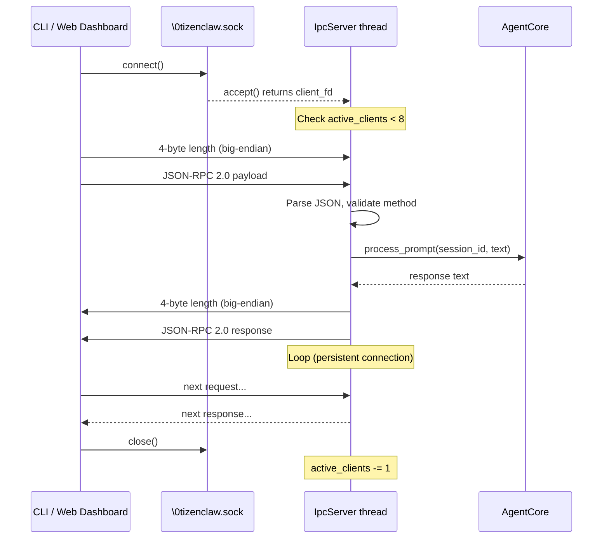

# 07 - Channels and IPC

This guide covers TizenClaw's multi-channel communication architecture: how external clients
connect to the agent daemon, and how you can add new communication channels.

---

## 1. Channel Abstraction

All communication channels in TizenClaw implement a single trait defined in
`src/tizenclaw/src/channel/mod.rs` (lines 23-29):

```rust
pub trait Channel: Send {
    fn name(&self) -> &str;
    fn start(&mut self) -> bool;
    fn stop(&mut self);
    fn is_running(&self) -> bool;
    fn send_message(&self, text: &str) -> Result<(), String>;
}
```

**C++ analogy:** Think of `Channel` as a pure virtual interface class (`IChannel`).
In C++ you might write:

```cpp
class IChannel {
public:
    virtual ~IChannel() = default;
    virtual const char* name() const = 0;
    virtual bool start() = 0;
    virtual void stop() = 0;
    virtual bool is_running() const = 0;
    virtual int send_message(const char* text) = 0;
};
```

### ChannelRegistry

The `ChannelRegistry` (same file, lines 32-117) manages a collection of channels using
dynamic dispatch. It stores them as `Vec<Box<dyn Channel>>` -- the Rust equivalent of
`std::vector<std::unique_ptr<IChannel>>` in C++.

Key operations:

| Method | Description |
|--------|-------------|
| `register(channel)` | Add a channel to the registry |
| `start_all()` | Start every registered channel that is not already running |
| `stop_all()` | Stop every running channel |
| `broadcast(text)` | Send a message to all running channels |
| `send_to(name, text)` | Send a message to a specific channel by name |
| `load_config(path)` | Parse `channel_config.json` and instantiate channels via the factory |

### Auxiliary Types

```rust
pub struct ChannelConfig {
    pub name: String,
    pub channel_type: String,
    pub enabled: bool,
    pub settings: serde_json::Value,
}

pub struct ChannelMessage {
    pub channel_name: String,
    pub sender: String,
    pub text: String,
    pub session_id: String,
    pub metadata: serde_json::Value,
}
```

`ChannelConfig` is deserialized from `channel_config.json`. `ChannelMessage` represents
an inbound message arriving from any channel.

---

## 2. IPC Server (Core Channel)

**Source:** `src/tizenclaw/src/core/ipc_server.rs`

The IPC server is the primary communication path between CLI/web clients and the
`AgentCore`. It uses a **Linux abstract namespace Unix domain socket** -- the address
`\0tizenclaw.sock` (the leading null byte means no filesystem entry is created).

### Key Constants

```rust
const MAX_CONCURRENT_CLIENTS: usize = 8;
const MAX_PAYLOAD_SIZE: usize = 10 * 1024 * 1024; // 10 MB
```

### Wire Protocol

The IPC protocol uses **length-prefixed JSON-RPC 2.0** over the Unix socket:

- **4-byte big-endian length prefix** followed by the JSON payload
- Request: JSON-RPC 2.0 with `method` and `params`
- Response: JSON-RPC 2.0 with `result` or `error`
- Plain text (non-JSON) is accepted as a shortcut -- treated as a raw prompt

### Raw libc Socket Code

The server is built with raw `libc` calls (`socket`, `bind`, `listen`, `accept`,
`recv`, `write`) rather than the Rust standard library's `UnixListener`. This is
because abstract namespace sockets require manual `sockaddr_un` construction with
`sun_path[0] = 0`, which the standard library does not support.

A 1-second `SO_RCVTIMEO` timeout is set on the listening socket so the accept loop
can periodically check the `running` flag and respond to SIGTERM without hanging.

### Sequence Diagram



### Supported JSON-RPC Methods

| Method | Params | Description |
|--------|--------|-------------|
| `prompt` | `session_id`, `text` | Send a prompt to AgentCore |
| `get_usage` | (none) | Retrieve daily token usage statistics |

If the payload is not valid JSON, the server treats it as a **plain text prompt** and
dispatches it directly to `AgentCore::process_prompt()` with session `"default"`.

---

## 3. Web Dashboard

**Source:** `src/tizenclaw/src/channel/web_dashboard.rs`

The web dashboard is an **axum-based HTTP server** registered as a `Channel` implementation.
It is always started on port **9090** (configurable). The setup from `main.rs` (lines 94-112):

```rust
// Always ensure web_dashboard is started on port 9090
let has_dashboard = channel_registry.has_channel("web_dashboard");
if !has_dashboard {
    let web_root = platform.paths.web_root.to_string_lossy().to_string();
    let dashboard_config = channel::ChannelConfig {
        name: "web_dashboard".into(),
        channel_type: "web_dashboard".into(),
        enabled: true,
        settings: serde_json::json!({
            "port": 9090,
            "localhost_only": false,
            "web_root": web_root
        }),
    };
    if let Some(ch) = channel::channel_factory::create_channel(&dashboard_config) {
        channel_registry.register(ch);
    }
}
```

### REST API Endpoints

| Endpoint | Method | Description |
|----------|--------|-------------|
| `/api/status` | GET | Service status |
| `/api/metrics` | GET | Memory, CPU, uptime, thread count |
| `/api/chat` | POST | Forward prompt via internal IPC to AgentCore |
| `/api/sessions` | GET | List conversation sessions |
| `/api/sessions/:id` | GET | Get session detail |
| `/api/tasks` | GET | List scheduled tasks |
| `/api/logs` | GET | Retrieve audit logs by date |
| `/api/auth/login` | POST | Admin authentication (returns bearer token) |
| `/api/config/list` | GET | List editable config files |
| `/api/config/:name` | GET/POST | Read/write config files |
| `/api/apps` | GET | List installed web apps |
| `/.well-known/agent.json` | GET | A2A agent card |

### How Chat Works

The dashboard's `/api/chat` endpoint does **not** call AgentCore directly. Instead, it
connects to the same `\0tizenclaw.sock` IPC socket as an internal client (see
`ipc_send_prompt()` in `web_dashboard.rs`, lines 273-358). This ensures all prompts
flow through a single processing path.

### Static File Serving

Static web assets are served from `PlatformPaths::web_root` (typically
`/opt/usr/share/tizenclaw/web/` on Tizen or `~/.local/share/tizenclaw/web/` on Linux).
Sub-applications are served from `/apps/<app_id>/`.

---

## 4. CLI Integration

**Source:** `src/tizenclaw-cli/src/main.rs`

The `tizenclaw-cli` binary is a standalone IPC client that connects to the daemon
through the same abstract namespace socket.

### Connection Flow

```rust
fn connect_daemon() -> Result<i32, String> {
    // 1. Create AF_UNIX socket
    // 2. Set up sockaddr_un with abstract name "tizenclaw.sock"
    // 3. connect() to the socket
    // 4. Return raw file descriptor
}
```

### Length-Prefixed Protocol

All communication uses the same 4-byte length prefix protocol as the IPC server:

```rust
fn send_payload(fd: i32, data: &str) -> bool {
    // Write 4-byte big-endian length, then the payload bytes
}

fn recv_response(fd: i32) -> String {
    // Read 4-byte length, then read that many bytes
}
```

### Usage Modes

**Single-shot mode** -- pass the prompt as a command-line argument:
```bash
tizenclaw-cli "What is the battery level?"
tizenclaw-cli -s my_session "Run a skill"
tizenclaw-cli --stream "Tell me about Tizen"
```

**Interactive REPL mode** -- no arguments starts a `tizenclaw>` prompt loop:
```
tizenclaw-cli
TizenClaw Interactive CLI (session: cli_test)
Type 'quit' or 'exit' to leave. Type '/help' for commands.

tizenclaw> Hello!
Hello! How can I help you today?
tizenclaw> /usage
{ "prompt_tokens": 300, "completion_tokens": 130, ... }
tizenclaw> quit
```

### CLI Flags

| Flag | Description |
|------|-------------|
| `-s <id>` | Session ID (default: `cli_test`) |
| `--stream` | Enable streaming mode |
| `--usage` | Print daily token usage and exit |
| `-h`, `--help` | Show help |

### Session Management

Each prompt includes a `session_id` in the JSON-RPC params. The CLI defaults to
`"cli_test"` but can be changed with `-s`. The server-side `SessionStore` persists
messages across CLI invocations.

---

## 5. Messaging Channels

### Telegram (`src/tizenclaw/src/channel/telegram_client.rs`)

Long-polling Telegram Bot API client. Uses `getUpdates` with a 2-second timeout and
exponential backoff on errors (5s to 60s). Features:

- Chat ID allowlisting for access control
- Message truncation at Telegram's 4096-char limit
- Markdown fallback to plain text on send failure
- `MAX_CONCURRENT_HANDLERS = 3`
- Configuration: `bot_token` and `allowed_chat_ids` in settings

### Discord (`src/tizenclaw/src/channel/discord_channel.rs`)

Discord bot integration channel. Implements the `Channel` trait for sending and
receiving messages through a Discord bot.

### Slack (`src/tizenclaw/src/channel/slack_channel.rs`)

Slack workspace integration. Implements the `Channel` trait for Slack messaging.

### Webhook (`src/tizenclaw/src/channel/webhook_channel.rs`)

Generic webhook channel for outbound notifications. Sends messages to a configurable
HTTP endpoint via POST requests.

---

## 6. Protocol Channels

### MCP Server (`src/tizenclaw/src/channel/mcp_server.rs`)

Model Context Protocol server implementation. Exposes TizenClaw's tools and capabilities
to MCP-compatible clients.

### MCP Client (`src/tizenclaw/src/channel/mcp_client.rs`)

MCP client that connects to external MCP servers to discover and use remote tools.

### A2A Handler (`src/tizenclaw/src/channel/a2a_handler.rs`)

Agent-to-Agent protocol handler. Implements Google's A2A protocol for inter-agent
communication. The agent card is served at `/.well-known/agent.json` by the web dashboard.

### Voice Channel (`src/tizenclaw/src/channel/voice_channel.rs`)

Voice input/output channel. Handles speech-to-text and text-to-speech integration
for voice-based interaction with the agent.

---

## 7. Channel Configuration

Channels are configured through `channel_config.json`, located at
`PlatformPaths::config_dir` (e.g., `/opt/usr/share/tizenclaw/config/channel_config.json`).

### Schema

```json
{
  "channels": [
    {
      "name": "my_telegram",
      "type": "telegram",
      "enabled": true,
      "settings": {
        "bot_token": "123456:ABC-DEF...",
        "allowed_chat_ids": [12345678]
      }
    },
    {
      "name": "my_webhook",
      "type": "webhook",
      "enabled": true,
      "settings": {
        "url": "https://example.com/hook",
        "method": "POST"
      }
    },
    {
      "name": "web_dashboard",
      "type": "web_dashboard",
      "enabled": true,
      "settings": {
        "port": 9090,
        "localhost_only": false,
        "web_root": "/opt/usr/share/tizenclaw/web"
      }
    }
  ]
}
```

### Loading Flow

`ChannelRegistry::load_config()` in `src/tizenclaw/src/channel/mod.rs` (lines 93-116):

1. Read and parse the JSON file
2. Iterate over the `channels` array
3. For each entry, construct a `ChannelConfig` struct
4. Call `channel_factory::create_channel(&cfg)` to instantiate the channel
5. Register the channel with the registry
6. Log the total number of loaded channels

The factory function in `src/tizenclaw/src/channel/channel_factory.rs` maps the
`channel_type` string to a concrete constructor:

```rust
pub fn create_channel(config: &ChannelConfig) -> Option<Box<dyn Channel + Send + Sync>> {
    match config.channel_type.as_str() {
        "web_dashboard" => Some(Box::new(WebDashboard::new(config))),
        "webhook"       => Some(Box::new(WebhookChannel::new(config))),
        "telegram"      => Some(Box::new(TelegramClient::new(config))),
        "discord"       => Some(Box::new(DiscordChannel::new(config))),
        "slack"         => Some(Box::new(SlackChannel::new(config))),
        "voice"         => Some(Box::new(VoiceChannel::new(config))),
        "a2a"           => Some(Box::new(A2aHandler::new(config))),
        _ => None,
    }
}
```

---

## 8. Adding a New Channel

Follow these steps to add a custom channel (e.g., a Matrix chat integration):

### Step 1: Create the Source File

Create `src/tizenclaw/src/channel/matrix_channel.rs`:

```rust
use super::{Channel, ChannelConfig};

pub struct MatrixChannel {
    name: String,
    running: std::sync::atomic::AtomicBool,
    // ... your fields
}

impl MatrixChannel {
    pub fn new(config: &ChannelConfig) -> Self {
        MatrixChannel {
            name: config.name.clone(),
            running: std::sync::atomic::AtomicBool::new(false),
        }
    }
}

impl Channel for MatrixChannel {
    fn name(&self) -> &str { &self.name }

    fn start(&mut self) -> bool {
        // Start your polling thread / listener
        self.running.store(true, std::sync::atomic::Ordering::SeqCst);
        true
    }

    fn stop(&mut self) {
        self.running.store(false, std::sync::atomic::Ordering::SeqCst);
    }

    fn is_running(&self) -> bool {
        self.running.load(std::sync::atomic::Ordering::SeqCst)
    }

    fn send_message(&self, text: &str) -> Result<(), String> {
        // Send message to Matrix room
        Ok(())
    }
}
```

### Step 2: Register the Module

Add the module to `src/tizenclaw/src/channel/mod.rs`:

```rust
pub mod matrix_channel;
```

### Step 3: Add to the Factory

Add a match arm in `src/tizenclaw/src/channel/channel_factory.rs`:

```rust
"matrix" => Some(Box::new(super::matrix_channel::MatrixChannel::new(config))),
```

### Step 4: Add Configuration

Add an entry to `channel_config.json`:

```json
{
  "name": "my_matrix",
  "type": "matrix",
  "enabled": true,
  "settings": {
    "homeserver": "https://matrix.org",
    "room_id": "!abc:matrix.org",
    "access_token": "..."
  }
}
```

### Step 5: Build and Test

```bash
cargo build
# Test locally, then deploy to device
./deploy.sh
```

The `ChannelRegistry` will automatically discover and start your channel at boot time.
