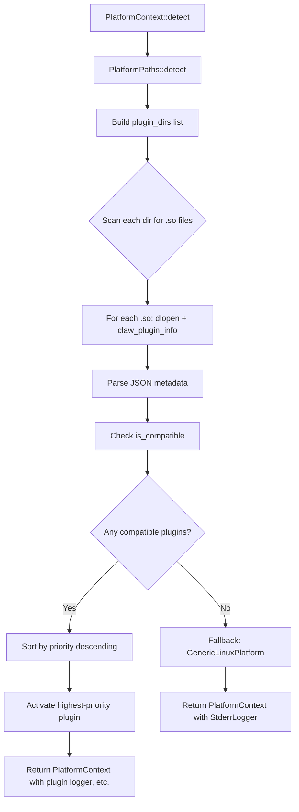

# 08 - Platform Abstraction and FFI

This guide covers TizenClaw's platform abstraction layer, the plugin system that bridges
Tizen-specific APIs into Rust, and the C-ABI client library for embedding TizenClaw in
native Tizen applications.

---

## 1. Platform Abstraction Layer

**Source:** `src/libtizenclaw/src/lib.rs` (lines 36-59)

Every platform capability is expressed as a Rust trait. The daemon never calls Tizen APIs
directly -- it calls these trait methods, and the active platform plugin provides the
concrete implementation.

**C++ analogy:** This is similar to a COM interface hierarchy. Each trait is a pure virtual
class, and the platform plugin is a DLL that implements all of them behind a single factory.

### Core Traits

```rust
/// Core platform plugin trait.
/// Every platform plugin (Tizen, Ubuntu, etc.) implements this.
pub trait PlatformPlugin: Send + Sync {
    fn platform_name(&self) -> &str;
    fn plugin_id(&self) -> &str;
    fn version(&self) -> &str { "1.0.0" }
    fn priority(&self) -> u32 { 0 }
    fn is_compatible(&self) -> bool { true }
    fn initialize(&mut self) -> bool { true }
    fn shutdown(&mut self) {}
}
```

### Supporting Traits

| Trait | Purpose | C++ Equivalent |
|-------|---------|---------------|
| `PlatformLogger` | Log routing (dlog on Tizen, stderr on Linux) | `ILogger` |
| `SystemInfoProvider` | OS version, device profile, battery, network | `ISystemInfo` |
| `PackageManagerProvider` | List/query installed packages | `IPackageManager` |
| `AppControlProvider` | Launch apps, list running apps | `IAppControl` |
| `SystemEventProvider` | Monitor system events | `IEventMonitor` |

```rust
pub trait PlatformLogger: Send + Sync {
    fn log(&self, level: LogLevel, tag: &str, msg: &str);
}

pub trait SystemInfoProvider: Send + Sync {
    fn get_os_version(&self) -> Option<String>;
    fn get_device_profile(&self) -> serde_json::Value;
    fn get_battery_level(&self) -> Option<u32> { None }
    fn is_network_available(&self) -> bool { /* TCP probe to 8.8.8.8 */ }
}

pub trait PackageManagerProvider: Send + Sync {
    fn list_packages(&self) -> Vec<PackageInfo>;
    fn get_package_info(&self, pkg_id: &str) -> Option<PackageInfo>;
    fn is_installed(&self, pkg_id: &str) -> bool { ... }
}

pub trait AppControlProvider: Send + Sync {
    fn launch_app(&self, app_id: &str) -> Result<(), String>;
    fn list_running_apps(&self) -> Vec<String> { vec![] }
}
```

### GenericLinuxPlatform

When no Tizen plugin is present (e.g., during local development on Ubuntu), the
`GenericLinuxPlatform` in `src/libtizenclaw/src/generic_linux.rs` provides stub
implementations for all traits. It has `priority = 0` so any real plugin will override it.

---

## 2. PlatformContext Singleton

**Source:** `src/libtizenclaw/src/lib.rs` (lines 140-195)

`PlatformContext` is the single object that holds the active platform and all its
capabilities. It is created once at daemon boot via `PlatformContext::detect()`.

```rust
pub struct PlatformContext {
    pub platform: Box<dyn PlatformPlugin>,
    pub logger: Arc<dyn PlatformLogger>,
    pub system_info: Box<dyn SystemInfoProvider>,
    pub package_manager: Box<dyn PackageManagerProvider>,
    pub app_control: Box<dyn AppControlProvider>,
    pub paths: PlatformPaths,
}
```

### Detection Flow



The detection algorithm:

1. Determine `PlatformPaths` (environment vars, then Tizen paths, then XDG defaults)
2. Build a list of plugin directories to scan
3. For each `.so` file found, call `claw_plugin_info()` to get JSON metadata
4. Filter to compatible plugins (`is_compatible() == true`)
5. Sort by `priority` (highest wins -- Tizen plugin uses `priority: 100`)
6. Attempt to activate the best plugin
7. If no plugin matches, fall back to `GenericLinuxPlatform`

---

## 3. Plugin Loader

**Source:** `src/libtizenclaw/src/loader.rs`

The plugin loader uses `libloading` (a safe wrapper around `dlopen`/`dlsym`) to
discover and load platform plugins at runtime.

### Plugin ABI Contract

Every `.so` plugin must export two C functions:

```c
// Returns a JSON string describing the plugin's capabilities.
// The caller must free the returned string with claw_plugin_free_string().
const char* claw_plugin_info();

// Free a string returned by claw_plugin_info().
void claw_plugin_free_string(const char* s);
```

The JSON returned by `claw_plugin_info()` must conform to this schema:

```json
{
  "plugin_id": "tizen",
  "platform_name": "Tizen",
  "version": "1.0.0",
  "priority": 100,
  "capabilities": ["logging", "system_info", "package_manager", "app_control"]
}
```

Optional additional symbol for logging:

```c
// Platform-specific log function (dlog on Tizen)
void claw_plugin_log(int level, const char* tag, const char* message);
```

### Discovery Directories

The loader scans these directories in order:

1. `$TIZENCLAW_DATA_DIR/plugins` (user/env override)
2. `/usr/lib/tizenclaw/plugins` (system-wide)
3. `/usr/local/lib/tizenclaw/plugins` (local builds)
4. `/opt/usr/share/tizenclaw/plugins` (Tizen production)

### PluginMeta

After probing each `.so`, the loader constructs a `PluginMeta` struct:

```rust
pub struct PluginMeta {
    pub plugin_id: String,
    pub platform_name: String,
    pub version: String,
    pub priority: u32,
    pub capabilities: Vec<String>,
    pub so_path: PathBuf,
}
```

Plugins are sorted by `priority` descending. The first compatible plugin is activated.

---

## 4. PlatformPaths

**Source:** `src/libtizenclaw/src/paths.rs`

`PlatformPaths` resolves filesystem locations for all TizenClaw data, configuration,
tools, and assets. The detection priority:

1. **Environment variables** (`TIZENCLAW_DATA_DIR`, `TIZENCLAW_TOOLS_DIR`)
2. **Tizen standard paths** (if `/opt/usr/share/tizenclaw` or `/etc/tizen-release` exists)
3. **XDG-compliant Linux paths** (`~/.local/share/tizenclaw`)

### Path Fields

| Field | Tizen | Linux Development |
|-------|-------|-------------------|
| `data_dir` | `/opt/usr/share/tizenclaw` | `~/.local/share/tizenclaw` |
| `config_dir` | `.../config` | `.../config` |
| `tools_dir` | `/opt/usr/share/tizen-tools` | `.../tools` |
| `skills_dir` | `.../skills` | `.../skills` |
| `plugins_dir` | `.../plugins` | `.../plugins` |
| `web_root` | `.../web` | `.../web` |
| `workflows_dir` | `.../workflows` | `.../workflows` |
| `llm_plugins_dir` | `.../plugins/llm` | `.../plugins/llm` |

### Key Methods

```rust
impl PlatformPaths {
    pub fn detect() -> Self;              // Auto-detect paths
    pub fn from_base(base: PathBuf) -> Self;  // Build from custom base
    pub fn ensure_dirs(&self);            // Create all directories if missing
    pub fn sessions_db_path(&self) -> PathBuf; // data_dir / "sessions.db"
    pub fn app_data_dir(&self) -> PathBuf;     // Writable data area
}
```

On Tizen, `app_data_dir()` returns `/opt/usr/data/tizenclaw` (a separate writable
partition), while `data_dir` points to `/opt/usr/share/tizenclaw` (shared assets).

---

## 5. tizen-sys FFI Bindings

**Source:** `src/tizen-sys/src/lib.rs`

This crate provides raw C FFI bindings to Tizen-specific APIs. General-purpose libraries
(HTTP, JSON, SQLite) use standard Rust crates instead.

### Bound Modules

| Module | Tizen C API | Purpose |
|--------|-------------|---------|
| `dlog` | `dlog_print()` | Tizen system logging |
| `tizen_core` | `tizen_core_init()`, task management | Main loop integration |
| `vconf` | `vconf_get_str()`, `vconf_set_int()` | Device configuration store |
| `pkgmgr` | `pkgmgr_client_new()`, `pkgmgr_client_listen_status()` | Package manager events |
| `app_control` | `app_control_create()`, `app_control_send_launch_request()` | Launch/control apps |
| `app_event` | `event_add_event_handler()` | System event callbacks |
| `system_info` | `system_info_get_platform_string()` | Device info queries |
| `alarm` | `alarm_schedule_after_delay()` | Scheduled tasks |
| `bundle` | `bundle_create()`, `bundle_add_str()` | Data bundles for IPC |
| `soup` | `soup_server_*` | libsoup HTTP (legacy, replaced by axum) |

### The mock-sys Feature

Every extern block has a `#[cfg(feature = "mock-sys")]` counterpart that provides
no-op stub implementations:

```rust
#[cfg(not(feature = "mock-sys"))]
extern "C" {
    pub fn dlog_print(prio: c_int, tag: *const c_char, fmt: *const c_char, ...) -> c_int;
}

#[cfg(feature = "mock-sys")]
#[no_mangle]
pub unsafe extern "C" fn dlog_print(prio: c_int, tag: *const c_char, fmt: *const c_char) -> c_int {
    let tag_str = std::ffi::CStr::from_ptr(tag).to_string_lossy();
    let fmt_str = std::ffi::CStr::from_ptr(fmt).to_string_lossy();
    println!("[MOCK DLOG {}] [{}] {}", prio, tag_str, fmt_str);
    0
}
```

This allows the workspace crates to compile and run tests on a standard Linux
workstation without Tizen development headers or libraries installed. The mock
stubs print to stdout so you can verify the correct calls are being made.

---

## 6. C-ABI Client Library

**Source:** `src/libtizenclaw-client/` (Rust) and `src/libtizenclaw-client/include/tizenclaw.h` (C header)

`libtizenclaw-client` is a shared library (`.so`) that exposes TizenClaw's full agent
functionality through a stable C ABI. Tizen C/C++ applications link against it.

### Header: tizenclaw.h

```c
#include <tizenclaw/tizenclaw.h>

// Opaque handle
typedef struct tizenclaw_s *tizenclaw_h;

// Error codes
typedef enum {
    TIZENCLAW_ERROR_NONE = 0,
    TIZENCLAW_ERROR_INVALID_PARAMETER = -1,
    TIZENCLAW_ERROR_OUT_OF_MEMORY = -2,
    TIZENCLAW_ERROR_NOT_INITIALIZED = -3,
    TIZENCLAW_ERROR_LLM_FAILED = -6,
    TIZENCLAW_ERROR_TOOL_FAILED = -7,
    // ...
} tizenclaw_error_e;
```

### API Walkthrough

```c
tizenclaw_h agent;

// 1. Create the agent handle
int ret = tizenclaw_create(&agent);

// 2. Initialize (loads config, LLM backends, tools)
ret = tizenclaw_initialize(agent);

// 3. Process a prompt synchronously
char *response = tizenclaw_process_prompt(agent, "session1", "What time is it?");
printf("Response: %s\n", response);

// 4. Free the returned string (allocated by Rust)
tizenclaw_free_string(response);

// 5. Process asynchronously (non-blocking)
tizenclaw_process_prompt_async(agent, "session1", "Long task...",
                                my_callback, user_data);

// 6. Check last error if needed
const char *err = tizenclaw_last_error();

// 7. Destroy the agent
tizenclaw_destroy(agent);
```

### Thread Safety

The opaque handle wraps `Arc<Mutex<HandleInner>>` in Rust. Multiple C threads can
call API functions concurrently on the same handle -- the mutex serializes access.

### Additional APIs

| Function | Description |
|----------|-------------|
| `tizenclaw_get_status(h)` | Get agent status as JSON string |
| `tizenclaw_get_metrics(h)` | Get system metrics as JSON string |
| `tizenclaw_get_tools(h)` | List available tools as JSON array |
| `tizenclaw_execute_tool(h, name, args)` | Execute a tool directly |
| `tizenclaw_reload_skills(h)` | Force reload of skill manifests |
| `tizenclaw_clear_session(h, sid)` | Clear a session's conversation history |
| `tizenclaw_start_dashboard(h, port)` | Start the web dashboard |
| `tizenclaw_last_error()` | Get thread-local last error message |

---

## 7. SDK for Plugin Developers

**Source:** `src/libtizenclaw-sdk/`

The SDK provides C headers and a helper library for third parties building custom
LLM backends or channel plugins as `.so` shared libraries.

### SDK Headers

| Header | Purpose |
|--------|---------|
| `tizenclaw_llm_backend.h` | LLM backend plugin interface |
| `tizenclaw_channel.h` | Channel plugin interface |
| `tizenclaw_curl.h` | HTTP helper (ureq-backed curl-like API) |
| `tizenclaw_error.h` | Shared error codes |

### LLM Backend Plugin

To build a custom LLM backend (e.g., a proprietary on-device model), implement the
functions declared in `tizenclaw_llm_backend.h`:

- Handle types: `tizenclaw_llm_response_h`, `tizenclaw_llm_messages_h`, `tizenclaw_llm_tool_h`
- Streaming callback: `tizenclaw_llm_backend_chunk_cb`
- Tool call iteration: `tizenclaw_llm_tool_call_cb`

### Channel Plugin

To build a custom channel plugin, implement the functions in `tizenclaw_channel.h`:

```c
bool TIZENCLAW_CHANNEL_INITIALIZE(const char* config_json);
const char* TIZENCLAW_CHANNEL_GET_NAME(void);
bool TIZENCLAW_CHANNEL_START(tizenclaw_channel_prompt_cb cb, void* user_data);
void TIZENCLAW_CHANNEL_STOP(void);
bool TIZENCLAW_CHANNEL_SEND(const char* text);
```

### curl_wrapper Module

`src/libtizenclaw-sdk/src/curl_wrapper.rs` provides a curl-like C API backed by the
`ureq` Rust HTTP client, so plugin developers do not need to link against libcurl.

---

## 8. Tizen Infrastructure Adapters

These modules in `src/tizenclaw/src/infra/` bridge Tizen platform services into the
agent's event system.

### dbus_probe.rs

**Purpose:** Safely check whether the D-Bus system bus is accessible.

Uses `fork()` to run the probe in a child process, protecting against `SIGABRT` from
`libdbuspolicy1` (which can crash the daemon if the policy database is corrupt). The
probe checks socket accessibility at `/run/dbus/system_bus_socket`. Result is cached
atomically so subsequent calls return instantly.

### app_lifecycle_adapter.rs

**Purpose:** Monitor Tizen app lifecycle events (launched, terminated, paused, resumed).

Wraps the `capi-appfw-event` API. Delivers `AppEvent` values through a callback:

```rust
pub enum AppEvent {
    Launched { app_id: String },
    Terminated { app_id: String },
    Paused { app_id: String },
    Resumed { app_id: String },
}
```

### package_event_adapter.rs

**Purpose:** Monitor package install/uninstall/update events.

Uses the `pkgmgr_client` API to listen for package manager events. Delivers
`PackageEvent` values containing the package ID, event type, and metadata.

### health_monitor.rs

**Purpose:** Track system resource usage.

Reads `/proc/meminfo` and `/proc/loadavg` to provide a `HealthStatus` snapshot:

```rust
pub struct HealthStatus {
    pub memory_used_kb: u64,
    pub memory_total_kb: u64,
    pub cpu_load_percent: f64,
    pub uptime_secs: u64,
}
```

This data feeds the `/api/metrics` endpoint on the web dashboard.
