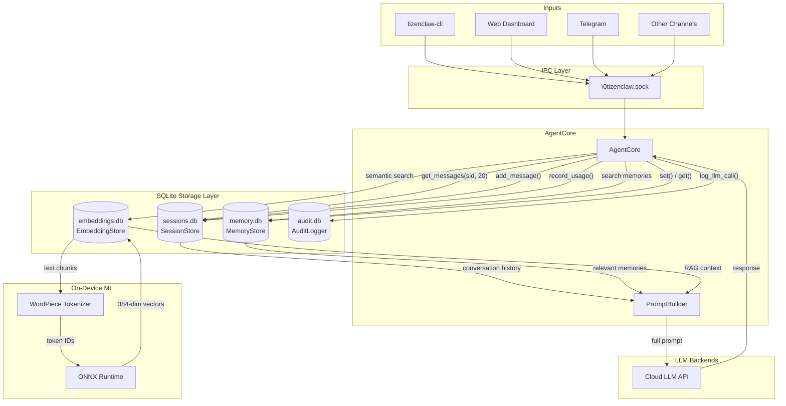

# 09 - Storage and Memory

This guide covers TizenClaw's persistence layer: SQLite databases for sessions, long-term
memory, vector embeddings, and audit logging. All storage is designed for embedded devices
with limited RAM and flash storage.

---

## 1. SQLite Foundation

**Source:** `src/tizenclaw/src/storage/sqlite.rs`

TizenClaw uses SQLite as its sole persistence engine. This choice is deliberate for
embedded/Tizen deployment:

- **No external service:** No PostgreSQL or MySQL daemon to manage on a TV or watch
- **Single-file databases:** Easy to back up, migrate, or reset
- **Bundled from source:** The `rusqlite` crate compiles SQLite from C source via the
  `bundled` feature, so there is no dependency on the system's SQLite version
- **WAL mode:** Write-Ahead Logging enables concurrent readers alongside a single writer,
  which is critical when the IPC server, web dashboard, and agent core all access the
  database simultaneously

### Database Opening

```rust
pub fn open_database(path: &str) -> SqliteResult<Connection> {
    let conn = Connection::open(path)?;
    conn.execute_batch(
        "PRAGMA journal_mode=WAL;
         PRAGMA busy_timeout=5000;
         PRAGMA foreign_keys=ON;",
    )?;
    Ok(conn)
}
```

Every database connection is opened with three PRAGMAs:

| PRAGMA | Value | Why |
|--------|-------|-----|
| `journal_mode` | `WAL` | Concurrent reads while writing |
| `busy_timeout` | 5000ms | Wait 5 seconds on lock contention instead of failing immediately |
| `foreign_keys` | `ON` | Enforce referential integrity |

The `SessionStore` adds `PRAGMA synchronous=NORMAL` for a small write-speed improvement
at the cost of durability in a power-loss scenario (acceptable for conversation data).

---

## 2. Session Store

**Source:** `src/tizenclaw/src/storage/session_store.rs`

The session store persists conversation history across daemon restarts and across
different channels (CLI, web, Telegram, etc.).

### SQL Schema

```sql
CREATE TABLE IF NOT EXISTS sessions (
    id TEXT PRIMARY KEY,
    created_at TEXT DEFAULT (datetime('now')),
    updated_at TEXT DEFAULT (datetime('now'))
);

CREATE TABLE IF NOT EXISTS messages (
    id INTEGER PRIMARY KEY AUTOINCREMENT,
    session_id TEXT NOT NULL,
    role TEXT NOT NULL,        -- 'user', 'assistant', 'system'
    content TEXT NOT NULL,
    timestamp TEXT DEFAULT (datetime('now')),
    FOREIGN KEY(session_id) REFERENCES sessions(id)
);

CREATE TABLE IF NOT EXISTS token_usage (
    id INTEGER PRIMARY KEY AUTOINCREMENT,
    session_id TEXT NOT NULL,
    prompt_tokens INTEGER DEFAULT 0,
    completion_tokens INTEGER DEFAULT 0,
    model TEXT DEFAULT '',
    timestamp TEXT DEFAULT (datetime('now'))
);

CREATE INDEX IF NOT EXISTS idx_messages_session ON messages(session_id);
CREATE INDEX IF NOT EXISTS idx_usage_session ON token_usage(session_id);
CREATE INDEX IF NOT EXISTS idx_usage_timestamp ON token_usage(timestamp);
```

### Key Operations

**Session creation** -- `ensure_session()` uses `INSERT OR IGNORE` so it is idempotent:

```rust
pub fn ensure_session(&self, session_id: &str) {
    let _ = self.db.execute(
        "INSERT OR IGNORE INTO sessions (id) VALUES (?1)",
        params![session_id],
    );
}
```

**Message append** -- `add_message()` wraps the insert, session creation, and timestamp
update in a single `BEGIN IMMEDIATE`/`COMMIT` transaction to avoid multiple fsync calls
(saves 10-30ms per message on flash storage):

```rust
pub fn add_message(&self, session_id: &str, role: &str, content: &str) {
    let _ = self.db.execute_batch("BEGIN IMMEDIATE");
    // INSERT OR IGNORE session
    // INSERT message
    // UPDATE sessions.updated_at
    let _ = self.db.execute_batch("COMMIT");
}
```

**History retrieval** -- `get_messages()` fetches the most recent N messages for a session,
ordered chronologically. The query uses `ORDER BY id DESC LIMIT ?2` then reverses the
result in Rust to get oldest-first ordering:

```rust
pub fn get_messages(&self, session_id: &str, limit: usize) -> Vec<SessionMessage> {
    // SELECT role, content, timestamp FROM messages
    // WHERE session_id = ?1 ORDER BY id DESC LIMIT ?2
    // Then reverse the Vec
}
```

### Context Window

`AgentCore` calls `get_messages(session_id, 20)` to retrieve the last 20 messages when
building the LLM prompt. This `MAX_CONTEXT_MESSAGES = 20` window keeps the prompt size
bounded while providing enough conversational context. Older messages are still stored in
the database and can be retrieved through the web dashboard.

---

## 3. Token Usage Tracking

**Source:** `src/tizenclaw/src/storage/session_store.rs` (lines 118-162)

Every LLM API call records its token consumption:

```rust
pub fn record_usage(
    &self,
    session_id: &str,
    prompt_tokens: i32,
    completion_tokens: i32,
    model: &str,
) {
    // INSERT INTO token_usage (session_id, prompt_tokens, completion_tokens, model)
}
```

### Aggregation Methods

**Per-session usage:**

```rust
pub fn load_token_usage(&self, session_id: &str) -> TokenUsage
// Returns: total_prompt_tokens, total_completion_tokens, total_requests
```

**Daily usage** (used by the `/api/metrics` endpoint and `tizenclaw-cli --usage`):

```rust
pub fn load_daily_usage(&self, date: &str) -> TokenUsage
// If date is empty, uses today's date: date('now')
// Aggregates across all sessions for that day
```

The `TokenUsage` struct:

```rust
pub struct TokenUsage {
    pub total_prompt_tokens: i64,
    pub total_completion_tokens: i64,
    pub total_requests: i64,
    pub entries: Vec<Value>,
}
```

Per-model tracking is available through the `model` column in `token_usage`. The IPC
`get_usage` method exposes this data to CLI and web clients.

---

## 4. Memory Store

**Source:** `src/tizenclaw/src/storage/memory_store.rs`

The memory store provides **long-term key-value memory** that persists across sessions.
This powers the agent's "remember" and "forget" tools -- the LLM can explicitly store
facts that should survive session boundaries.

### SQL Schema

```sql
CREATE TABLE IF NOT EXISTS memories (
    key TEXT PRIMARY KEY,
    value TEXT NOT NULL,
    category TEXT DEFAULT 'general',
    created_at TEXT DEFAULT (datetime('now')),
    updated_at TEXT DEFAULT (datetime('now'))
);

CREATE INDEX IF NOT EXISTS idx_mem_category ON memories(category);
```

### Operations

| Method | Description |
|--------|-------------|
| `set(key, value, category)` | Store or overwrite a memory (uses `INSERT OR REPLACE`) |
| `get(key)` | Retrieve a memory by exact key |
| `get_by_category(category, limit)` | List memories in a category, most recently updated first |
| `search(query, limit)` | Fuzzy search across keys and values using `LIKE %query%` |
| `delete(key)` | Remove a memory |

### Example Usage

When a user says "Remember that my favorite color is blue", the agent's `remember` tool
calls:

```rust
memory_store.set("user_favorite_color", "blue", "preferences");
```

In a later session, when building the system prompt, the agent can retrieve relevant
memories:

```rust
let prefs = memory_store.get_by_category("preferences", 10);
// Returns: [("user_favorite_color", "blue"), ...]
```

---

## 5. Embedding Store

**Source:** `src/tizenclaw/src/storage/embedding_store.rs`

The embedding store provides vector storage for **Retrieval-Augmented Generation (RAG)**.
It stores text chunks alongside their vector embeddings, enabling semantic search.

### SQL Schema

```sql
CREATE TABLE IF NOT EXISTS embeddings (
    id INTEGER PRIMARY KEY AUTOINCREMENT,
    source TEXT NOT NULL,
    chunk_text TEXT NOT NULL,
    embedding BLOB,
    created_at DATETIME DEFAULT CURRENT_TIMESTAMP
);

CREATE INDEX IF NOT EXISTS idx_emb_source ON embeddings(source);
```

### How Semantic Search Works

1. **Ingestion:** Documents are split into ~500-character chunks and stored in the
   `embeddings` table. The `source` field records where each chunk came from.

2. **Knowledge databases:** External SQLite databases can be registered via
   `register_knowledge_db()`. These are lazily attached via SQLite's `ATTACH DATABASE`
   when a search is performed.

3. **Search:** Currently uses `LIKE %query%` text matching across the main database
   and all attached knowledge databases, combined with `UNION ALL`. Results are limited
   to `top_k` entries.

4. **Cleanup:** After each search, attached databases are immediately detached to
   reclaim memory and file handles -- important on memory-constrained embedded devices.

### Key Methods

```rust
impl EmbeddingStore {
    pub fn initialize(&mut self, db_path: &str) -> bool;
    pub fn register_knowledge_db(&mut self, path: &str);
    pub fn ingest(&self, source: &str, text: &str) -> Result<usize, String>;
    pub fn search(&self, query: &str, top_k: usize) -> Vec<Value>;
    pub fn close(&mut self);
}
```

---

## 6. On-Device Embeddings

**Source:** `src/tizenclaw/src/core/on_device_embedding.rs` and
`src/tizenclaw/src/core/wordpiece_tokenizer.rs`

TizenClaw can generate vector embeddings locally without any cloud API, using the
**all-MiniLM-L6-v2** model in ONNX format.

### ONNX Runtime Integration

The embedding engine loads ONNX Runtime via `dlopen` (not a compile-time dependency),
allowing graceful fallback if the library is not installed:

```rust
pub const EMBEDDING_DIM: usize = 384;

const DEFAULT_ORT_LIB_PATH: &str = "/usr/lib/libonnxruntime.so";
```

The ORT C API types (OrtEnv, OrtSession, OrtValue, etc.) are declared as opaque
repr(C) structs and accessed through function pointers loaded at runtime.

### WordPiece Tokenizer

`wordpiece_tokenizer.rs` implements a BERT-compatible tokenizer that:

1. Loads a `vocab.txt` file
2. Tokenizes input text into WordPiece tokens
3. Produces `input_ids`, `attention_mask`, and `token_type_ids` tensors

```rust
pub struct TokenizedInput {
    pub input_ids: Vec<i64>,
    pub attention_mask: Vec<i64>,
    pub token_type_ids: Vec<i64>,
}

pub struct WordPieceTokenizer {
    vocab: HashMap<String, i64>,
    cls_id: i64,
    sep_id: i64,
    unk_id: i64,
    pad_id: i64,
}
```

This eliminates any cloud dependency for the embedding pipeline -- the entire
tokenize-embed-search flow runs on-device.

---

## 7. Audit Logger

**Source:** `src/tizenclaw/src/storage/audit_logger.rs`

The audit logger records security-relevant and operational events to a separate
SQLite database.

### SQL Schema

```sql
CREATE TABLE IF NOT EXISTS audit_events (
    id INTEGER PRIMARY KEY AUTOINCREMENT,
    event_type TEXT NOT NULL,
    session_id TEXT DEFAULT '',
    details TEXT DEFAULT '{}',
    timestamp TEXT DEFAULT (datetime('now'))
);

CREATE INDEX IF NOT EXISTS idx_audit_type ON audit_events(event_type);
CREATE INDEX IF NOT EXISTS idx_audit_ts ON audit_events(timestamp);
```

### Event Types

| Method | Event Type | Details |
|--------|-----------|---------|
| `log_ipc_auth()` | `ipc_auth` | `{uid, pid, allowed}` |
| `log_tool_exec()` | `tool_exec` | `{tool, exit_code}` |
| `log_llm_call()` | `llm_call` | `{backend, prompt_tokens, completion_tokens}` |

The web dashboard serves audit logs through `/api/logs` and `/api/logs/dates` endpoints,
reading from date-partitioned markdown files in the `audit/` directory.

---

## 8. Data Flow Diagram



### Database File Locations

All database files reside under `PlatformPaths::data_dir`:

| File | Store | Purpose |
|------|-------|---------|
| `sessions.db` | SessionStore | Conversations + token usage |
| `memory.db` | MemoryStore | Long-term agent memories |
| `embeddings.db` | EmbeddingStore | RAG vector storage |
| `audit.db` | AuditLogger | Security and operational events |

The `sessions_db_path()` method on `PlatformPaths` returns the canonical path for the
sessions database. Other stores follow the same pattern of opening their database file
from the data directory.
