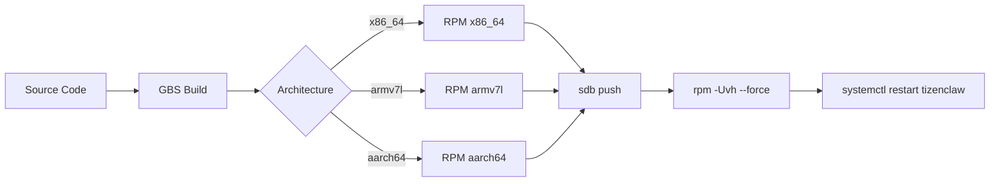
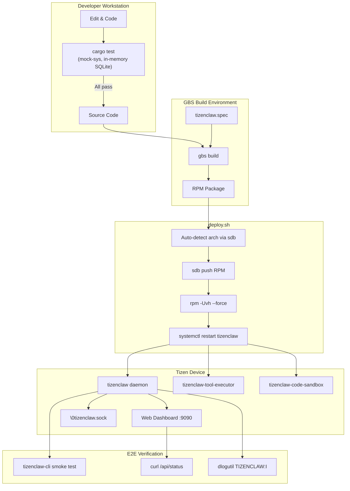

# 10 - Build, Test, and Deploy

This guide covers how to build TizenClaw from source, run tests locally, cross-compile
for Tizen devices via GBS, and deploy to target hardware.

---

## 1. Prerequisites

| Tool | Version | Purpose |
|------|---------|---------|
| Rust toolchain | 1.83+ | Compiler and cargo |
| `sdb` | Tizen Studio | Device communication (like Android's `adb`) |
| GBS | Tizen GBS | Cross-compilation and RPM packaging |
| Tizen emulator | (optional) | Test without physical hardware |

Install Rust:
```bash
curl --proto '=https' --tlsv1.2 -sSf https://sh.rustup.rs | sh
```

The `sdb` tool is part of Tizen Studio. The deploy script auto-detects it in common
install locations (`~/tizen-studio/tools`, `/opt/tizen-studio/tools`).

---

## 2. Workspace Structure

**Source:** `Cargo.toml` (root)

TizenClaw is organized as a Cargo workspace with 6 members and 2 excluded crates:

```toml
[workspace]
resolver = "2"
members = [
    "src/libtizenclaw",
    "src/tizenclaw",
    "src/tizenclaw-cli",
    "src/libtizenclaw-client",
    "src/libtizenclaw-sdk",
    "src/tizenclaw-tool-executor",
]
exclude = ["src/tizen-sys", "src/tizenclaw-core"]

[profile.release]
opt-level = "s"    # Optimize for size (embedded devices)
panic = "abort"    # Smaller binary (no unwinding tables)
```

### Crate Roles

| Crate | Type | Description |
|-------|------|-------------|
| `libtizenclaw` | Library | Platform abstraction layer, plugin loader, paths |
| `tizenclaw` | Binary | Main daemon (AgentCore, channels, storage, LLM) |
| `tizenclaw-cli` | Binary | CLI tool for interacting with the daemon via IPC |
| `libtizenclaw-client` | cdylib | C-ABI shared library for Tizen C/C++ apps |
| `libtizenclaw-sdk` | cdylib | SDK for third-party LLM backend and channel plugins |
| `tizenclaw-tool-executor` | Binary | Sandboxed tool execution service |

### Excluded Crates

| Crate | Why Excluded |
|-------|-------------|
| `tizen-sys` | Built separately via GBS; requires Tizen headers |
| `tizenclaw-core` | Built separately via GBS for Tizen deployment |

These crates are excluded from the default workspace build because they depend on
Tizen-specific C libraries that are only available in the GBS build environment.

### Release Profile

```toml
[profile.release]
opt-level = "s"    # Optimize for size (not speed) -- critical for flash storage
panic = "abort"    # No unwinding tables -- saves ~100KB per binary
# lto = true       # Disabled: causes undefined references in armv7l GCC ld
# codegen-units = 1 # Disabled: interferes with cross-language linking on ARM
```

The commented-out optimizations were disabled due to specific cross-compilation issues
on Tizen armv7l targets.

---

## 3. Local Development (Mock-Sys)

For day-to-day development on a standard Linux workstation (Ubuntu, Fedora, etc.),
you do not need Tizen Studio or a physical device.

### Building Locally

```bash
# Debug build (all workspace members)
cargo build

# Release build
cargo build --release
```

The `libtizenclaw` crate detects the platform at runtime. On non-Tizen systems,
`PlatformContext::detect()` falls back to `GenericLinuxPlatform`, which uses stderr
logging, `/proc`-based system info, and XDG-compliant paths.

### Running Tests

```bash
# Run all tests
cargo test

# Run tests for a specific crate
cargo test -p tizenclaw

# Run a specific test
cargo test -p tizenclaw test_add_and_get_messages
```

### What the mock-sys Feature Gates

The `mock-sys` feature (on the `tizen-sys` crate) replaces all Tizen C FFI extern
blocks with no-op stub functions that print to stdout:

- `dlog_print()` prints `[MOCK DLOG]` messages
- `app_control_*()` functions return success (0)
- `pkgmgr_client_*()` functions return null pointers
- `vconf_*()` functions return default values

### What You CAN Test Locally

- Session store operations (uses in-memory SQLite with `:memory:`)
- Prompt building and system prompt construction
- Textual skill scanning (uses `tempfile` for filesystem fixtures)
- Channel registry lifecycle
- Memory store operations
- Embedding store ingestion and search
- JSON-RPC message parsing
- Token usage tracking

### What Requires a Device

- Actual LLM API calls (need API keys configured)
- Tizen package manager integration
- D-Bus system bus probing
- App lifecycle event monitoring
- dlog output verification
- Full end-to-end IPC with real socket connections

---

## 4. Cross-Compilation via GBS

**Source:** `deploy.sh`

GBS (Git Build System) is the standard Tizen build tool. It creates an RPM package
inside a chroot environment with the correct cross-compilation toolchain.

### Supported Targets

| Architecture | Devices |
|-------------|---------|
| `x86_64` | Tizen emulator, some reference boards |
| `armv7l` | Older Tizen devices (32-bit ARM) |
| `aarch64` | Modern Tizen devices (64-bit ARM) |

### Build Flow



### How deploy.sh Works

The deploy script automates the full pipeline:

1. **Auto-detect architecture:** Queries the connected device via `sdb` to determine
   the target architecture
2. **Load repo config:** Reads `repo_config.ini` for Tizen package repository URLs
3. **GBS build:** Runs `gbs build` with the appropriate architecture flags
4. **Locate RPM:** Finds the built RPM in the GBS output directory
5. **Push to device:** Uses `sdb push` to transfer the RPM
6. **Install:** Runs `rpm -Uvh --force --nodeps` on the device
7. **Restart services:** `systemctl restart tizenclaw`

---

## 5. Deploy Script Reference

**Source:** `deploy.sh`

### Usage Patterns

```bash
# Full pipeline: build + deploy + restart
./deploy.sh

# Skip build, deploy previously built RPM
./deploy.sh -s

# Faster rebuild (skip GBS init)
./deploy.sh -n

# Preview commands without executing
./deploy.sh --dry-run

# Target a specific device (when multiple are connected)
./deploy.sh -d DEVICE_SERIAL

# Build, deploy, and run E2E smoke tests
./deploy.sh --test
```

### All Flags

| Flag | Description |
|------|-------------|
| `-s` | Skip build, deploy only (use previously built RPM) |
| `-n`, `--noinit` | Skip GBS init for faster incremental rebuilds |
| `--dry-run` | Print commands without executing them |
| `-d <serial>` | Target a specific sdb device by serial number |
| `--test` | Run E2E smoke tests after deploy |
| `-a <arch>` | Override architecture auto-detection |
| `--debug` | Build with debug symbols |
| `--with-ngrok` | Include ngrok tunnel support |
| `--with-crun` | Include container runtime |
| `--with-assets` | Deploy web dashboard assets |
| `--with-bridge` | Include bridge mode |
| `--rag <dir>` | Include RAG knowledge from a project directory |

### sdb Wrapper

The script wraps `sdb` commands to support the `-d` device serial flag:

```bash
sdb_cmd() {
  if [ -n "${DEVICE_SERIAL}" ]; then
    sdb -s "${DEVICE_SERIAL}" "$@"
  else
    sdb "$@"
  fi
}
```

---

## 6. Systemd Units

TizenClaw runs as a set of systemd services on the device.

### tizenclaw.service

**Source:** `packaging/tizenclaw.service`

```ini
[Unit]
Description=TizenClaw Agent System Service
After=network.target

[Service]
Type=simple
EnvironmentFile=-/run/tizen-system-env
EnvironmentFile=-/run/xdg-root-env
ExecStart=/usr/bin/tizenclaw
Restart=on-failure
User=root
AmbientCapabilities=CAP_SYS_ADMIN CAP_MAC_ADMIN CAP_NET_ADMIN CAP_SYS_PTRACE CAP_SETUID CAP_SETGID CAP_SYS_CHROOT
LimitCORE=infinity
TimeoutStopSec=5
KillMode=mixed

[Install]
WantedBy=multi-user.target
```

The `mixed` kill mode sends SIGTERM to the main process and SIGKILL to remaining
processes after `TimeoutStopSec`. The daemon's signal handler sets the `RUNNING` flag
to false, triggering graceful shutdown.

### tizenclaw-tool-executor.service

**Source:** `packaging/tizenclaw-tool-executor.service`

```ini
[Unit]
Description=TizenClaw Tool Executor
Requires=tizenclaw-tool-executor.socket
After=tizenclaw-tool-executor.socket

[Service]
Type=simple
ExecStart=/usr/bin/tizenclaw-tool-executor
User=root
Restart=on-failure
RestartSec=3
```

Socket-activated via `tizenclaw-tool-executor.socket`:

```ini
[Socket]
ListenStream=@tizenclaw-tool-executor.sock
SocketMode=0600
Accept=no
```

### tizenclaw-code-sandbox.service

**Source:** `packaging/tizenclaw-code-sandbox.service`

```ini
[Unit]
Description=TizenClaw Code Execution Sandbox
Requires=tizenclaw-code-sandbox.socket
After=tizenclaw-code-sandbox.socket

[Service]
Type=simple
ExecStart=/usr/libexec/tizenclaw/tizenclaw_secure_container.sh start
ExecStop=/usr/libexec/tizenclaw/tizenclaw_secure_container.sh stop
Restart=on-failure
RestartSec=3
User=root
```

Socket-activated via `tizenclaw-code-sandbox.socket`:

```ini
[Socket]
ListenStream=@tizenclaw-code-sandbox.sock
SocketMode=0600
Accept=no
```

All sockets use the abstract namespace (the `@` prefix), matching the IPC server's
`\0tizenclaw.sock` convention.

---

## 7. Writing Tests

### Test Module Pattern

Rust tests live alongside production code in `#[cfg(test)] mod tests` blocks. This
means test code is compiled only when running `cargo test`, never in release builds.

**Example from `src/tizenclaw/src/core/prompt_builder.rs`:**

```rust
#[cfg(test)]
mod tests {
    use super::*;

    #[test]
    fn test_default_prompt_builder() {
        let builder = SystemPromptBuilder::new();
        let prompt = builder.build();
        assert!(prompt.contains("You are TizenClaw"));
        assert!(prompt.contains("(No tools currently loaded)"));
    }

    #[test]
    fn test_soul_injection() {
        let prompt = SystemPromptBuilder::new()
            .set_soul_content("I am a helpful assistant.".into())
            .build();
        assert!(prompt.contains("## Persona (SOUL.md)"));
        assert!(prompt.contains("I am a helpful assistant."));
    }

    #[test]
    fn test_tool_and_skill_injection() {
        let prompt = SystemPromptBuilder::new()
            .add_tool_names(vec!["tool_a".into(), "tool_b".into()])
            .add_available_skills(vec![("skills/test/SKILL.md".into(), "A skill".into())])
            .build();
        assert!(prompt.contains("- tool_a"));
        assert!(!prompt.contains("(No tools currently loaded)"));
    }
}
```

### Filesystem Fixtures with tempfile

**Example from `src/tizenclaw/src/core/textual_skill_scanner.rs`:**

```rust
#[cfg(test)]
mod tests {
    use super::*;
    use std::fs;

    #[test]
    fn test_scan_textual_skills_valid() {
        let dir = tempfile::tempdir().unwrap();
        let skill_dir = dir.path().join("hello_world");
        fs::create_dir_all(&skill_dir).unwrap();
        fs::write(
            skill_dir.join("SKILL.md"),
            "---\ndescription: \"A test skill\"\n---\n# Hello\nBody text",
        ).unwrap();

        let skills = scan_textual_skills(&dir.path().to_string_lossy());
        assert_eq!(skills.len(), 1);
        assert_eq!(skills[0].file_name, "hello_world");
        assert_eq!(skills[0].description, "A test skill");
    }

    #[test]
    fn test_ignores_loose_markdown_files() {
        let dir = tempfile::tempdir().unwrap();
        fs::write(dir.path().join("cli tool.md"), "# Not a skill").unwrap();
        let skills = scan_textual_skills(&dir.path().to_string_lossy());
        assert_eq!(skills.len(), 0);
    }
}
```

### In-Memory SQLite for Storage Tests

The `SessionStore` and `MemoryStore` accept `:memory:` as a database path,
creating an in-memory SQLite database that requires no filesystem cleanup:

```rust
#[cfg(test)]
mod tests {
    use super::*;

    fn inmemory_store() -> SessionStore {
        SessionStore::new(":memory:").expect("Failed to create in-memory DB")
    }

    #[test]
    fn test_add_and_get_messages() {
        let store = inmemory_store();
        store.add_message("s1", "user", "Hello");
        store.add_message("s1", "assistant", "Hi there!");
        let msgs = store.get_messages("s1", 10);
        assert_eq!(msgs.len(), 2);
        assert_eq!(msgs[0].role, "user");
    }

    #[test]
    fn test_record_and_load_usage() {
        let store = inmemory_store();
        store.record_usage("s1", 100, 50, "gpt-4");
        store.record_usage("s1", 200, 80, "gpt-4");
        let usage = store.load_token_usage("s1");
        assert_eq!(usage.total_prompt_tokens, 300);
        assert_eq!(usage.total_requests, 2);
    }
}
```

---

## 8. E2E Testing on Device

After deploying with `./deploy.sh`, you can run end-to-end tests on the device.

### Basic Connectivity

```bash
# Check if the daemon is running
sdb shell systemctl status tizenclaw

# View daemon logs (Tizen dlog)
sdb shell dlogutil TIZENCLAW:I

# View daemon logs (journalctl)
sdb shell journalctl -u tizenclaw -f
```

### CLI Smoke Test

```bash
# Send a simple ping
sdb shell tizenclaw-cli "ping"

# Check token usage
sdb shell tizenclaw-cli --usage

# Interactive session
sdb shell tizenclaw-cli
```

### Web Dashboard Test

```bash
# Check if the web dashboard is responding
sdb shell curl -s http://localhost:9090/api/status
# Expected: {"status":"running","version":"1.0.0","channels":"active"}

# Check metrics
sdb shell curl -s http://localhost:9090/api/metrics
```

### Automated E2E Tests

The `--test` flag on deploy.sh runs a smoke test suite after deployment:

```bash
./deploy.sh --test
```

This typically:
1. Checks that the service started successfully
2. Sends a test prompt via `tizenclaw-cli`
3. Verifies the web dashboard responds on port 9090
4. Reports pass/fail status

---

## 9. Debugging

### Logging

**On Tizen:** Logs go through `dlog` via the platform plugin. View with:
```bash
sdb shell dlogutil TIZENCLAW:I
```

**On Linux (development):** Logs go to stderr via the `StderrLogger`. The standard
`log` crate macros are used everywhere:

```rust
log::info!("Channel '{}' started", channel_name);
log::error!("Failed to connect: {}", err);
log::debug!("Parsed payload: {:?}", payload);
```

The logging bridge in `src/tizenclaw/src/common/logging.rs` routes all `log::*` macro
calls through the platform logger, so the same code produces dlog output on Tizen
and stderr output on Linux.

### Common Failure Modes

| Symptom | Cause | Fix |
|---------|-------|-----|
| "Failed to bind IPC socket" | Another instance is running | `systemctl stop tizenclaw` |
| "Failed to connect to daemon" | Daemon not running | `systemctl start tizenclaw` |
| "No platform plugin found" | Plugin .so not in search path | Check `/usr/lib/tizenclaw/plugins/` |
| "DB open: unable to open" | Data directory does not exist | Run `paths.ensure_dirs()` or create manually |
| LTO build errors on armv7l | GCC linker plugin issue | Keep `lto = true` commented out in Cargo.toml |
| "Max concurrent clients reached" | More than 8 simultaneous IPC connections | Check for leaked socket connections |
| Web dashboard "bind failed" | Port 9090 already in use | Change port in `channel_config.json` |

### Inspecting the Database

```bash
# On the device
sdb shell sqlite3 /opt/usr/share/tizenclaw/sessions.db ".tables"
sdb shell sqlite3 /opt/usr/share/tizenclaw/sessions.db "SELECT COUNT(*) FROM messages"
sdb shell sqlite3 /opt/usr/share/tizenclaw/sessions.db "SELECT * FROM token_usage ORDER BY timestamp DESC LIMIT 5"
```

---

## 10. Build Pipeline Diagram



### Summary of the Full Cycle

1. **Edit** code on your workstation
2. **Test locally** with `cargo test` (uses mock-sys and in-memory SQLite)
3. **Build RPM** with `gbs build` (cross-compiles for the target architecture)
4. **Deploy** with `./deploy.sh` (pushes RPM, installs, restarts services)
5. **Verify** with CLI smoke tests, web dashboard checks, and dlog output
6. **Debug** failures using dlog, journalctl, or direct SQLite inspection
