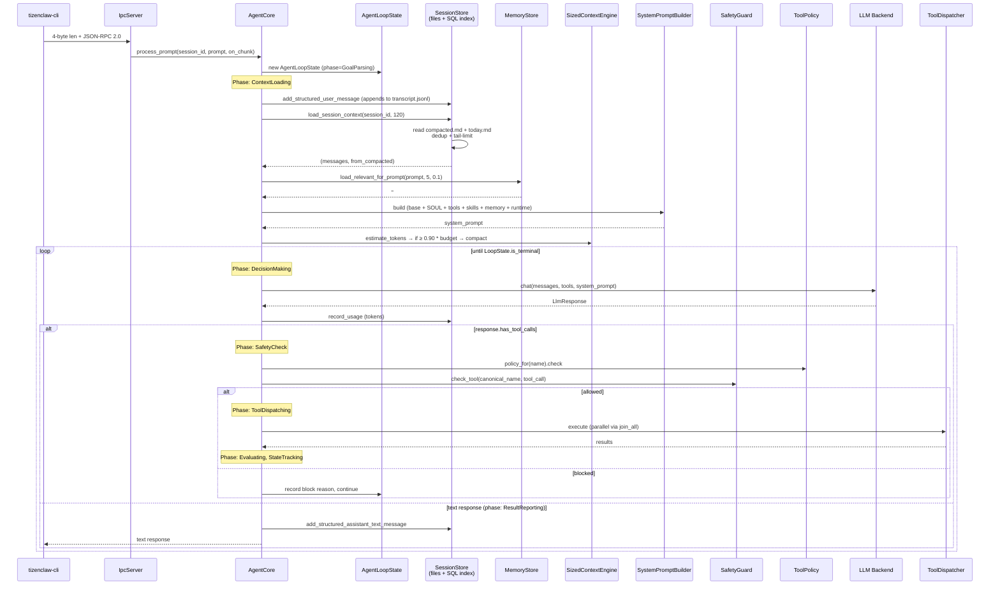
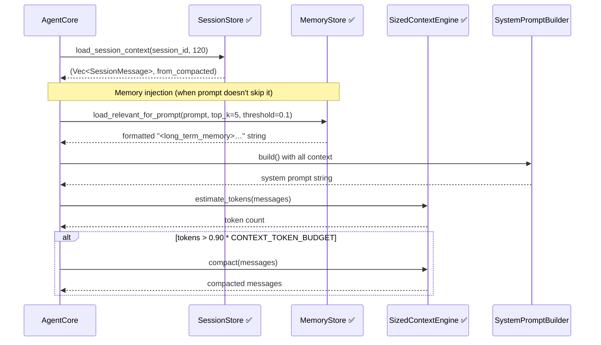

# 11 — Memory & Session Lifecycle (Deep Dive)

> Integration Status Badges (used throughout this document)
> - ✅ **Integrated** — wired into `AgentCore::process_prompt()`
> - ⚠️ **Built, not wired** — struct/impl exists but no call sites in the agent loop
> - 🔧 **Stub** — skeleton only
> - 🚧 **Planned** — documented intent only

---

## Overview

TizenClaw ships with **multiple storage subsystems**, and — as of the April 2026 merge — most of them are now wired into the agent's prompt-building loop. `SessionStore` (file-based, SQLite index) and `MemoryStore` are both active in `AgentCore::process_prompt()`. The former `EmbeddingStore` / `OnDeviceEmbedding` pair has been absorbed into `MemoryStore`, and `UserProfileStore` has been superseded by a per-session `SessionPromptProfile` map. `ContextFusionEngine` has been replaced by `SizedContextEngine`.

This document traces the end-to-end memory flow through the agent and **explicitly marks what runs in production today vs. what is still planned**. Read it alongside `docs_detailed/09_STORAGE_AND_MEMORY.md` (which covers the storage APIs themselves) — this one focuses on the *runtime lifecycle*.

The subsystems today:

| Subsystem | Purpose | Status |
|---|---|---|
| **SessionStore** (file-based + `session_index.db`) | Conversation history (on-disk .md/.jsonl) + token accounting (SQLite index) | ✅ Integrated |
| **MemoryStore** (`memory/memories.db` + ONNX models) | Long-term facts + on-device embedding search | ✅ Integrated |
| **SizedContextEngine** | Token-aware compaction of the in-memory conversation window | ✅ Integrated |
| **SessionPromptProfile** (per-session role overrides) | Session-scoped role/prompt overrides held in `AgentCore.session_profiles` | ✅ Integrated |
| Full multi-user `UserProfileStore` (role-driven tool filters) | Global user-profile store with role-based tool gating | 🚧 Planned |

---

## 1. What Is a Session?

A **session** is a string ID identifying a conversation. There is no `Session` struct, no authentication, no session object with behaviour — it is the primary key of a row in the `session_index` table **and** a directory name on disk under `{base_dir}/sessions/{session_id}/`. The on-disk directory holds the canonical conversation content (see §2); the SQLite index only carries `(id, created_at, last_active)` plus token accounting.

- **Creation is implicit.** There is no `start_session` IPC method. The first time the agent sees a `session_id`, the store creates its directory on demand and issues `INSERT OR REPLACE INTO session_index (id, created_at, last_active) …` (`src/tizenclaw/src/storage/session_store.rs:389`).
- **Persistence is automatic.** File + SQLite storage is durable; sessions survive daemon restarts, reboots, and app updates (as long as the data dir is preserved).
- **No timeout / no expiry.** Sessions live forever unless you manually delete the directory and the matching row. `clear_session(session_id)` / `clear_all()` helpers now exist for this (see §10).
- **Sharing is unrestricted.** Multiple callers (web dashboard, CLI, a Telegram channel, the MQTT bridge) can all use the same `session_id` and will see the same history. This is useful for multi-surface continuity but dangerous if you mix contexts.
- **Typical IDs seen in the codebase:** `"default"` (CLI fallback), `"user-telegram-12345"`, `"web-sse-abc"`. Namespacing is a client-side convention, not enforced.
- **Each session has an on-disk workdir:** `{base_dir}/sessions/{session_id}/` holds `{date}.md`, `transcript.jsonl`, `compacted.md`, and `compacted.jsonl`. See §2.

---

## 2. Session Storage Layout ✅ Integrated

Sessions are now **file-first**: the SQLite database only carries an index plus token accounting. The canonical conversation content lives under `{base_dir}/sessions/{session_id}/` as markdown and JSONL files.

### 2.1 Per-session directory layout

```
{base_dir}/sessions/
└── {session_id}/
    ├── compacted.md         ← compact snapshot (atomic overwrite on compaction)
    ├── compacted.jsonl      ← structured compaction snapshot (preserves tool-call history)
    ├── transcript.jsonl     ← append-only structured transcript
    ├── 2026-04-01.md        ← day-1 conversation (append-only)
    ├── 2026-04-02.md        ← day-2 conversation
    └── 2026-04-22.md        ← today's conversation (active append target)
```

See the doc comment at the top of `src/tizenclaw/src/storage/session_store.rs` for the full load strategy.

### 2.2 SQLite index schema (`session_index.db`)

Only two tables remain, defined at `src/tizenclaw/src/storage/session_store.rs:297-312`:

```sql
CREATE TABLE IF NOT EXISTS session_index (
    id TEXT PRIMARY KEY,
    created_at TEXT NOT NULL,
    last_active TEXT NOT NULL
);
CREATE TABLE IF NOT EXISTS token_usage (
    id INTEGER PRIMARY KEY AUTOINCREMENT,
    session_id TEXT NOT NULL,
    date TEXT NOT NULL,
    model TEXT NOT NULL,
    prompt_tokens INTEGER DEFAULT 0,
    completion_tokens INTEGER DEFAULT 0,
    cache_creation_input_tokens INTEGER DEFAULT 0,
    cache_read_input_tokens INTEGER DEFAULT 0
);
```

Note the new **Anthropic prompt-cache columns**: `cache_creation_input_tokens` and `cache_read_input_tokens`. The `ensure_token_usage_columns()` migration (line 947) adds these columns in-place for older on-disk databases.

The former `messages` table is gone — conversation content is no longer in SQL.

### 2.3 Atomic compaction writes

When `SizedContextEngine` compacts the in-memory message list, the caller persists the result via `save_compacted()`. The file is written atomically (`compacted.tmp` → `rename` + `sync_all`) to protect against partial writes on flash. The same pattern is used for `compacted.jsonl`.

### 2.4 Load-time dedup

On `load_session_context(session_id, limit)`:
1. If `compacted.md` exists → use it as the base context snapshot.
2. Load today's `{date}.md` for messages since the compaction.
3. Deduplicate, tail-limit to `limit`, return `(Vec<SessionMessage>, from_compacted: bool)`.
4. If no `compacted.md` → load all historical day-files up to `limit`.

---

## 3. Session Creation Sequence (end-to-end)

What actually happens when a user types `"what's my battery?"` into `tizenclaw-cli`, now driven by the 15-phase `AgentLoopState` state machine (`core/agent_loop_state.rs`):



Key observations:

- The system prompt is **rebuilt from scratch on every single user turn** (see `core/agent_core/process_prompt.rs`). The Gemini prompt-hash cache (`prompt_hash: tokio::sync::RwLock<u64>` on `AgentCore`) memoises the hash so that identical prompts reuse backend-side prompt caches, but the assembled string is rebuilt each turn. This is intentional: it lets skills be hot-reloaded and SOUL/system-prompt files be edited without a daemon restart taking effect.
- `record_usage` fires on **every LLM response**, including intermediate tool-call responses within a single user turn. A single `process_prompt` call may write 3-10 `token_usage` rows.
- The **15 phases** (`AgentPhase`) in the loop: `GoalParsing → ContextLoading → (pre-loop compaction) → DecisionMaking → SafetyCheck → ToolDispatching → ObservationCollect → Evaluating → ErrorRecovery → StateTracking → SelfInspection → RePlanning → TerminationCheck → ResultReporting`.
- The assistant's final text is appended to `{date}.md` and `transcript.jsonl` via `add_structured_assistant_text_message` (see §2.1). Intermediate tool-call turns are also written to `transcript.jsonl` (structured), so full replay is available from disk — no audit log needed.

---

## 4. What Gets Pulled Into a Prompt TODAY ✅

This section walks through `AgentCore::process_prompt()` in `src/tizenclaw/src/core/agent_core/process_prompt.rs`. Every item below is actually happening in production right now.

| Context item | Source | Code reference |
|---|---|---|
| Conversation history (last 120) ✅ | `SessionStore::load_session_context(session_id, MAX_CONTEXT_MESSAGES)` | `core/agent_core.rs:79-90` (constants) + `process_prompt.rs` (context load phase) |
| Tool declarations ✅ | `tool_dispatcher.read().await.get_tool_declarations()` | `process_prompt.rs` (decision phase) |
| Base system prompt ✅ | `config_dir/system_prompt.txt` (or hardcoded default) | `runtime_core_impl.rs` init |
| SOUL.md persona ✅ (optional) | `config_dir/SOUL.md` if present | `runtime_core_impl.rs` init |
| Textual skills ✅ | `TextualSkillScanner::scan_textual_skills(skills_dir)` / cached via `skill_capability_manager` | `core/skill_capability_manager.rs` |
| Runtime context ✅ | `platform.platform_name()`, `backend_name`, `data_dir` | `runtime_capabilities.rs` |
| **Long-term memory ✅** | `memory_store.load_relevant_for_prompt(prompt, 5, 0.1)` — injected as `<long_term_memory>` block | `process_prompt.rs:443-463` |
| **Token-aware compaction ✅** | `SizedContextEngine` compacts when estimated tokens ≥ `CONTEXT_COMPACT_THRESHOLD` of budget | `core/context_engine.rs` |

The constants governing the window size (`core/agent_core.rs:79-90`):

```rust
const MAX_CONTEXT_MESSAGES: usize = 120;     // was 20
const CONTEXT_TOKEN_BUDGET: usize = 0;       // 0 = unlimited
const CONTEXT_COMPACT_THRESHOLD: f32 = 0.90; // compact when usage ≥ 90% of budget
const MAX_PREFETCHED_SKILLS: usize = 3;
```

Note that `MAX_TOOL_ROUNDS` has moved to `AgentLoopState::DEFAULT_MAX_TOOL_ROUNDS = 0` (`core/agent_loop_state.rs:207`). A value of `0` means **no default cap** on tool rounds; session-level overrides are applied via `session_profile.max_iterations`.

### 4.1 Memory integration — the actual code

From `process_prompt.rs:443-463`:

```rust
if literal_json_output || should_skip_memory_for_prompt(prompt) {
    loop_state.record_prefetch_memory(None);
} else if let Ok(ms) = self.memory_store.lock() {
    if let Some(store) = ms.as_ref() {
        let mem_str = store.load_relevant_for_prompt(prompt, 5, 0.1);
        if !mem_str.is_empty() {
            let memory_context = format!(
                "## Context from Long-Term Memory\n<long_term_memory>\n{}\n</long_term_memory>",
                mem_str
            );
            // injected into messages
        }
    }
}
```

The memory hop is skipped when `literal_json_output` is on (tool-call JSON modes where extra context would pollute the output) or when `should_skip_memory_for_prompt(prompt)` returns true (see the helper for skip heuristics — typically short interactive prompts).

### Assembly inside `SystemPromptBuilder::build()`

From `src/tizenclaw/src/core/prompt_builder.rs:61-133`, the final prompt is assembled in a fixed order:

```rust
pub fn build(self) -> String {
    let mut lines = Vec::new();

    // 1. Identity
    lines.push(self.base_prompt);
    lines.push("".into());

    // Optional Soul Persona Injection
    if let Some(soul) = self.soul_content {
        lines.push("## Persona (SOUL.md)".into());
        lines.push("Embody the following persona and tone. ...".into());
        lines.push(soul);
        lines.push("".into());
    }

    // 2. Tooling Constraints & Execution Rules
    lines.push("## Tooling".into());
    lines.push("Tool availability (filtered by policy):".into());
    lines.push("Tool names are case-sensitive. Call tools exactly as listed.".into());
    for t in &self.tool_declarations {
        lines.push(format!("- {}", t));
    }
    // ...

    // 3. Safety (Anthropic-style boundaries)
    // 4. Memory & Skills Reference (including <available_skills> block)
    // 5. Platform Runtime Metadata

    lines.join("\n")
}
```

Important: the builder **only injects tool *names***, not full declarations. The full JSON-schema tool declarations are passed to the LLM backend as a separate `tools: &[LlmToolDecl]` argument (`agent_core.rs:411`), not inlined into the system prompt text. The names in the prompt are for the LLM's *awareness* — the calling schema is negotiated through the backend's tool-calling protocol.

---

## 5. What's Still Planned (post-merge) 🚧

Most of the subsystems previously listed here have landed. The list below reflects what is **still** outstanding.

### 5.1 MemoryStore ✅ (moved to §4)

Now integrated — see §4.1 for the actual code location (`process_prompt.rs:443-463`) and skip conditions. The former "substring LIKE" search has been replaced by on-device embedding similarity bundled inside `MemoryStore::load_relevant_for_prompt(prompt, top_k, threshold)`. The old `EmbeddingStore` and `OnDeviceEmbedding` modules have been absorbed into `MemoryStore` (ONNX models live under `{base_dir}/models/`).

### 5.2 SessionPromptProfile ✅ (per-session role override)

The former `UserProfileStore` has been replaced by a per-session override map on `AgentCore`:

```rust
session_profiles: Mutex<HashMap<String, SessionPromptProfile>>
```

This holds session-scoped prompt/role overrides (including `max_iterations` which acts as a per-session tool-round cap) instead of a global user-profile store. It is written via the session-profile update IPC path and read at prompt-build time.

### 5.3 Full multi-user UserProfileStore 🚧 (still planned)

The ambition of a global multi-user profile store with role-driven **tool-filter-level** enforcement (e.g. blocking `reboot` for `role = "child"`) is still planned. Today, role enforcement is handled by `ToolPolicy` / `SafetyGuard` (see `13_SAFETY_AND_POLICY.md`) but there is no user-identity store feeding them — role gating remains session-shaped, not user-shaped.

### 5.4 ContextFusionEngine — superseded

The former `ContextFusionEngine` has been superseded by `SizedContextEngine` (`core/context_engine.rs`), which provides token-aware compaction with a `DEFAULT_TOOL_RESULT_BUDGET_CHARS = 4_000` cap on per-tool-result inline length. See §4 and §6.

---

## 6. Memory Retrieval Sequence — current (all wired)



All interactions above run on every user turn. Note the skip guard for memory injection (§4.1): `literal_json_output` and `should_skip_memory_for_prompt(prompt)` each short-circuit the `MemoryStore` hop.

---

## 7. Storage Layer Map

All storage locations at a glance:

| Path | Store module | Purpose | Integration |
|---|---|---|---|
| `{base_dir}/sessions/{session_id}/*.md,*.jsonl` | `storage::session_store::SessionStore` | Conversation history (file-based, per-session dirs) | ✅ |
| `{base_dir}/session_index.db` | `storage::session_store::SessionStore` | `session_index` + `token_usage` (with Anthropic cache columns) | ✅ |
| `{base_dir}/memory/memories.db` + `{base_dir}/models/*.onnx` | `storage::memory_store::MemoryStore` | Long-term facts with on-device embedding similarity (ONNX MiniLM) | ✅ |
| `{base_dir}/audit/*` | `storage::audit_logger::AuditLogger` | Security events, tool exec, LLM calls | ⚠️ Optional |

Note: the separate `embeddings.db` file no longer exists as its own database — the embedding-store concept has been absorbed into `MemoryStore`, which holds both the metadata rows and the ONNX models in adjacent locations.

### Where these files live on disk (via `PlatformPaths`)

From `src/libtizenclaw/src/paths.rs`:

- **Tizen**: `/opt/usr/share/tizenclaw/` — sessions under `sessions/`, SQLite index alongside. Note: `app_data_dir()` remaps to `/opt/usr/data/tizenclaw` for Tizen-specific file-based dashboard storage.
- **Linux dev**: `$XDG_DATA_HOME/tizenclaw/` (default `$HOME/.local/share/tizenclaw/`).
- **Override:** `TIZENCLAW_DATA_DIR` env var wins over both.

So on a typical developer laptop you will find `$HOME/.local/share/tizenclaw/sessions/{session_id}/…`. On a deployed TV you will find `/opt/usr/share/tizenclaw/sessions/{session_id}/…`.

---

## 8. Token Usage Tracking ✅

Token accounting is **production-active**. The flow (all in `src/tizenclaw/src/storage/session_store.rs`):

- **`record_usage(session_id, prompt_tokens, completion_tokens, model)`** at lines 118-124 — one `INSERT` per LLM response.
- **`load_token_usage(session_id)`** at lines 126-140 — sums `prompt_tokens`, `completion_tokens`, and counts requests for one session via `SUM` + `COUNT`.
- **`load_daily_usage(date)`** at lines 142-162 — aggregates across all sessions for a given date (empty string means today).

**Call site:** `src/tizenclaw/src/core/agent_core.rs:428-437`, inside the agentic loop **after every LLM response** (not just the final one). A single user prompt that triggers 3 tool-call rounds produces 3 rows in `token_usage`.

**Exposed via IPC:** the `get_usage` JSON-RPC method lives at `src/tizenclaw/src/core/ipc_server.rs:200-211`:

```rust
"get_usage" => {
    if let Some(ss_ref) = agent.get_session_store() {
        let usage = ss_ref.store().load_daily_usage("");
        json!({
            "prompt_tokens": usage.total_prompt_tokens,
            "completion_tokens": usage.total_completion_tokens,
            "total_requests": usage.total_requests
        })
    } else {
        json!({"error": "No session store"})
    }
}
```

Note: the IPC method always asks for **today's aggregate across all sessions** — there is no way to query a specific session or date through IPC today. To get per-session data you must talk to SQLite directly.

---

## 9. Concurrency & Locking Strategy

`AgentCore` (see `core/agent_core/runtime_core.rs:9-36`) now holds 19 fields that mix `std::sync::Mutex`, `std::sync::RwLock`, `tokio::sync::RwLock`, and `Arc<…>`. Relevant to memory/session:

- `session_store: Mutex<Option<SessionStore>>` — outer `std::Mutex` guards the `Option`. Inside, `SessionStore` itself is `Clone + Send + Sync` because it carries `db: Arc<std::sync::Mutex<rusqlite::Connection>>` plus `lock: Arc<RwLock<()>>` for path-level coordination. So the session layer has **two lock tiers**: the outer option-guard (held for microseconds to grab a clone) and the inner SQLite+file locks.
- `memory_store: Mutex<Option<MemoryStore>>` — same pattern, `std::Mutex<Option<…>>` guards the outer option.
- `safety_guard: Arc<Mutex<SafetyGuard>>` — short-held mutex around the content-blocking layer (see `13_SAFETY_AND_POLICY.md`).
- `tool_policy: Mutex<ToolPolicy>` — internal call-history + idle-history are each their own `Mutex`.
- `event_bus: Arc<EventBus>` — interior locks (see `14_EVENT_BUS_TRIGGERS.md`).
- `agent_roles: RwLock<AgentRoleRegistry>` — read-mostly role registry.
- `context_engine: Arc<SizedContextEngine>` — stateless engine, no outer lock needed.
- `action_bridge: Mutex<ActionBridge>` — tool-action router.
- `session_profiles: Mutex<HashMap<String, SessionPromptProfile>>` — per-session role overrides.
- `prompt_hash: tokio::sync::RwLock<u64>` — Gemini prompt-cache hash memo.

**Why `session_store` still uses `std::sync::Mutex` for the option:**

1. `rusqlite::Connection` is **`!Sync`** — the SQLite C API is not thread-safe on a single connection without serialization. The inner `Arc<std::sync::Mutex<Connection>>` handles that.
2. The outer `Mutex<Option<SessionStore>>` is only held long enough to clone the `SessionStore` (which is cheap — just `Arc` bumps).
3. `std::Mutex` does not require an async context. You can `.lock()` it from anywhere.
4. Rule of thumb: `std::Mutex` when the guarded op is guaranteed-short and sync; `tokio::sync::*` when the guarded op is long, awaited, or blocks on I/O inside the critical section.

**Why `tool_dispatcher` uses `tokio::sync::RwLock`:**

- Reads are frequent — **every** prompt calls `get_tool_declarations()` and every tool invocation reads the dispatcher.
- Writes are rare — only on `reload_tools()` / hot-reload.
- `RwLock` lets many readers proceed concurrently, and `tokio::sync::RwLock` does this without blocking the Tokio runtime (reads in the dispatcher may involve `.await` inside `execute()`).

---

## 10. Gotchas & Anti-Patterns

- **Session ID collision.** The CLI's default `session_id` is literally the string `"default"`. If two users share a machine and both use `tizenclaw-cli` without overriding the session, **their conversations bleed into each other**. This is true of the web dashboard too unless the frontend supplies its own session. Fix: every caller should generate or persist its own session ID.
- **Session cleanup exists.** `SessionStore::clear_session(session_id)` (line 690) and `clear_all()` (line 767) now exist. They wipe the on-disk directory AND the SQLite index rows (`session_index` + `token_usage`) atomically under the store's internal locks. The older "there is no way to reset a session" warning is obsolete.
- **No SQL history query.** Because transcripts are now file-based (`.md` + `.jsonl`), you can no longer `SELECT * FROM messages WHERE session_id = …` to inspect a session's history. Use `ls {base_dir}/sessions/{session_id}/` + `cat` / `jq` on the JSONL files instead. The SQLite database is **only** for the index and token accounting.
- **Tail-limit applies at read, not at write.** `load_session_context(session_id, limit)` reads `compacted.md` + today's `{date}.md`, deduplicates, then tail-limits to `limit` entries. The full history is always on disk. For very long-lived sessions, consider compaction so that startup context-load stays bounded.
- **Intermediate assistant turns ARE now persisted.** Unlike the pre-merge code, every structured turn (user, assistant, tool-call, tool-result) is appended to `transcript.jsonl` so full replay is available from disk.
- **File fsync cost.** Each append goes through `OpenOptions::new().append(true)` and compaction writes use `.tmp` → `rename` + `sync_all`. This is slower than the old batched SQL transaction but durable against flash partial-write corruption. On eMMC expect ~5-15 ms per user-message append.

---

## 11. MemoryStore is now wired — how it works today

As of the April 2026 merge, `MemoryStore` is a first-class field on `AgentCore`:

```rust
// core/agent_core/runtime_core.rs:9-36
memory_store: Mutex<Option<MemoryStore>>,
```

It is initialised during `AgentCore::initialize()` (see `runtime_core_impl.rs`) with the paths provided by `PlatformPaths` — `{base_dir}/memory/memories.db` for metadata and `{base_dir}/models/*.onnx` for the MiniLM embedding model (loaded via `dlopen` of `libonnxruntime.so`).

The **read path** is `process_prompt.rs:443-463` (reproduced in §4.1). Two skip conditions short-circuit the hop:

1. `literal_json_output` — set when the caller requires a raw JSON-only response (e.g. structured tool-call-planning modes). Extra context would pollute the output.
2. `should_skip_memory_for_prompt(prompt)` — helper that filters out prompts where memory context would be noise (short interactive chaff, internal planner calls, etc.).

When both conditions are false and `MemoryStore` returns a non-empty string, the agent wraps the result in:

```
## Context from Long-Term Memory
<long_term_memory>
…
</long_term_memory>
```

…and prepends it to the message list before the LLM call.

The **write path** is exposed to the LLM via in-process tools registered with `ToolDispatcher` (see `tool_dispatcher.rs` + `feature_tools.rs`); the LLM can call `remember(key, value, category)` and `forget(key)` to update its own long-term store. The search side uses on-device embeddings via the absorbed ONNX MiniLM pipeline, not substring `LIKE`.

---

## FAQ

**Q: Why isn't there one big `sessions.db` anymore?**
A: Session content was moved out of SQLite into per-session directories (markdown + JSONL). SQLite now only carries the `session_index` and `token_usage` tables — it's an index, not the source of truth. The file-based layout is friendlier to human inspection, safer for partial-write durability (atomic rename + `sync_all`), and makes compaction snapshots a first-class concept.

**Q: How do I reset a session's conversation?**
A: `SessionStore::clear_session(session_id)` wipes the on-disk directory and the matching SQLite rows. `clear_all()` nukes every session's directory plus the `session_index` and `token_usage` tables. Both hold the file-level `Arc<RwLock<()>>` plus the SQLite connection mutex for safe concurrent access.

**Q: Can two channels (Telegram + CLI) share the same session?**
A: Yes — if they send the same `session_id`, they see and write the same history. Usually each channel namespaces its own IDs (e.g., `telegram:12345`, `cli:default`) to avoid cross-channel conversation bleed, but the system does not enforce this.

**Q: Why is `MAX_CONTEXT_MESSAGES = 120` (not a token budget)?**
A: It is **both** — a message-count ceiling and a separate token-aware compactor. `MAX_CONTEXT_MESSAGES = 120` bounds what `load_session_context` pulls off disk; `CONTEXT_TOKEN_BUDGET` plus `CONTEXT_COMPACT_THRESHOLD = 0.90` (via `SizedContextEngine`) then triggers compaction when the in-memory messages cross the threshold. The two work in tandem: message count keeps I/O bounded at load, token-aware compaction keeps the prompt bounded at send.

**Q: Does the CircuitBreaker state persist across daemon restarts?**
A: No. It is still held in-memory on the backend-manager side; a restart clears everything. First ≤2 requests to a still-dead backend after restart will hit and fail.

**Q: What about `load_daily_usage` SQL-injection?**
A: The current implementation still formats a date filter into SQL via `format!`. As before, the only caller is the IPC handler which always passes `""` (meaning "today"). If you plumb a user-controlled date through IPC, **parameterize first**.

**Q: What happens when a session has more than 120 messages?**
A: Only the last 120 post-dedup messages (compacted + today) are sent to the LLM. Older messages remain on disk in their day-files — visible via `ls {base_dir}/sessions/{session_id}/` and plain `cat`. Compaction is the mechanism that lets the assistant retain *summarised* knowledge beyond the tail window.
