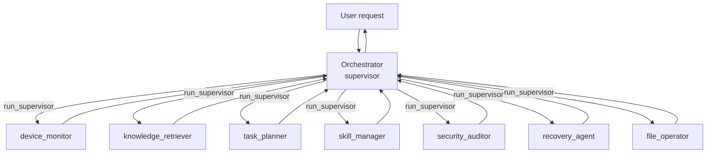
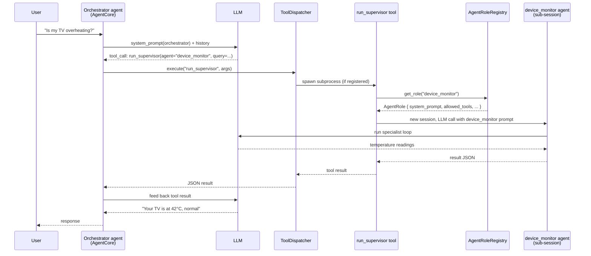

# 12 — Multi-Agent Orchestration

> **Reader context**: You are a C/C++ developer with Tizen experience who has already worked through docs 01–11. This chapter walks through how TizenClaw is *supposed* to coordinate a team of specialist agents — and, equally important, where the code stops short of the marketing diagram.

## Integration Status Legend

- ✅ **Integrated** — actively used at runtime
- ⚠️ **Built, not wired** — exists but no call sites (or only partial ones)
- 🔧 **Stub** — skeleton only
- 🚧 **Planned** — documented intent only

---

## Overview

TizenClaw ships with an **8-agent orchestration model**: one **orchestrator** (supervisor) plus seven **specialists**. The model is expressed in `data/config/agent_roles.json`.

Two things are worth flagging up front because they shape every section below:

1. The April 2026 upstream merge **resolved** the JSON/loader schema mismatch: `AgentRoleRegistry::load_roles` now accepts either `"agents"` or `"roles"` (it tries `agents` first, then falls back to `roles`). In addition, `ensure_builtin_roles()` is called during `AgentCore::initialize` before `load_roles()`, so three built-in roles (`default`, `subagent`, `local-reasoner`) are always present even if the file is missing or unreadable. The `agent_roles.json` registry is now genuinely wired.
2. The `run_supervisor` tool is **declared to the LLM** (`tool_declaration_builder.rs:658`) and is now **handled inline inside the agent loop** at `agent_core/process_prompt.rs:1637`. It is not a classic `ToolDispatcher` entry — the dispatch branch is inlined next to `list_sessions`, `send_to_session`, and the session-profile tools — but it does now actually run: it picks candidate worker roles via `select_delegate_roles`, filters by the caller's `can_delegate_to` whitelist, spawns real sub-sessions through `AgentFactory`, registers a `SessionPromptProfile` for each, and dispatches the goal either sequentially or in parallel (`strategy="parallel"`).

The net effect is that what used to be almost purely **prompt-engineered** now has a real runtime path. It is still worth knowing where the seams are, because the specialists still run against the same backend and the same global tool set — scoping is via `SessionPromptProfile` overrides, not via a fully isolated sub-agent.

---

## 1. The Orchestrator-Specialist Pattern

The orchestrator-specialist (also called **supervisor–worker**) pattern is standard in multi-agent systems literature (LangGraph, CrewAI, AutoGen, and before them the blackboard architectures of the 1980s). One "smart" agent sees the user request, decides *which* expert should handle it, fans out work, and synthesises a reply. Specialists are narrower: they have a tight system prompt, a restricted tool set, and know one domain well.

Benefits of this layout (compared to a single monolithic agent):

- **Prompt economy** — each specialist carries only the instructions it needs.
- **Tool scoping** — the `skill_manager` never sees `web_search`; the `knowledge_retriever` never sees `manage_custom_skill`. Smaller tool menus reduce LLM hallucination and cost.
- **Parallelism** — independent subtasks can be fanned out (strategy=`parallel`).
- **Observability** — each delegation is a discrete, loggable unit.



In TizenClaw's design, the orchestrator is the *only* agent the user speaks to directly. All other agents are internal workers invoked through the `run_supervisor` tool.

---

## 2. Agent Roles Configuration

The `data/config/agent_roles.json` file defines all eight agents.

### The eight agents

| Agent | Type | Domain | Key tools | Auto-start |
|---|---|---|---|---|
| `orchestrator` | supervisor | Routes requests, decomposes goals | `run_supervisor`, `list_agent_roles` | ✅ true |
| `device_monitor` | worker | Battery, temperature, CPU, memory, storage, network | `execute_code`, `file_manager` | false |
| `knowledge_retriever` | worker | RAG, semantic search, memory recall | `ingest_document`, `search_knowledge`, `recall`, `remember` | false |
| `task_planner` | worker | Scheduling, pipelines, workflows | `create_task`, `list_tasks`, `create_pipeline`, `run_pipeline`, `create_workflow`, `run_workflow` | false |
| `skill_manager` | worker | Bash skill creation, Tizen CLI integration | `manage_custom_skill`, `file_manager`, `execute_code` | false |
| `security_auditor` | worker | Audit, risk assessment, policy | `file_manager`, `recall`, `search_knowledge` | false |
| `recovery_agent` | worker | Error recovery, fallback, incident logging | `execute_code`, `file_manager`, `remember`, `recall` | false |
| `file_operator` | worker | Files, code execution, data processing | `file_manager`, `execute_code` | false |

Only the orchestrator is marked `auto_start: true`. In practice this doesn't matter today — since the specialists are not spawned as independent sessions, there is nothing to "start".

### The orchestrator's delegation table (verbatim)

Quoted from `data/config/agent_roles.json`, line 7 — this table is embedded in the orchestrator's `system_prompt`:

```
| Agent                | Domain         | When to Delegate                                                     |
|----------------------|----------------|----------------------------------------------------------------------|
| `device_monitor`     | Device Health  | Battery, temperature, CPU, memory, storage, network status           |
| `knowledge_retriever`| Knowledge Search| Document search, knowledge lookup, semantic queries                 |
| `task_planner`       | Automation     | Scheduling tasks, creating pipelines/workflows                       |
| `skill_manager`      | Skill Dev      | Creating new Shell/Bash skills, Tizen CLI integration                |
| `security_auditor`   | Security       | Security analysis, audit logs, risk assessment, policy               |
| `recovery_agent`     | Error Recovery | Failure diagnosis, fallback strategies, error correction             |
| `file_operator`      | File & Code    | File read/write, code execution, data processing                     |
```

Also quoted verbatim from the orchestrator prompt: the numbered delegation rules (e.g., rule 1: *Device status questions → Always delegate to `device_monitor`*, rule 8: *Multi-domain tasks → Use `run_supervisor` with strategy="parallel"*).

### ✅ Schema Mismatch Resolved (April 2026)

This was previously a live bug: the loader read `config["roles"]` while the JSON file used `"agents"`, so `AgentRoleRegistry::load_roles()` silently returned `true` with zero roles loaded. As of the April 2026 upstream merge the loader tries both keys, `agents` first and then `roles` (see `agent_role.rs:49-52`):

```rust
let role_entries = config
    .get("agents")
    .and_then(Value::as_array)
    .or_else(|| config.get("roles").and_then(Value::as_array));
```

There is now a regression test (`test_load_roles_accepts_agents_schema`) that writes an `agents`-keyed JSON file and asserts it loads.

### ✅ Built-in Roles Always Present

A second change matters for every section below: `AgentCore::initialize` now calls `ensure_builtin_roles()` **before** `load_roles()` (runtime_core_impl.rs:1032-1036):

```rust
if let Ok(mut roles) = self.agent_roles.write() {
    roles.ensure_builtin_roles();
    let role_path = self.role_file_path();
    let _ = roles.load_roles(&role_path.to_string_lossy());
}
```

`ensure_builtin_roles()` seeds three roles programmatically — `default`, `subagent`, and `local-reasoner` — each with its own `PromptMode` and `ReasoningPolicy`. File-loaded roles are merged on top without overwriting (`entry().or_insert(role)`). The practical consequence: the `agent_roles.json` specialists load normally, and even if that file is missing the daemon still has a usable minimal role set. Those three built-ins are filtered out of supervisor candidate selection at `process_prompt.rs:1652` — they are scaffolding for session profiles, not worker personas.

---

## 3. AgentRole Struct ✅

From `src/tizenclaw/src/core/agent_role.rs:7-19`:

```rust
pub struct AgentRole {
    pub name: String,
    pub system_prompt: String,
    pub allowed_tools: Vec<String>,
    pub max_iterations: usize,
    pub description: String,
    pub role_type: String,                      // "supervisor" | "worker"
    pub auto_start: bool,
    pub can_delegate_to: Vec<String>,
    pub prompt_mode: Option<PromptMode>,        // Full | Minimal
    pub reasoning_policy: Option<ReasoningPolicy>, // Native | Tagged
}
```

The struct is fully used. `AgentRoleRegistry` maintains two maps:

```rust
pub struct AgentRoleRegistry {
    roles: HashMap<String, AgentRole>,          // loaded from config + builtins
    dynamic_roles: HashMap<String, AgentRole>,  // added at runtime
}
```

Methods:

- `ensure_builtin_roles()` — seeds `default`, `subagent`, `local-reasoner` without overwriting (called before `load_roles`).
- `load_roles(path)` — accepts either `"agents"` or `"roles"` as the top-level key.
- `get_role(name)` — checks static map first, falls back to dynamic.
- `add_dynamic_role(role)` — insert a role at runtime.
- `remove_dynamic_role(name)` — remove a dynamic role. Static roles cannot be removed.
- `get_role_names()` — union of both maps.
- `AgentRole::is_supervisor()` — helper used by the supervisor delegation filter.

Unit tests now cover `load_roles` against the `agents`-keyed schema (`test_load_roles_accepts_agents_schema`) in addition to the dynamic-role add/remove/get cases.

---

## 4. AgentFactory ✅ (as a session-id minter)

File: `src/tizenclaw/src/core/agent_factory.rs`

`AgentFactory` itself is still intentionally minimal — it mints a session ID string of the form `agent_<role>_<timestamp_ms_mod_100000>` and logs at `debug` level. The `system_prompt` parameter is accepted but not consumed by the factory directly:

```rust
pub fn create_agent_session(role_name: &str, system_prompt: &str) -> String { /* ... */ }
```

What changed around it: the *callers* now do the work the factory used to be imagined to do. Inside the `run_supervisor` branch in `process_prompt.rs:1687` (and similarly for manual `create_session`-style calls at 1572), the flow is:

1. `build_session_profile(Some(&role.name), ...)` constructs a full `SessionPromptProfile` populated from the role (system prompt, allowed tools, `max_iterations`, prompt mode, reasoning policy).
2. `AgentFactory::create_agent_session` returns a fresh session ID.
3. `SessionStore::ensure_session(&id)` persists the session row.
4. The profile is inserted into `AgentCore::session_profiles` under the new session ID.
5. Subsequent `process_prompt(id, goal, None)` calls on that session see the profile via `resolve_session_profile`, which in turn overrides `loop_state.max_tool_rounds`, swaps the system prompt, and constrains tool visibility.

So delegation *does* happen at runtime now. It is not a fully isolated sub-agent — the backend, the tool dispatcher, and most infra are shared — but the scoping the JSON roles describe (system prompt, allowed tools, max iterations) is honored per-session through the `SessionPromptProfile` layer described in §5a below.

---

## 5. Delegation Mechanism

### How delegation is declared ✅

`run_supervisor` is declared as a tool to the LLM in `src/tizenclaw/src/core/tool_declaration_builder.rs` around line 658:

```rust
tools.push(LlmToolDecl {
    name: "run_supervisor".into(),
    description: "Decompose a complex goal into sub-tasks and delegate to specialized role agents.".into(),
    parameters: json!({
        "type": "object",
        "properties": {
            "goal": {"type": "string", "description": "High-level goal"},
            ...
```

The orchestrator's system prompt instructs the model to use this tool with two delegation strategies:

- **sequential** (default) — specialists run one after another, output of one can feed the next.
- **parallel** — independent specialists run concurrently; results are joined before synthesis.

Each agent's `can_delegate_to` whitelist (in the JSON) prevents lateral cross-talk — e.g., `recovery_agent` cannot delegate to `task_planner`. This whitelist is now enforced at runtime: `process_prompt.rs:1644-1658` retains only those candidate roles whose names appear in the caller's `can_delegate_to`.

### How delegation actually executes today ✅

Runtime handling lives in `agent_core/process_prompt.rs:1637` inside the main tool-call loop — not in `tool_dispatcher.rs`. The dispatcher is bypassed for this case and the `run_supervisor` branch runs inline. Concretely:

1. Parse `goal` and `strategy` from the tool args.
2. Resolve the caller's `SessionPromptProfile` to fetch their `can_delegate_to` list.
3. Snapshot all roles from the registry; drop `supervisor`-typed roles and the three built-ins (`default`, `subagent`, `local-reasoner`); then retain only roles in the caller's whitelist (if any).
4. `select_delegate_roles(goal, &candidate_roles, limit)` picks up to 2 (sequential) or 3 (parallel) best candidates for this goal.
5. For each selected role: build a `SessionPromptProfile` from the role, mint a session ID via `AgentFactory::create_agent_session("<role>_delegate", ...)`, `SessionStore::ensure_session`, and register the profile in `self.session_profiles`.
6. Dispatch the goal through `build_role_supervisor_hint` to each delegated session:
   - `parallel` → `join_all(...)` over delegated sessions, results collected into one JSON array.
   - `sequential` → a `for` loop, each step's response threaded into the next hint.
7. Return `{"status": "success", "strategy": ..., "results": [...]}` to the orchestrator LLM.

What this means in practice:

- Delegation produces **real sub-sessions** with their own profiles; `max_iterations`, prompt mode, allowed tools, and system prompt from the role are applied per session.
- The backend and tool dispatcher are shared across sessions. Tool filtering is done by the `allowed_tools` check in the session's resolved profile — not by running a parallel `ToolDispatcher` with a reduced tool set.
- `can_delegate_to` is now a **runtime guard**, not just documentation.

Remaining limitation: there is no isolation of state between parent and delegate sessions beyond the profile swap. Memory store, event bus, and safety guard are global.

### 5a. SessionPromptProfile — the runtime substitute for "role assigned to session" ✅

Defined in `src/tizenclaw/src/core/agent_core/foundation.rs`:

```rust
struct SessionPromptProfile {
    role_name: Option<String>,
    role_description: Option<String>,
    system_prompt: Option<String>,
    allowed_tools: Option<Vec<String>>,
    max_iterations: Option<usize>,
    role_type: Option<String>,
    can_delegate_to: Option<Vec<String>>,
    prompt_mode: Option<PromptMode>,
    reasoning_policy: Option<ReasoningPolicy>,
}
```

Stored in `AgentCore` as `session_profiles: Mutex<HashMap<String, SessionPromptProfile>>` (see `runtime_core.rs:31`). Resolution happens at the top of `process_prompt` (`process_prompt.rs:174-206`): `resolve_session_profile(session_id)` is called first; if no explicit profile exists, heuristic fallbacks may synthesize one (dashboard web-app session, file-management session).

The profile drives four things in the agentic loop:

- **System prompt override**: the session's system prompt replaces the default generalist prompt.
- **Tool filter**: `allowed_tools` restricts what the LLM sees.
- **Iteration cap**: `max_iterations` overrides `AgentLoopState::DEFAULT_MAX_TOOL_ROUNDS` (which is `0`, used as a sentinel meaning "no cap"). `process_prompt.rs:207-212`:

  ```rust
  if let Some(max_iterations) = session_profile
      .as_ref()
      .and_then(|profile| profile.max_iterations)
  {
      loop_state.max_tool_rounds = max_iterations;
  }
  ```

- **Prompt mode / reasoning policy**: passed through to `prompt_builder` so minimal sessions skip heavy context.

`SessionPromptProfile` is, in effect, the runtime substitute for "AgentRole assigned to this session". It is cheaper than spawning a separate `AgentCore` and keeps all sessions inside one event bus, one memory store, and one safety guard.

---

## 6. Workflow Engine ✅

File: `src/tizenclaw/src/core/workflow_engine.rs`

**Format**: Markdown with YAML-like frontmatter.

Frontmatter fields:
- `name` — workflow identifier
- `description` — human-readable intent
- `trigger` — `manual`, `daily`, `event-driven`, etc.

Body contains numbered steps. Each step is one of:

- **`tool`** — invoke a tool by name with args
- **`prompt`** — ask the LLM a question; its answer becomes the step's output
- **`condition`** — branch on a predicate over prior step outputs

**Variable interpolation**: `{{varname}}` — the `output_var` of a previous step is substituted into the args or prompt of a later step.

**Storage**: workflows are loaded from `/opt/usr/share/tizenclaw/workflows/`.

Example (illustrative — show the shape, not a literal file from the repo):

```markdown
---
name: battery_check_and_notify
description: Check battery, notify if low
trigger: manual
---

1. [tool] get_battery_level → output_var: level
2. [condition] if level < 20 then go to step 3 else stop
3. [tool] send_notification args: {"text": "Battery at {{level}}%"}
```

The workflow engine is now fully wired. `AgentCore` owns it as `workflow_engine: tokio::sync::RwLock<WorkflowEngine>` (`runtime_core.rs:29`), initialized in `AgentCore::initialize` with `workflow_engine.load_workflows_from(workflows_dir)`. At the start of each loop iteration in `process_prompt_loop.rs:41-42` the loop iterates over `workflow_engine.list_workflows()` to match any prompt-triggered workflow before calling the LLM, and the `create_workflow` / `list_workflows` / `run_workflow` / `delete_workflow` tools mutate the engine directly (see `process_prompt.rs:947`, `2315`, `2456`). Inline interpolation (`WorkflowEngine::interpolate` / `interpolate_json`) and conditional evaluation (`eval_condition`) are invoked from the loop body during execution.

Workflows still run their step tools via the dispatcher, so they share the same tool set and policy checks as LLM-issued tool calls — but they now observe per-session `SessionPromptProfile` constraints when executed inside a scoped session.

---

## 7. Pipeline Executor ⚠️

File: `src/tizenclaw/src/core/pipeline_executor.rs`

**Format**: JSON.

Fields per step:
- `name` — step identifier
- `tool` — tool to invoke
- `args` — JSON object passed to the tool
- `output_var` — name under which the tool result is stored
- `max_retries` — automatic retry count on failure
- `skip_on_failure` — whether to continue the pipeline if this step fails

**Strictly serial, deterministic.** No LLM in the loop. Pipelines are pure tool chains — given the same inputs and same tool state, they produce the same outputs. This is exactly what you want for cron-style automation.

Stored in `pipelines.json`.

Example:

```json
{
  "pipelines": [{
    "name": "daily_summary",
    "steps": [
      {"name":"get_news","tool":"web_search","args":{"query":"tech news"},"output_var":"news","max_retries":2},
      {"name":"summarize","tool":"execute_code","args":{"code":"..."},"output_var":"summary","skip_on_failure":true}
    ]
  }]
}
```

Like workflows, pipelines sidestep the agent role system and invoke `ToolDispatcher` directly.

---

## 8. Workflow vs Pipeline — When to Use Which

| Feature | Workflow | Pipeline |
|---|---|---|
| Format | Markdown + frontmatter | JSON |
| LLM-evaluated | Yes (prompt steps, conditional branches) | No |
| Deterministic | No | Yes |
| Retry semantics | Manual via conditions | Built-in `max_retries` |
| Branching | Explicit conditions | Linear only |
| Failure handling | Via condition steps | `skip_on_failure` per step |
| Best for | User-friendly multi-step tasks requiring judgment | Cron-style reproducible automation |
| Example | "Check battery; if low, draft a warning message and send it" | "Fetch news at 08:00, summarise, write to file" |

Rule of thumb: if any step requires a *decision* that a human would make, use a workflow. If every step is mechanical, use a pipeline.

---

## 9. SwarmManager / FleetAgent 🔧

Two related files, both still at the stub/skeleton level as of April 2026:

- `src/tizenclaw/src/core/swarm_manager.rs` — 30 lines, just `start()` / `stop()` / `is_running()` flags. Verified still a stub.
- `src/tizenclaw/src/infra/fleet_agent.rs` — richer skeleton with `FleetPeer`, `FleetConfig`, peer map and device-id generation, but no actual discovery or delegation logic.

Config lives in `data/config/fleet_config.json`; it is **disabled by default**.

Planned behaviour 🚧: a mesh of TizenClaw daemons running across a household's Samsung devices (TVs, fridges, phones, watches) with:

- **Heartbeat** — devices announce themselves periodically.
- **Capability announcement** — each peer broadcasts which tools/agents it can run.
- **Task delegation** — one device can route a sub-task to a peer with better capability (e.g., the TV asks the phone to read a notification).
- **HTTP transport** — the skeleton reserves port 9091 for peer RPC.

None of this is wired today. Treat the fleet subsystem as an architectural hook, not a feature.

---

## 10. Delegation Example (End-to-End Walkthrough)

**Scenario**: the user asks *"Is my TV overheating?"*

Step by step, what happens today (April 2026, post-merge):

1. User sends prompt through the IPC socket (`session_id=default`).
2. `AgentCore::process_prompt` resolves the session profile; the orchestrator's `system_prompt` is active if the default session was configured with the orchestrator role.
3. The LLM sees the delegation table and rule **"Device status questions → Always delegate to `device_monitor`"**.
4. The LLM returns a tool call: `run_supervisor(goal="check TV temperature", strategy="sequential")`.
5. The inline `run_supervisor` branch in `process_prompt.rs:1637` runs:
   - Resolves the caller's `SessionPromptProfile` and its `can_delegate_to` list.
   - Snapshots the role registry, drops supervisors and built-ins, and filters to the whitelist.
   - `select_delegate_roles` picks `device_monitor` for this goal.
   - `build_session_profile(Some("device_monitor"), ...)` builds a profile using the role's system prompt, allowed tools, and `max_iterations`.
   - `AgentFactory::create_agent_session("device_monitor_delegate", ...)` mints a session ID; `SessionStore::ensure_session` persists it; the profile is registered in `session_profiles`.
   - A supervisor hint is built and `Box::pin(self.process_prompt(&delegated_session_id, &hint, None)).await` runs the sub-session with the scoped profile.
6. Inside the sub-session, the LLM sees only the `device_monitor` system prompt and its `allowed_tools`, reads thermal data via `file_manager`, and returns a structured reply.
7. The supervisor branch collects the delegate's response into a results JSON and returns it as the tool output to the orchestrator LLM.
8. Orchestrator synthesises a reply to the user: *"Your TV is at 42°C, which is within the normal range."*



---

## 11. How to Add a Custom Agent Role

A preview of the full recipe in `15_EXTENDING_TIZENCLAW.md`.

Short version:

1. Open `data/config/agent_roles.json`.
2. Append a new object to the `agents` array (the loader also accepts `roles` as the top-level key for schema compatibility):
   ```json
   {
     "name": "media_curator",
     "type": "worker",
     "description": "Finds and curates media (photos, videos) on device.",
     "system_prompt": "You are the TizenClaw Media Curator...",
     "allowed_tools": ["file_manager", "execute_code"],
     "max_iterations": 6,
     "auto_start": false,
     "can_delegate_to": [],
     "prompt_mode": "minimal",
     "reasoning_policy": "native"
   }
   ```
3. If you want the orchestrator to delegate to it, add `"media_curator"` to the orchestrator's `can_delegate_to` array **and** add a row to the delegation table in the orchestrator's `system_prompt`. (Editing a JSON string containing Markdown is awkward; keep the escaping correct.)
4. Restart the daemon. At boot, `ensure_builtin_roles()` seeds `default` / `subagent` / `local-reasoner`, then `load_roles()` merges in your JSON role.
5. Test by asking the orchestrator a question in your new agent's domain; look for `AgentFactory: created session` in `debug` logs and a `<role>_delegate` session id in the supervisor tool response.

**Note**: you cannot shadow a built-in role (`default`, `subagent`, `local-reasoner`) by adding a JSON entry with the same name — the built-in wins because it is inserted first and `ensure_builtin_roles()` uses `entry().or_insert(...)`. Pick a distinct name.

**Note on delegation candidacy**: supervisor-typed roles and the three built-ins are explicitly filtered out in `run_supervisor` candidate selection (`process_prompt.rs:1651-1653`). Your `worker`-typed role will be picked up automatically.

---

## FAQ

**Q: Is the `agents` vs `roles` JSON key mismatch a bug?**
A: It was, and it has been fixed in the April 2026 upstream merge. The loader now tries `agents` first, then falls back to `roles`, and there is a regression test for the `agents`-keyed schema. Either key works.

**Q: Can I disable the orchestrator and talk to a specialist directly?**
A: Yes. Two ways: (a) set the active session's `SessionPromptProfile` to a specific role using the session-profile management tools — this swaps the system prompt, allowed tools, and `max_iterations` in one shot; or (b) set any arbitrary prompt on the default session. Option (a) is now the preferred path because it uses the real per-session scoping rather than relying on prompt hygiene alone.

**Q: How do workflows and pipelines interact with agent roles?**
A: Workflows are now wired into the agent loop (§6) and run under the caller's `SessionPromptProfile`, so a workflow executed from a scoped session inherits that session's system prompt and allowed-tools filter. Pipelines still execute step-tools through the dispatcher directly, independent of role. An agent-aware pipeline executor is still a natural enhancement.

**Q: What prevents `agent_A` from delegating to `agent_B` outside its `can_delegate_to` whitelist?**
A: The `run_supervisor` handler in `process_prompt.rs:1644-1658` looks up the caller's `SessionPromptProfile`, pulls its `can_delegate_to`, and retains only candidates on that list before running `select_delegate_roles`. This is now a runtime guard, not just prompt-level guidance.

**Q: How is the per-role `max_iterations` used?**
A: `AgentRole.max_iterations` is copied into `SessionPromptProfile.max_iterations` by `build_session_profile` (see `runtime_core_impl.rs:973`). When `process_prompt` resolves a profile, it overrides `loop_state.max_tool_rounds = profile.max_iterations` at lines 207-212. The default `AgentLoopState::DEFAULT_MAX_TOOL_ROUNDS = 0` is a sentinel meaning "no cap"; a role-specified value clamps the loop to that many tool rounds.

**Q: What's the practical status of multi-agent orchestration?**
A: Materially better after the April 2026 merge. `run_supervisor` actually delegates (inline in the agent loop, not through `ToolDispatcher`), `SessionPromptProfile` honors per-session role scoping, `can_delegate_to` is enforced, and built-in roles are seeded at startup. The remaining gaps are (a) the specialists share the same backend and tool dispatcher rather than running truly isolated, and (b) `SwarmManager` / `FleetAgent` are still stubs. For most single-device production use, scoping via `SessionPromptProfile` is sufficient.

**Q: If the pieces are wired now, why is the orchestrator prompt still so long?**
A: Two reasons. First, the orchestrator's system prompt is genuinely useful on its own — it nudges the model toward a plan-and-execute shape that improves reliability. Second, even with runtime wiring, the prompt still tells the LLM *which* role to delegate to, because the runtime only matches once the LLM picks `run_supervisor` and names a goal. Prompt engineering still drives the choice of delegate; the runtime enforces the choice.

**Q: Where should I look next?**
A: `13_SAFETY_AND_POLICY.md` for how (and whether) tool invocations are sandboxed, `14_EVENT_BUS_TRIGGERS.md` for how agents are activated by non-user events, and `15_EXTENDING_TIZENCLAW.md` for the full guide to adding your own role, tool, or workflow.
