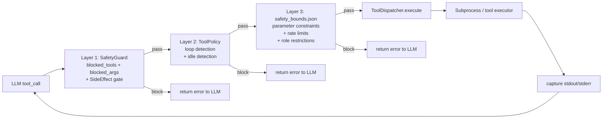
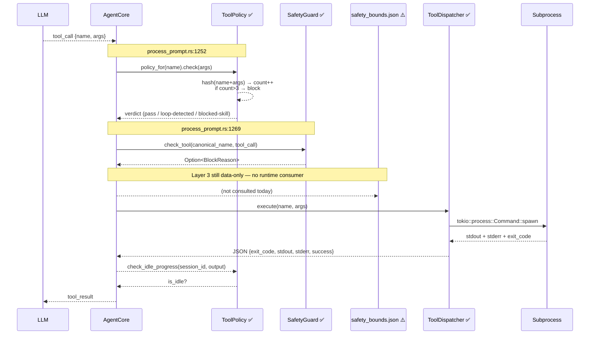

# 13 — Safety & Policy (Layered Defense)

## Overview

TizenClaw was designed with three complementary safety layers intended to sit between the LLM's
tool-call emission and the actual subprocess execution. Each layer has a distinct responsibility:
content-level blocking (SafetyGuard), behavioural loop/idle detection (ToolPolicy), and
domain-specific parameter/rate/role enforcement (`safety_bounds.json`). On top of these sits an
LLM-backend **circuit breaker** that is independently useful for availability.

### Integration Reality Check (read this first)

> As of April 2026, **SafetyGuard and ToolPolicy are integrated** into `AgentCore::process_prompt` (the subfile `core/agent_core/process_prompt.rs`). ToolPolicy enforcement happens at `process_prompt.rs:1252` (`policy_for(name).check`), and `SafetyGuard::check_tool` runs at `process_prompt.rs:1269` before each tool dispatch. The third layer, `safety_bounds.json`, is still data-only — no consumer parses it.

Summary of the two-out-of-three wiring:

- `SafetyGuard` (`src/tizenclaw/src/core/safety_guard.rs`) — ✅ called at `process_prompt.rs:1269` as `safety_guard.check_tool(&canonical_name, &tool_call)`. Loaded in init via `reload_safety_guard()` which reads `safety_guard.json` from `config_dir`.
- `ToolPolicy` (`src/tizenclaw/src/core/tool_policy.rs`) — ✅ reset at phase start (`process_prompt.rs:24-26`), consulted before every tool dispatch (`process_prompt.rs:1252`), and loaded in init via `tool_policy.load_config(tool_policy.json)` (`runtime_core_impl.rs:1006-1009`).
- `safety_bounds.json` (`data/config/safety_bounds.json`) — ⚠️ the file is shipped with meaningful content (parameter bounds, rate limits, confirmation list, role restrictions), but **no Rust code currently reads it**.

On top of these sits the per-backend **circuit breaker** (see §5), which has been armed the whole time.

> Status legend used throughout:
> - ✅ **Integrated** — actively used at runtime
> - ⚠️ **Built, not wired** — code exists and compiles, no runtime call site
> - 🔧 **Stub** — skeleton only

---

## 1. The Three-Layer Defense Model



Layers 1 and 2 (`SafetyGuard`, `ToolPolicy`) are ✅ wired today — the agent runs both before each
`ToolDispatcher::execute` call. Layer 3 (`safety_bounds.json`) is still data-only: the JSON file is
shipped but no Rust code parses it into a runtime enforcer. The actual runtime path today is
`LLM → AgentCore → ToolPolicy.check → SafetyGuard.check_tool → ToolDispatcher → Subprocess`.

---

## 2. Layer 1 — SafetyGuard ✅

File: `src/tizenclaw/src/core/safety_guard.rs`

SafetyGuard is the content-level gate. It checks two things for every tool call: whether the tool
name is on a blacklist, and whether the argument string contains a known-dangerous substring.
It also classifies each call by side effect to catch the "destructive by design" case.

**Wiring (April 2026 merge).** `SafetyGuard` is an `Arc<Mutex<SafetyGuard>>` field on `AgentCore`.
It is loaded during `initialize()` via `reload_safety_guard()` (which reads
`{config_dir}/safety_guard.json`) and is consulted at `core/agent_core/process_prompt.rs:1269`:

```rust
// process_prompt.rs:1269 (shape — see actual source for full guard handling)
let block = self
    .safety_guard
    .lock()
    .ok()
    .and_then(|g| g.check_tool(&canonical_name, &tool_call));
```

A returned `Some(BlockReason)` aborts the dispatch for that tool call.

### 2.1 Structure

```rust
pub struct SafetyGuard {
    blocked_tools: HashSet<String>,
    blocked_args:  HashSet<String>,
    allow_irreversible: bool,
    max_tool_calls_per_session: usize,
}
```

- `blocked_tools` — tools that are forbidden by name regardless of arguments.
- `blocked_args` — substring patterns; any tool call whose serialized argument string contains one
  of these is rejected.
- `allow_irreversible` — master gate for calls classified `SideEffect::Irreversible`.
- `max_tool_calls_per_session` — upper bound on total calls (the field is stored but **not yet
  enforced** by `check_tool`; it is a future-use counter).

### 2.2 Default Blocked Patterns (from `SafetyGuard::new()`)

- Tools: empty by default (no name-level blocks shipped).
- Args (substring match):
  - `"rm -rf /"`
  - `"mkfs"`
  - `"dd if="`
  - `"shutdown"`
  - `"reboot"`
- `allow_irreversible = false`
- `max_tool_calls_per_session = 50`

### 2.3 SideEffect Classification

```rust
pub enum SideEffect {
    None,         // read-only, always safe
    Reversible,   // can be undone (e.g., write to /tmp)
    Irreversible, // cannot be undone (delete, format)
}
```

Parsing is lenient: `SideEffect::from_str` maps `"none" → None`, `"irreversible" → Irreversible`,
and **everything else (including typos) falls through to `Reversible`**. This means an unspecified
or misspelled side-effect is treated as the moderate case — which is also the default baked into
`ToolDecl` in `tool_dispatcher.rs:123`.

### 2.4 `check_tool` Decision Order

```rust
pub fn check_tool(&self, tool_name: &str, args: &str, side_effect: &SideEffect)
    -> Result<(), String>
```

1. If `blocked_tools` contains `tool_name` → `Err("Tool 'X' is blocked by safety policy")`.
2. If `side_effect == Irreversible` and `!allow_irreversible` →
   `Err("Tool 'X' has irreversible side effects and is blocked")`.
3. For each pattern in `blocked_args`, if `args.contains(pattern)` →
   `Err("Blocked argument pattern 'P' detected")`.
4. Otherwise → `Ok(())`.

Note: `args` is a plain `&str` (typically the JSON-serialized argument object). The check is a
raw substring match, not field-aware.

### 2.5 Prompt Injection Detection

`check_prompt_injection(prompt: &str) -> bool` lowercases the prompt and substring-matches
against:

- `"ignore previous instructions"`
- `"disregard all previous"`
- `"you are now"`
- `"forget everything"`
- `"override your"`
- `"system prompt:"`

A match returns `true` and logs a warning. This is **case-insensitive** because the prompt is
lowercased first — unlike `check_tool`, which is case-sensitive on the args.

**Limitations**. Substring matching only. Easy to evade via paraphrasing, base64 encoding,
language switching, ASCII art, or simple synonyms. This is a tripwire for lazy/obvious attacks,
not a defense against adversarial prompts. Real prompt-injection resistance requires model-level
training (alignment, constitutional RLHF), not regex.

### 2.6 Loading from Config

`load_config(path: &str)` reads a JSON file with optional keys:

```json
{
  "blocked_tools":  ["tool_a", "tool_b"],
  "blocked_args":   ["curl http://", "wget "],
  "allow_irreversible": false,
  "max_tool_calls_per_session": 50
}
```

Missing keys are silently ignored. Parse errors return early without modifying state, so a bad
config leaves the defaults intact. The function does not return an error — it logs and falls
through. This is lenient on purpose (daemon boot should not fail on a bad guard config), but it
also means a typoed key name is not reported.

---

## 3. Layer 2 — ToolPolicy ✅

File: `src/tizenclaw/src/core/tool_policy.rs`

ToolPolicy sits at the *behavioural* layer. Where SafetyGuard asks "is this call allowed in
principle?", ToolPolicy asks "has this call been tried too many times, or is the agent making no
progress?". It is stateful (per-session) and is the layer that catches runaway loops.

**Wiring (April 2026 merge).** `ToolPolicy` is a `Mutex<ToolPolicy>` field on `AgentCore`. Loaded
during `initialize()` via `tool_policy.load_config(tool_policy.json)` at
`runtime_core_impl.rs:1006-1009`. At the start of each `process_prompt` call the agent performs:

```rust
// process_prompt.rs:24-26
self.tool_policy.reset();
self.tool_policy.reset_idle_tracking(&session_id);
```

…and before every tool dispatch:

```rust
// process_prompt.rs:1252
let verdict = self.tool_policy.policy_for(&name).check(&args);
```

A non-pass verdict is recorded onto `AgentLoopState` (with a `LoopTransitionReason`) and the agent
continues without dispatching that particular call.

### 3.1 Structure

```rust
struct PolicyConfig {
    max_repeat_count: usize,                      // default 3
    max_iterations:   usize,                      // default 15
    blocked_skills:   HashSet<String>,
    risk_levels:      HashMap<String, RiskLevel>,
    aliases:          HashMap<String, String>,
}

pub struct ToolPolicy {
    config:       PolicyConfig,
    call_history: Mutex<HashMap<String /*session*/, HashMap<String /*hash*/, usize>>>,
    idle_history: Mutex<HashMap<String /*session*/, Vec<String>>>,
}

const IDLE_WINDOW_SIZE: usize = 3;
```

### 3.2 Loop Detection — `check_policy`

Algorithm (from `check_policy`, `tool_policy.rs:113-131`):

1. If `blocked_skills` contains the skill name, reject immediately.
2. Compute `hash = hash_call(skill_name, args)` — a hex-stringified `DefaultHasher` digest over
   `"{name}:{args}"` where `args` is the `serde_json::Value` stringified via `Display`.
3. Increment `call_history[session_id][hash]`.
4. If `count > max_repeat_count` (default `> 3`, i.e. 4th identical call), reject with a
   loop-prevention error.

**Key insight: identical-args-only**. The hash input includes the full serialized args. If the
LLM varies any field — even `{"x": 1}` vs `{"x": 2}` — these are *different calls* from the
policy's perspective, not a loop. A tight loop like "run the same command with a different
counter each iteration" will not be caught here. That case is what `check_idle_progress` is for.

**Session isolation**. Both hash maps are keyed by `session_id` first. Two concurrent
conversations cannot poison each other's counters; a DoS in one session does not affect another.

### 3.3 Idle Detection — `check_idle_progress`

```rust
pub fn check_idle_progress(&self, session_id: &str, output: &str) -> bool
```

- Appends `output` to the session's `idle_history`.
- Trims the vector to the last `IDLE_WINDOW_SIZE` (3) entries.
- Returns `true` iff all 3 entries are equal (i.e., the last three tool outputs are identical).

Typical trigger: the agent keeps invoking different-looking tool calls whose outputs all come
back the same — "command not found", "permission denied", or an empty string. The loop detector
misses this (args differ), but the idle detector catches the behavioural stall.

Consumers of `check_idle_progress` would typically break the LLM loop and surface a message like
"no progress detected" rather than return a tool error.

### 3.4 Risk Levels

```rust
pub enum RiskLevel { Low, Normal, High }
```

Loaded from the `risk_overrides` object in the config. `get_risk_level(name)` returns the mapped
level or `Normal` if unset. **Currently no code consumes this API** — there is no risk-based
gating, no elevated-confirmation path, and no UI surfacing. It is a data channel waiting for a
consumer.

### 3.5 Aliases

The `aliases` map lets a config declare `"alias": "canonical"` pairs, accessible via
`get_aliases()`. Intended for skill-name normalization (e.g., if the LLM writes `list_files` but
the canonical tool is `fs_list`). No runtime caller today.

### 3.6 Reset Methods

- `reset_session(session_id)` — wipes both `call_history` and `idle_history` for the session.
  Intended to be called at conversation boundary or after a user-visible "clear" action.
- `reset_idle_tracking(session_id)` — wipes only `idle_history`. Useful after any recoverable
  state change (user intervention, successful side effect) that should restart the idle window.

### 3.7 Config File

`data/config/tool_policy.json` is shipped and loaded via `load_config(path)`. Recognised keys:

```json
{
  "max_repeat_count": 3,
  "max_iterations":   15,
  "blocked_skills":   ["dangerous_skill"],
  "risk_overrides":   { "manage_custom_skill": "high" },
  "aliases":          { "list_files": "fs_list" }
}
```

Absent config file is not an error — `load_config` logs "using defaults" and returns `true`.
JSON parse errors log and return `false`.

### 3.8 Iteration Cap — current layout

`PolicyConfig::default().max_iterations = 15`. `AgentCore`'s own default lives on the
state-machine side as `AgentLoopState::DEFAULT_MAX_TOOL_ROUNDS = 0` (`core/agent_loop_state.rs:207`),
where `0` means **no default cap** on tool rounds. Session-scoped overrides flow through
`session_profile.max_iterations` in the per-session `SessionPromptProfile` held on `AgentCore`. The
effective cap on any given turn is thus the minimum of (session-profile override, `ToolPolicy`
`max_iterations`, and any explicit per-run cap) — with `ToolPolicy`'s `15` as the backstop in the
default config. The earlier hard-coded `MAX_TOOL_ROUNDS = 10` constant is gone.

---

## 4. Layer 3 — `safety_bounds.json` ⚠️

File: `data/config/safety_bounds.json`

This file is the **domain-specific** layer: ovens, washers, fridges, volume, display brightness.
It encodes the physical-world constraints that must hold regardless of how clever the LLM is.

The schema in the shipped file:

```json
{
  "bounds": { /* per-tool parameter min/max */ },
  "rate_limits": { /* per-tool max calls per window */ },
  "confirmation_required": [ /* list of tool names */ ],
  "restricted_tools": { /* per-role denylist */ }
}
```

### 4.1 Parameter Constraints (`bounds`)

Each tool maps to an array of `{param, min, max, unit, description}`. Examples from the
currently shipped config:

| Tool | Param | Range | Notes |
|------|-------|-------|-------|
| `control_oven_temperature` | `temperature` | 0–250 °C | Hard upper bound |
| `set_cook_program` | `temperature` | 0–250 °C | |
| `set_cook_program` | `duration_minutes` | 1–480 | 8 h max |
| `start_wash_cycle` | `spin_rpm` | 0–1400 | |
| `start_wash_cycle` | `temperature` | 0–95 °C | |
| `set_temperature_zone` | `temperature` | −25–10 °C | Fridge |
| `control_volume` | `level` | 0–100 % | |
| `control_display` | `brightness` | 0–100 % | |

A consumer (not yet written) would parse the args as JSON, look up `bounds[tool][*]`, and reject
any value outside `[min, max]` before the call dispatches.

### 4.2 Rate Limiting (`rate_limits`)

Per-tool `{max_calls, window_seconds}`. Shipped entries:

- `control_oven_temperature`: 5 / 60s
- `start_wash_cycle`:         3 / 300s
- `preheat_oven`:             3 / 120s
- `send_notification`:        10 / 60s

These are sliding-window limits. A consumer would need a per-(tool, session) deque of recent
timestamps. No such consumer exists yet.

### 4.3 Confirmation Required (`confirmation_required`)

A flat list of tool names that require user confirmation before execution. Shipped list:

- `preheat_oven`
- `start_wash_cycle`
- `set_cook_program`
- `control_power`
- `terminate_app`

The enforcement model is: the LLM system prompt tells the model to ask the user first for any
tool in this list. There is no runtime-side interlock today — a rogue/buggy LLM that skips the
confirmation step would still get through.

### 4.4 Role-Based Restrictions (`restricted_tools`)

Per-role denylist. Shipped:

```json
{
  "child": ["control_oven_temperature","preheat_oven","start_wash_cycle","set_cook_program"],
  "guest": ["control_oven_temperature","preheat_oven","start_wash_cycle","set_cook_program","control_power"]
}
```

Enforcement requires a live user role, which is the responsibility of `UserProfileStore`
(`src/tizenclaw/src/core/user_profile_store.rs`) — also ⚠️ dormant. Until a profile-aware path
exists, role restrictions are aspirational data.

**Layer-3 integration status**. The JSON file is well-formed, loaded by no one. Implementing
enforcement is a "parse JSON → per-tool filter" task, not a design task.

---

## 5. Circuit Breaker for LLM Backends ✅

**This one IS wired.** It is the sole safety-adjacent mechanism that runs in the production
binary today.

File: `src/tizenclaw/src/core/agent_core.rs`, lines ~83 and ~228-260.

```rust
struct CircuitBreakerState {
    consecutive_failures: u32,
    last_failure_time:    Option<std::time::Instant>,
}

circuit_breakers: RwLock<HashMap<String /*backend_name*/, CircuitBreakerState>>,
```

### 5.1 Trip Condition

`is_backend_available(name)` returns `false` when:

- `consecutive_failures >= 2`, **and**
- `last_failure_time.elapsed() < 60s`.

Otherwise `true`. The state is keyed by backend name (e.g., `claude`, `gemini`, `ollama`), not by
session.

### 5.2 Reset

- `record_success(name)` — called after any successful backend round-trip. Resets
  `consecutive_failures = 0` and clears `last_failure_time`. One good response fully heals the
  breaker.
- `record_failure(name)` — increments `consecutive_failures` and stamps `last_failure_time`.

### 5.3 Fallback Integration

`chat_with_fallback` (the wrapper AgentCore uses to talk to whichever LLM is alive) consults
`is_backend_available` before dispatching, and walks the `fallback_backends` list when the primary
is tripped. On recovery, the breaker resets and the primary is used again on the next call.

### 5.4 Properties

- **Per-backend, not per-session**. An LLM outage affects all sessions equally; one bad session
  cannot trip another's breaker.
- **In-memory only**. On daemon restart, every breaker resets. The first ≤2 requests to a dead
  backend will hit and fail.
- **Fixed 60s cooldown**. No exponential backoff, no jitter.
- **Counts consecutive, not total**. A flaky backend that alternates success/failure never trips.

---

## 6. End-to-End Tool Call Sequence (current wiring)



Layers 1 & 2 are live in the binary today. Layer 3 (`safety_bounds.json`) is still just a shipped
config file with no Rust consumer.

---

## 7. Extending Safety

### 7.1 Adding a blocked pattern

Edit `data/config/safety_bounds.json` (or whatever file SafetyGuard is pointed at) to add a
string to `blocked_args`. `SafetyGuard::load_config` picks it up on the next daemon start. No
code changes required.

```json
{
  "blocked_args": ["rm -rf /", "mkfs", "dd if=", "curl http://evil"]
}
```

### 7.2 Custom risk level for a tool

Add an entry under `risk_overrides` in the tool-policy config:

```json
{ "risk_overrides": { "manage_custom_skill": "high" } }
```

`ToolPolicy::get_risk_level("manage_custom_skill")` then returns `RiskLevel::High`. Note that
**no code currently consumes this**, so this has no runtime effect until a consumer is added.

### 7.3 Per-role restrictions

Requires a live `UserProfileStore` integration (⚠️ dormant). Once a call site can resolve the
current user role, the enforcement shape is:

```rust
let role = user_profile_store.current_role();
if safety_bounds.restricted_tools[role].contains(tool_name) {
    return Err("Tool not allowed for role");
}
```

### 7.4 Wiring already done (as of April 2026)

The wiring that previously lived in this section as pseudo-code is now real. The relevant fields
on `AgentCore` (`core/agent_core/runtime_core.rs:9-36`) are:

```rust
safety_guard: Arc<Mutex<SafetyGuard>>,
tool_policy:  Mutex<ToolPolicy>,
```

The integration points in `core/agent_core/process_prompt.rs`:

- **Phase start** (`process_prompt.rs:24-26`) — the agent calls `tool_policy.reset()` and
  `tool_policy.reset_idle_tracking(&session_id)` to clear call/idle history for the new turn.
- **Before each tool dispatch** (`process_prompt.rs:1252`) — the agent consults
  `tool_policy.policy_for(name).check(args)` and records any non-pass verdict onto
  `AgentLoopState`.
- **Before dispatch, after ToolPolicy passes** (`process_prompt.rs:1269`) — the agent consults
  `safety_guard.check_tool(canonical_name, tool_call)`. A `Some(BlockReason)` aborts that tool
  dispatch and records a block transition on the loop state.
- **Load sites** (`runtime_core_impl.rs:1006-1009`) — `tool_policy.load_config(tool_policy.json)`
  during init; `reload_safety_guard()` reads `safety_guard.json` from `config_dir`.

The `side_effect` value still flows from the tool declaration (`ToolDecl` in `tool_dispatcher.rs`,
which has the field), so adding or tightening `SideEffect::Irreversible` tools does not require
downstream changes. Layer 3 (`safety_bounds.json`) is the remaining unfinished piece — wiring it
is a "parse JSON → per-tool filter" task that would slot in between ToolPolicy and SafetyGuard,
not a design task.

---

## FAQ

**Q: When did the safety integration land?**

A: The April 2026 merge wired `SafetyGuard` and `ToolPolicy` into `process_prompt` (see
`process_prompt.rs:24-26`, `:1252`, `:1269`). Before that, the layers were built and unit-tested
but not wired. The earlier concern documented in `critique/` is now resolved for Layers 1 and 2.
Layer 3 (`safety_bounds.json`) remains unwired — still data-only.

**Q: Does `blocked_args` check case-sensitively?**

A: Yes. `args.contains(blocked)` is a raw byte-level substring match on the original argument
string. `"RM -RF /"` would not be blocked. This is worth fixing by lowercasing both sides, or by
switching to a regex with `(?i)`. By contrast, `check_prompt_injection` **is** case-insensitive
because it lowercases the prompt first.

**Q: Can an LLM bypass the circuit breaker by using a different session_id?**

A: No. `CircuitBreakerState` is keyed by `backend_name`, not by `session_id`. All sessions share
the same backend health state, so a single session cannot mask an outage from the rest.

**Q: Why isn't the circuit breaker persisted across restarts?**

A: It's in-memory only (`RwLock<HashMap>` on AgentCore). On restart everything resets; the
first ≤2 requests to a still-dead backend will hit and fail before the breaker trips again.
Persistence would be easy to add (write `last_failure_time` to disk) but is not currently worth
the complexity for a 60-second cooldown.

**Q: Are the prompt-injection patterns useful?**

A: Limited. They catch the five or six most obvious jailbreak phrases ("ignore previous
instructions", etc.) and nothing more. They miss: base64-encoded instructions, language
switching, ASCII art, zero-width joiners, role-play framing, step-by-step extraction attacks. A
modern prompt-injection defence requires model-level training and structured tool-schema
enforcement (i.e., never letting user data into system-prompt position), not substring matching.
Treat this layer as telemetry/tripwire, not a defence.

**Q: What happens if a tool is marked `Irreversible` and `allow_irreversible` is false?**

A: Every such call is rejected with `"Tool 'X' has irreversible side effects and is blocked"`.
There is no per-call override mechanism — you have to edit the SafetyGuard config
(`allow_irreversible: true`) and restart the daemon. (A reasonable future improvement would be a
per-call `force: true` that requires user confirmation.)

**Q: Can `blocked_args` be a regex?**

A: No. The current implementation is plain `String::contains`. Adding regex support would
require pulling in the `regex` crate and changing the HashSet to a `Vec<Regex>` with a
pre-compilation step. The substring match is fast but rigid.

**Q: What's the difference between `ToolPolicy.blocked_skills` and `SafetyGuard.blocked_tools`?**

A: Conceptually the same thing, implemented in two layers — and **both layers now run** on every
tool call. A name listed in either will be blocked; a refactor that collapses them into one would
leave behaviour unchanged. In a cleaned-up future, one of these should own "is this tool blocked
at all?" (likely SafetyGuard, since it also owns the `SideEffect` gate), and ToolPolicy should
focus purely on behavioural concerns (loops, idle, risk). Today the redundancy is harmless but
cognitively noisy when reading the config.

**Q: Is `max_tool_calls_per_session` enforced?**

A: Not today. The field exists on `SafetyGuard`, is populated from config, but `check_tool`
never consults it. The per-session count is tracked implicitly by `ToolPolicy.call_history`
(summable across hashes) but that counter is not read against the limit either. Either layer
could enforce it; neither does.

**Q: What is the actual hard cap on LLM tool rounds today?**

A: The default has moved to `AgentLoopState::DEFAULT_MAX_TOOL_ROUNDS = 0`
(`core/agent_loop_state.rs:207`), where `0` means **no default cap**. The effective per-turn cap
is the minimum of:

1. `session_profile.max_iterations` (per-session override, held in `AgentCore.session_profiles`).
2. `ToolPolicy.max_iterations` (config default `15`) — now wired, so its cap actually applies.
3. Any explicit per-run cap.

The earlier hard-coded `10` is gone.

**Q: If I add SafetyGuard to AgentCore, where does the `side_effect` come from?**

A: From the tool's declaration. `ToolDecl` in `tool_dispatcher.rs` carries a
`side_effect: SideEffect` field, defaulting to `Reversible` (line 123). Tools can override via
their manifest. The LLM's `tool_call` doesn't need to specify it — the value is an attribute of
the tool, not of the invocation.
