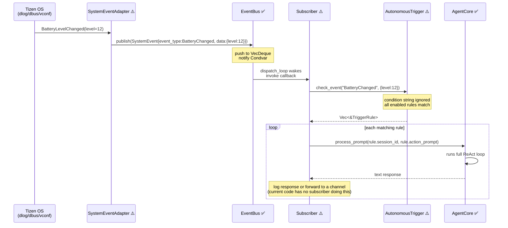

# 14 — Event Bus & Autonomous Triggers

## Overview

TizenClaw has a `std::thread`-based pub/sub event bus (not tokio-async) and a
JSON-configured autonomous trigger system. `EventBus::start()` is now called
during `AgentCore::initialize` (`runtime_core_impl.rs:1004`), so the bus is
active and its dispatcher thread is running. However, the **event publishers**
(`infra/*_adapter.rs`) are still sparse — the bus is ready to receive events
but few are actually published yet. `AutonomousTrigger` is similarly ready but
still needs a subscriber that bridges bus events into the trigger engine; no
such subscriber is installed in `main.rs` today.

### Integration Status Legend

- ✅ **Integrated** — actively used at runtime
- ⚠️ **Built, not wired** — exists but no active publishers or subscribers
- 🔧 **Stub** — skeleton only

### Status at a glance

| Component | Status |
|---|---|
| `EventBus` core (queue, dispatcher, subscriptions) | ✅ Dispatcher started in `AgentCore::initialize` |
| `AutonomousTrigger` rule loader & matcher | ⚠️ Built, no EventBus → trigger subscriber in `main.rs` |
| `app_lifecycle_adapter` | 🔧 Stub |
| `package_event_adapter` | 🔧 Stub |
| `tizen_system_event_adapter` | 🔧 Stub |
| `health_monitor` | 🔧 Stub |
| `AgentCore.process_prompt` (action target) | ✅ Integrated |

---

## 1. EventBus Architecture ✅ (dispatcher started; publishers still sparse)

File: `src/tizenclaw/src/core/event_bus.rs`

### 1.1 Why std::thread + Condvar, not tokio?

The EventBus uses `std::sync::Mutex<VecDeque>` guarded by a `Condvar`, with a
dedicated `std::thread` as the dispatcher. This is deliberately *not* tokio.
A few reasons a C/C++ dev on Tizen will appreciate:

- **Subscribers can be sync-only**: callbacks may include C FFI shims,
  `dlog_print` calls, or Tizen system adapters that have no `.await` points.
  Forcing an async boundary there would complicate the call site.
- **Fire-and-forget semantics**: publishers (battery interrupt, dbus signal,
  kernel netlink) just want to drop an event and return. A sync `publish` +
  `Condvar::notify_one` is a few instructions; a tokio channel send has
  runtime-entry overhead.
- **Bounded, blocking backpressure is undesirable**: if the queue fills,
  `publish` drops the oldest event instead of `.await`-ing. A pure-sync API
  makes this non-blocking contract obvious.
- **Isolation from the agent's tokio runtime**: the agent uses tokio for LLM
  I/O, but event delivery shouldn't pin or preempt runtime worker threads.

If you know pthreads + condition variables from Tizen native C, the model is
one-to-one: `pthread_mutex_t + pthread_cond_t` guarding a ring-ish buffer.

### 1.2 Data types

```rust
#[derive(Clone, Debug, PartialEq, Eq, Hash)]
pub enum EventType {
    AppInstalled,
    AppUninstalled,
    AppLaunched,
    AppTerminated,
    BatteryChanged,
    NetworkChanged,
    ScreenStateChanged,
    SystemEvent,           // generic catch-all
    Custom(String),        // user-defined
}

#[derive(Clone, Debug)]
pub struct SystemEvent {
    pub event_type: EventType,
    pub source: String,    // e.g., "tizen_dbus", "manual_test"
    pub data: Value,       // JSON payload (serde_json::Value)
    pub timestamp: u64,    // ms since epoch; auto-filled in publish() if 0
}
```

`EventType` derives `Hash` and `Eq` so it can be used as a map key and
compared cheaply in the dispatcher's filter loop. `Custom(String)` is hashed
by its contained string, so `Custom("battery.critical".into())` and
`Custom("battery.critical".into())` are equal.

`SystemEvent` implements `Default` (null data, empty source, timestamp 0,
`EventType::SystemEvent`) which is mostly used by tests and by the
`..Default::default()` spread syntax to construct partial events.

### 1.3 Queue behavior

- Bounded at `MAX_QUEUE_SIZE = 1000` events (constant in `event_bus.rs`).
- Overflow policy: drop **oldest** via `pop_front` (FIFO eviction) before
  pushing the new event. Newest events always win.
- After every push the publisher calls `cvar.notify_one()` to wake the
  dispatcher if it's parked on the condvar.

Overflow is covered by a unit test (`test_queue_overflow_drops_oldest`):
publishing `MAX_QUEUE_SIZE + 10` events without starting dispatch leaves
exactly `MAX_QUEUE_SIZE` in the queue.

### 1.4 Subscription model

Two subscription flavors:

- `subscribe(event_type, callback) -> i32` — exact match on `event_type`.
- `subscribe_all(callback) -> i32` — wildcard; receives every event.

Both return a unique integer ID (monotonically increasing `AtomicI32`).
`unsubscribe(id)` removes the matching subscription via `Vec::retain`.

Under the hood both flavors push a `Subscription` onto the same `Vec`. The
difference is a `match_all: bool` flag that the dispatcher checks:

```rust
if sub.match_all || sub.event_type == event.event_type {
    (sub.callback)(&event);
}
```

Callbacks are `Box<dyn Fn(&SystemEvent) + Send + Sync>`, so they can be
moved to the dispatcher thread and safely called concurrently.

### 1.5 Lifecycle

```rust
let bus = EventBus::new();
let handle = bus.start().unwrap();   // spawns dispatcher std::thread
bus.publish(event);
// ...
bus.stop();         // sets running=false, notify_all; dispatcher thread exits
handle.join().ok();
```

`start()` is idempotent-ish: if already running it returns `None`. `stop()`
sets `running = false` and broadcasts on the condvar so the dispatcher can
observe the shutdown and break out of its wait loop.

The dispatcher loop:

```rust
while running.load(Ordering::SeqCst) {
    let event = {
        let mut q = lock.lock().unwrap();
        while q.is_empty() && running.load(Ordering::SeqCst) {
            q = cvar.wait(q).unwrap();
        }
        if !running.load(Ordering::SeqCst) && q.is_empty() {
            break;
        }
        q.pop_front()
    };
    // ...invoke matching callbacks
}
```

Note: callbacks are invoked **while holding the subscribers lock**. A slow
callback will block new subscribe/unsubscribe calls. In practice this is
fine because callbacks should forward work to another channel, but a
misbehaving subscriber can stall the dispatcher.

### 1.6 Event publishers (infra adapters) — status

The following files are intended to translate OS-level signals into
`EventBus::publish` calls. Their current state:

| Adapter | File | Status |
|---|---|---|
| App lifecycle (install/launch) | `src/tizenclaw/src/infra/app_lifecycle_adapter.rs` | 🔧 Stub |
| Package manager events | `src/tizenclaw/src/infra/package_event_adapter.rs` | 🔧 Stub |
| Tizen system events (battery, network, screen) | `src/tizenclaw/src/infra/tizen_system_event_adapter.rs` | 🔧 Stub |
| Health monitoring | `src/tizenclaw/src/infra/health_monitor.rs` | 🔧 Stub |

**`main.rs` (as of April 2026) does not instantiate any of these adapters.**
The `EventBus` dispatcher thread itself IS started during `AgentCore::initialize`
(`runtime_core_impl.rs:1004`), so `EventBus::publish` calls from any caller
with a handle to the bus will be dispatched correctly. But because no
publisher adapter is wired, the bus is alive but silent. The unit tests in
`event_bus.rs` exercise publish/subscribe paths directly, which is why CI
stays green.

---

## 2. AutonomousTrigger Rule Engine ⚠️

File: `src/tizenclaw/src/core/autonomous_trigger.rs`

### 2.1 Rule structure

```rust
#[derive(Clone, Debug)]
pub struct TriggerRule {
    pub id: String,
    pub event_type: String,       // string match, NOT typed EventType
    pub condition: String,         // STORED but not evaluated today
    pub action_prompt: String,     // what to send to the agent if fired
    pub session_id: String,        // default "autonomous"
    pub enabled: bool,
}
```

Important details:

- `event_type` is a **plain `String`**, not the typed `EventType` enum.
  Matching is string equality. Whoever bridges EventBus → Trigger must
  format `EventType` into a string consistently (e.g. `format!("{:?}", …)`
  → `"BatteryChanged"`).
- `condition` is loaded and stored but never parsed — see §2.3.
- `session_id` defaults to `"autonomous"` when absent from the JSON.
- `enabled` defaults to `true`.

Rules are held in a `HashMap<String, TriggerRule>` keyed by `id`, so adding
a rule with an existing `id` silently overwrites it.

### 2.2 Config file format: `data/config/autonomous_trigger.json`

```json
{
  "triggers": [
    {
      "id": "low_battery_notify",
      "event_type": "BatteryChanged",
      "condition": "level < 20",
      "action_prompt": "Battery is below 20%. Suggest power saving mode.",
      "session_id": "autonomous",
      "enabled": true
    }
  ]
}
```

`load_config(path)` is tolerant:

- File missing → silently no-op (returns without loading).
- File present but unparseable JSON → silently no-op.
- `triggers` key missing or not an array → silently no-op.
- A rule with empty `id` is skipped.
- Missing fields fall back to defaults (empty strings, `"autonomous"`,
  `true`).

No error is surfaced; only an `info!` log line with the final rule count.
That's a friction point for operators: a typo in the JSON file produces a
silent failure, not a visible diagnostic.

### 2.3 Reality check: `condition` is NOT evaluated

Confirmed against the post-merge source (`autonomous_trigger.rs:64-69`): the
`check_event` implementation is unchanged from pre-merge:

```rust
pub fn check_event(&self, event_type: &str, data: &Value) -> Vec<&TriggerRule> {
    self.rules.values()
        .filter(|r| r.enabled && r.event_type == event_type)
        .collect()
}
```

The `data: &Value` parameter is accepted but ignored. The `condition: String`
on each rule is stored but never parsed or compared against `data`. No
cooldown tracking, no `last_fired` state, no `mode` field was added in the
April 2026 merge. The file grew slightly (to 159 lines) because of tests,
not new features.

**What this means**: any event of matching `event_type` will fire **ALL**
enabled rules of that type. The `"low_battery_notify"` example above would
fire on every `BatteryChanged` event, regardless of whether the level is
under 20%.

If you're porting from a typical rule engine (drools, node-red, home
assistant automations), treat the `condition` field as **documentation
only** today. Any semantic filtering must happen inside `action_prompt`
(i.e., tell the LLM to check the condition and no-op if it's not met), or
be added as a new evaluator module.

### 2.4 Missing features (vs typical trigger systems)

- **No cooldown/rate-limiting** per rule. No `last_fired` tracking.
- **No condition DSL evaluation.** Comparison operators, JSON paths, etc.
  are not supported.
- **No direct-mode vs LLM-evaluate-mode** distinction. Every rule fans out
  to the agent as an LLM prompt.
- **No priority ordering** between rules.
- **No short-circuit** (no "first match wins" semantics).
- **No runtime enable/disable IPC**. Edit JSON + restart, or mutate the
  `HashMap` in-process.

These would all be straightforward additions but aren't implemented.

---

## 3. Event-to-Action Flow

The **hypothetical** wired-up flow, if an operator assembled all the pieces
(see §5 for worked wiring code):



Key synchronization notes:

- The dispatcher thread calls the subscriber callback **synchronously** —
  a slow callback parks all other events behind it.
- Any subscriber that wants to run the LLM (which is async/tokio) must
  hand the work off to a tokio runtime via `tokio::spawn` or a channel.

---

## 4. Example Walkthrough: `battery_critical` Rule

Suppose the config is:

```json
{
  "id": "battery_critical",
  "event_type": "BatteryChanged",
  "condition": "level < 5",
  "action_prompt": "Battery at critical level. Suggest immediate shutdown and save state.",
  "session_id": "autonomous-battery",
  "enabled": true
}
```

### What would happen (if wired)

1. The device's battery drops from 6% to 4%.
2. Tizen emits a DBus signal `BatteryLevelChanged(level=4)`.
3. `tizen_system_event_adapter.rs` translates it to a publish:
   `SystemEvent { event_type: BatteryChanged, source: "tizen_dbus",
   data: json!({"level": 4}), timestamp: 0 }`.
4. `EventBus::publish` stamps `timestamp` with `now_ms`, pushes onto the
   queue, and notifies the dispatcher.
5. Dispatcher wakes, pops the event, walks subscribers, and invokes all
   whose `event_type == BatteryChanged` or `match_all == true`.
6. The trigger-bridge subscriber calls
   `AutonomousTrigger::check_event("BatteryChanged", &json!({"level": 4}))`.
7. Rule `battery_critical` matches (condition ignored) → returned in the
   vec.
8. Subscriber calls
   `agent.process_prompt("autonomous-battery", "Battery at critical level…", None)`.
9. Agent runs a full ReAct loop in session `autonomous-battery`, possibly
   calling tools to trigger a notification or power-save command.

### What actually happens today

- The `EventBus` dispatcher is running (started in `AgentCore::initialize` at
  `runtime_core_impl.rs:1004`) — calls to `EventBus::publish` would be
  dispatched correctly if anyone made them.
- Step 2 may work if `tizen_system_event_adapter` is compiled with Tizen
  bindings, **but** `main.rs` never instantiates it, so no publish ever
  happens.
- Steps 3–7 are not bridged: no subscriber in `main.rs` wires EventBus to
  AutonomousTrigger.
- Even if an event did get published, there's no trigger-subscriber, so
  the event is dispatched to an empty subscriber list and dropped.
- Net result: the bus is running but silent because publishers and the
  trigger-bridge subscriber are missing.

The unit tests in both files demonstrate the pieces work in isolation, but
the end-to-end path is dark.

---

## 5. How to Wire Up the System (Worked Example)

Add to `main.rs` or a new boot-time initialiser (simplified, pseudo-code).
Note that `AgentCore` already owns an `event_bus: Arc<EventBus>` field and
already calls `start()` during `initialize()` — so the real work is
(a) loading `AutonomousTrigger` rules, (b) installing the trigger-bridge
subscriber on the agent's existing bus, and (c) starting the publisher
adapters.

```rust
use std::sync::{Arc, Mutex};
use tizenclaw::core::event_bus::{EventBus, EventType, SystemEvent};
use tizenclaw::core::autonomous_trigger::AutonomousTrigger;

// 1. Load trigger rules.
let mut triggers = AutonomousTrigger::new();
triggers.load_config(
    &platform.paths.config_dir
        .join("autonomous_trigger.json")
        .to_string_lossy(),
);
let triggers = Arc::new(Mutex::new(triggers));

// 2. Reuse the agent's bus (already started in AgentCore::initialize).
let event_bus = agent.event_bus();   // &Arc<EventBus>

// 3. Install the trigger-bridge subscriber that pumps events into the
//    rule engine and dispatches action_prompts to the agent.
let agent_for_trigger = agent.clone();
let triggers_for_sub = triggers.clone();
event_bus.subscribe_all(move |event| {
    let rules = {
        let t = triggers_for_sub.lock().unwrap();
        let event_type_str = format!("{:?}", event.event_type);
        t.check_event(&event_type_str, &event.data)
            .into_iter()
            .cloned()
            .collect::<Vec<_>>()
    };
    for rule in rules {
        let agent = agent_for_trigger.clone();
        // Hand off to tokio so the sync dispatcher isn't blocked on I/O.
        tokio::spawn(async move {
            let _ = agent
                .process_prompt(&rule.session_id, &rule.action_prompt, None)
                .await;
        });
    }
});

// 4. Instantiate the publisher adapters so they can start emitting events.
let tizen_events =
    infra::tizen_system_event_adapter::TizenSystemEventAdapter::new(event_bus.clone());
tizen_events.start();
// ... similar for app_lifecycle_adapter, package_event_adapter, health_monitor
```

This is sketch code, **not** in the repo today. A real implementation must
also address:

- **String formatting consistency.** The rule file uses
  `"event_type": "BatteryChanged"`. `format!("{:?}", EventType::BatteryChanged)`
  produces `"BatteryChanged"`, which matches. But `EventType::Custom("foo")`
  debug-prints as `Custom("foo")`, not `"foo"` — so `Custom(_)` requires a
  custom formatter, not `{:?}`.
- **Cooldown map** (`HashMap<rule_id, Instant>`) to prevent flooding. On
  real hardware `BatteryChanged` can fire every 30s or faster.
- **Backpressure**. If the agent is slow, `tokio::spawn` will accumulate
  tasks. Consider a bounded mpsc to a single worker instead.
- **Lifetime of subscribers.** `subscribe_all` holds the closure forever;
  if you drop the last `Arc<EventBus>`, the dispatcher thread shuts down
  but the subscription vec holds `Arc` clones of captured state, which is
  fine but worth knowing.

---

## 6. Design Trade-offs

### Why no cooldowns?

Probably an oversight. In production on a real device, `BatteryChanged` can
fire every 30 seconds, which would spam the agent with identical prompts,
burn tokens, and potentially drain the battery faster than it reports on.
A minimal cooldown implementation would add
`last_fired: HashMap<String, Instant>` to `AutonomousTrigger` and a
`cooldown_ms: u64` field to `TriggerRule` — about 20 lines of code.

### Why is the `condition` string ignored?

The rule struct has the field but no evaluator module. A minimal evaluator
would need to support something like MongoDB-style operators
(`$lt`, `$gt`, `$eq`, `$and`) over JSON paths, or a pre-built DSL like
JSONLogic (`serde_json` has ecosystem crates for this). Adding one is
~100 lines plus tests. The current design punts this to the LLM: you put
"only act if level < 5" in the `action_prompt` and hope the model respects
it.

### Direct-mode vs LLM-mode

Every trigger today routes through the LLM via `process_prompt`. For simple
"send notification" reactions this is overkill — it incurs API cost, tokens,
latency, and the risk of non-determinism. A future enhancement: a `mode`
field on `TriggerRule` where `"direct"` runs a named tool call with a JSON
payload (no LLM), and `"evaluate"` goes through the LLM. This pairs well
with the condition DSL above — simple level checks become pure
rule-engine paths, complex "figure out what to do" logic goes to the LLM.

### Why std::thread, not tokio?

Already discussed in §1.1. The short version: publishers want sync fire-
and-forget, subscribers may be C FFI, and the agent's tokio runtime is
logically separate from event plumbing. The cost is that a subscriber that
wants to invoke async code must spawn onto tokio explicitly.

### Why drop oldest on overflow (not block publisher)?

Real-time embedded systems frequently have publishers that can't block: a
kernel-driven battery notification, a dbus signal on a system bus, an
interrupt handler. Blocking the publisher would stall the OS or drop the
event anyway at the source. Dropping the oldest favors liveness
(the publisher always succeeds) over completeness (you may miss historical
events during a flood). For a trigger system where only "what's happening
now" matters, this is the right trade-off.

---

## FAQ

**Q: Is the EventBus dispatcher thread actually running in production?**
A: Yes — `AgentCore::initialize` calls `event_bus.start()`
(`runtime_core_impl.rs:1004`). The dispatcher `std::thread` is alive and
parked on the condvar waiting for events. The reason no triggers fire is
that no publisher adapter in `infra/*_adapter.rs` is instantiated, and no
EventBus → AutonomousTrigger subscriber is installed by `main.rs`. The bus
is ready to work; nobody is talking to it yet.

**Q: Does EventBus use tokio?**
A: No. `std::sync::Mutex<VecDeque>` + `Condvar` + a dedicated `std::thread`.
The dispatcher blocks synchronously on the condvar when the queue is empty.

**Q: Is there a way to test EventBus without hardware events?**
A: Yes — call `bus.publish(SystemEvent { ... })` directly from anywhere
with access to the bus handle. See the unit tests at the bottom of
`event_bus.rs` (`test_publish_and_dispatch`, `test_subscribe_all_receives_all_events`,
etc.) for patterns.

**Q: Can multiple triggers subscribe to the same event type?**
A: Yes. `rules.values().filter(...)` returns every matching rule, and each
subscriber is invoked for every event. The
`test_multiple_rules_same_event` unit test confirms two rules with the same
`event_type` both match.

**Q: What happens if a trigger's `action_prompt` itself causes an event
that triggers the same rule?**
A: Infinite loop. There is no recursion guard, no cooldown, no depth
counter. If the agent executes a tool that eventually emits a system event
matching a rule whose action prompts the agent again, you have a tight
feedback loop that will burn API quota quickly. Cooldowns, max-depth, or
event-source blacklists are all reasonable mitigations — none are
implemented.

**Q: How do I disable a rule without editing the config?**
A: Today you effectively can't at runtime. Either set `"enabled": false`
in the JSON and restart, or call `AutonomousTrigger::remove_rule(id)` — but
the trigger is typically wrapped in a `Mutex` that no IPC handler currently
exposes. Adding a small IPC method to toggle `enabled` is a natural
extension point.

**Q: Why does the queue overflow drop the OLDEST event instead of blocking
the publisher?**
A: Real-time / embedded design: dropping old events is often better than
stalling the publisher (which could be a kernel callback, a DBus signal
handler, or an interrupt-adjacent path that can't block). This favors
liveness over historical completeness. See §6 for the full rationale.

**Q: What's the overhead of `subscribe_all` vs specific event_type?**
A: Effectively zero. The dispatcher iterates all subscribers and does one
boolean check per subscriber: either `match_all` is true (short-circuit
accept) or the `event_type` equality is compared. `EventType` is a small
enum that compares in a few instructions.

**Q: Does `Custom(String)` work for user-defined events?**
A: Yes. `EventType::Custom("battery.critical".into())` is hashed and
compared by the inner string value (derived `Hash`/`Eq`). Useful for
app-level events (install a new skill, user login, channel message
received, etc.). Note that `format!("{:?}", …)` on `Custom("foo")` produces
the literal `Custom("foo")`, not `"foo"` — so if you use `{:?}` as your
event-type-string bridge (see §5), you'll need a custom formatter for the
Custom variant.

**Q: What thread does the subscriber callback run on?**
A: The dispatcher `std::thread`, while holding the subscribers mutex.
Anything slow (network, LLM, filesystem) should be spawned elsewhere —
typically via `tokio::spawn` onto the agent's runtime.

**Q: Is timestamp monotonic?**
A: No. `publish()` uses `SystemTime::now()` (wall clock), which can jump
backwards if the system clock is adjusted (NTP, user setting). Don't use
it for ordering; rely on queue order instead.

**Q: How many subscribers can I register?**
A: Unbounded. Subscriptions are a `Vec<Subscription>`, so registration is
O(1) amortized. Dispatch is O(N) in subscribers per event — with 1000
events/sec and 100 subscribers that's 100k callback invocations/sec, which
is fine until the callbacks themselves become the bottleneck.
