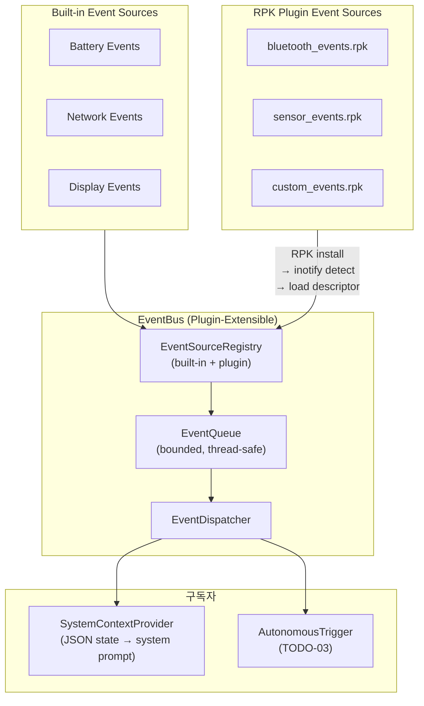

# TODO-01: Event Bus Architecture for System Context (Updated)

> **Date**: 2026-03-14
> **Status**: Plan (Updated with RPK Plugin Architecture)
> **Reference**: [ROADMAP_MULTI_AGENT.md](../docs/ROADMAP_MULTI_AGENT.md) | [DESIGN.md](../docs/DESIGN.md)

---

## 1. 문제 정의

현재 TizenClaw는 **사용자 입력(prompt)**이 들어올 때만 반응하는 **리액티브(reactive)** 구조입니다.
Tizen 플랫폼에서는 앱 lifecycle (launch/resume/pause/terminate), 시스템 이벤트(네트워크 변경, 배터리 상태, 디스플레이 상태 등)를 감지할 수 있지만,
이런 시스템 컨텍스트를 **LLM에게 전달할 통로가 없습니다**.

### 추가 요구사항 (User Feedback)
> EventBus는 **RPK 등으로 플러그인을 설치**하여 확장할 수 있는 구조여야 합니다.
> 제3자가 Tizen system event 수집 플러그인을 개발하고, runtime에 설치하면
> **일관된 포맷**으로 이벤트가 EventBus에 발행되어 LLM에 주입되어야 합니다.

---

## 2. 설계

### 2.1 Plugin-Extensible Event Bus



### 2.2 Event Source Plugin Interface

RPK로 설치되는 이벤트 소스 플러그인은 **Markdown descriptor + shared library** 형태:

```
/opt/usr/share/tizenclaw/tools/events/
├── battery/                   ← built-in (RPM으로 설치)
│   └── event_source.md        ← descriptor
├── network/                   ← built-in
│   └── event_source.md
└── org.example.bt_monitor/    ← RPK plugin
    ├── event_source.md        ← descriptor (기존 tool.md와 동일한 컨벤션)
    └── libbt_monitor.so       ← shared library (optional, for native plugins)
```

#### Plugin Descriptor (`event_source.md`)

```yaml
---
name: bluetooth_monitor
type: event_source
version: 1.0
events:
  - name: bluetooth.connected
    description: A Bluetooth device has connected
    data_schema:
      device_name: string
      device_type: string
  - name: bluetooth.disconnected
    description: A Bluetooth device has disconnected
    data_schema:
      device_name: string
      reason: string
collect_method: native   # "native" (C callback) | "poll" (periodic) | "script" (Python)
poll_interval_sec: 0     # only for poll method
---

# Bluetooth Monitor Event Source

Monitors Bluetooth device connections and disconnections via
`bt_adapter_set_device_discovery_state_changed_cb()`.
```

#### 일관된 이벤트 포맷 (Unified Event Format)

모든 이벤트 소스(built-in이든 plugin이든)는 동일한 `SystemEvent` 구조로 발행:

```cpp
struct SystemEvent {
  EventType type;           // enum: battery, network, display, custom
  std::string source;       // event source name (e.g. "bluetooth_monitor")
  std::string name;         // event name (e.g. "bluetooth.connected")
  nlohmann::json data;      // event-specific payload (schema-validated)
  int64_t timestamp;        // epoch ms
  std::string plugin_id;    // RPK ID or "builtin"
};
```

### 2.3 EventBus Core API

```cpp
class EventBus {
 public:
  static EventBus& GetInstance();

  // Publish (thread-safe, non-blocking)
  void Publish(SystemEvent event);

  // Subscribe to specific event type or all
  int Subscribe(EventType type, EventCallback callback);
  int SubscribeAll(EventCallback callback);
  void Unsubscribe(int id);

  // Plugin management
  void RegisterEventSource(const std::string& source_dir);
  void UnregisterEventSource(const std::string& source_id);
  std::vector<nlohmann::json> ListEventSources() const;

 private:
  // inotify watcher for plugin events directory
  void WatchPluginDirectory(const std::string& dir);
};
```

### 2.4 System Context → LLM 전달

`BuildSystemPrompt()`에 `{{SYSTEM_CONTEXT}}` 플레이스홀더 추가:

```json
{
  "device": {"model": "TM2", "display": "on", "wifi": "connected"},
  "runtime": {"network": "wifi", "battery": {"level": 85, "charging": true}, "memory_usage": "62%"},
  "recent_events": [
    {"time": "14:30:01", "source": "network", "event": "network.connected", "detail": "WiFi AP: home-5G"},
    {"time": "14:28:45", "source": "battery", "event": "battery.charging_started"}
  ],
  "active_plugins": ["bluetooth_monitor", "sensor_events"]
}
```

> **Selective Context Injection**: Raw 데이터가 아닌 해석된 요약만 주입

---

## 3. 수정 대상 파일

| 파일 | 변경 내용 |
|------|-----------|
| `src/tizenclaw/core/event_bus.hh` | **[NEW]** EventBus + EventSourceRegistry |
| `src/tizenclaw/core/event_bus.cc` | **[NEW]** 구현 (pub/sub + plugin loading) |
| `src/tizenclaw/core/system_context_provider.hh` | **[NEW]** 상태 관리 |
| `src/tizenclaw/core/system_context_provider.cc` | **[NEW]** 구현 |
| `src/tizenclaw/core/system_event_collector.hh` | **[NEW]** Tizen C-API built-in 이벤트 수집 |
| `src/tizenclaw/core/system_event_collector.cc` | **[NEW]** 구현 |
| `src/tizenclaw/core/agent_core.hh` | SystemContextProvider 멤버 추가 |
| `src/tizenclaw/core/agent_core.cc` | `{{SYSTEM_CONTEXT}}` 주입 |
| `src/tizenclaw/core/tizenclaw.cc` | EventBus/Collector 초기화 |
| `test/unit_tests/event_bus_test.cc` | **[NEW]** 유닛 테스트 |

---

## 4. 검증 계획

### Unit Test
- EventBus: pub/sub, bounded queue, plugin registration
- SystemContextProvider: 이벤트 → 상태 업데이트, `GetContextString()` 포맷

### Functional Test (Emulator)
- `deploy.sh` → `dlogutil TIZENCLAW` → EventBus 초기화 로그
- `tizenclaw-cli "현재 시스템 상태를 알려줘"` → 시스템 컨텍스트 참조 응답
