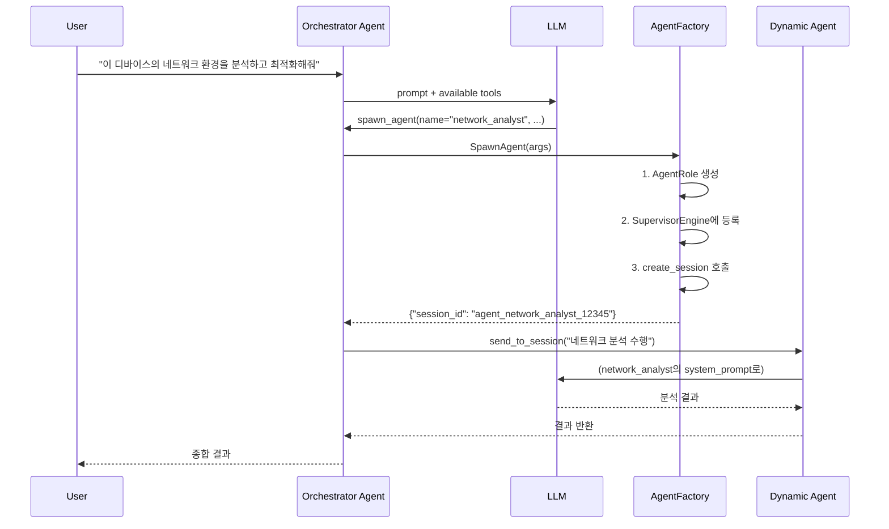

# TODO-02: LLM Self-Creating Agents

> **Date**: 2026-03-14
> **Status**: Plan
> **Reference**: [agent_role.cc](../src/tizenclaw/core/agent_role.cc) | [agent_roles.json](../data/config/agent_roles.json)

---

## 1. 문제 정의

현재 TizenClaw의 Agent는 **정적으로 정의**됩니다:
- `agent_roles.json`에 사전 정의된 역할(orchestrator, skill_manager, device_monitor)만 사용 가능
- `SupervisorEngine::DecomposeGoal()`이 기존 role 목록에서만 선택
- 새로운 종류의 agent가 필요한 상황에서 runtime에 생성할 수 없음

### 구조적 가능 여부 분석: ✅ **가능**

현재 코드가 이미 동적 agent 생성의 기반을 갖추고 있음:

| 기존 기능 | 코드 위치 | 설명 |
|-----------|-----------|------|
| `create_session` | `agent_core.cc:ExecuteSessionOp()` | 독립 세션 + 커스텀 system_prompt 동적 생성 |
| `send_to_session` | `agent_core.cc:ExecuteSessionOp()` | 세션 간 메시지 전달 |
| `AgentRole` 구조체 | `agent_role.hh` | name, system_prompt, allowed_tools 정의 |
| `SupervisorEngine` | `agent_role.cc` | LLM 기반 goal decomposition → delegation |

**결론**: `create_session`으로 이미 동적 agent 세션을 만들 수 있으나, LLM이 **스스로 (자발적으로)** 새로운 역할을 정의하고 등록하는 메커니즘은 없음.

---

## 2. 설계

### 2.1 `spawn_agent` 도구 추가

LLM이 스스로 판단하여 새로운 전문 agent를 생성할 수 있는 도구를 추가합니다.

```cpp
// New built-in tool: spawn_agent
LlmToolDecl spawn_agent_tool;
spawn_agent_tool.name = "spawn_agent";
spawn_agent_tool.description =
    "Create a new specialized agent with a custom "
    "role definition. The agent is dynamically registered "
    "and can be delegated tasks. Use this when existing "
    "agents are insufficient for a new task domain.";
spawn_agent_tool.parameters = {
    {"type", "object"},
    {"properties", {
        {"name", {
            {"type", "string"},
            {"description", "Unique name for the agent role"}}},
        {"system_prompt", {
            {"type", "string"},
            {"description", "Detailed system prompt defining the agent's expertise and behavior"}}},
        {"allowed_tools", {
            {"type", "array"},
            {"items", {{"type", "string"}}},
            {"description", "List of tool names this agent can use (empty = all tools)"}}},
        {"max_iterations", {
            {"type", "integer"},
            {"description", "Maximum LLM iterations for this agent (default: 10)"}}},
        {"persistent", {
            {"type", "boolean"},
            {"description", "If true, save this agent role to agent_roles.json for future use"}}}}},
    {"required", {"name", "system_prompt"}}};
```

### 2.2 `AgentFactory` 클래스

```cpp
// src/tizenclaw/core/agent_factory.hh
class AgentFactory {
 public:
  explicit AgentFactory(AgentCore* agent, SupervisorEngine* supervisor);

  // LLM이 호출하는 진입점
  std::string SpawnAgent(const nlohmann::json& args);

  // 동적으로 생성된 agent 목록
  nlohmann::json ListDynamicAgents() const;

  // 동적 agent 삭제
  std::string RemoveAgent(const std::string& name);

 private:
  // agent_roles.json에 영구 저장
  bool PersistRole(const AgentRole& role);

  AgentCore* agent_;
  SupervisorEngine* supervisor_;

  // 동적으로 생성된 role 트래킹
  std::map<std::string, AgentRole> dynamic_roles_;
  mutable std::mutex roles_mutex_;
};
```

### 2.3 동작 흐름



### 2.4 안전 제한

| 제한 | 값 | 이유 |
|------|-----|------|
| 최대 동적 Agent | 5개 | 임베디드 메모리 제한 |
| system_prompt 최대 길이 | 4KB | LLM context 절약 |
| 이름 규칙 | `^[a-z_]{3,30}$` | 파일명/세션ID 안전성 |
| persistent 기본값 | `false` | 디스크 공간 보호 |

---

## 3. 수정 대상 파일

| 파일 | 변경 내용 |
|------|-----------|
| `src/tizenclaw/core/agent_factory.hh` | **[NEW]** AgentFactory 클래스 |
| `src/tizenclaw/core/agent_factory.cc` | **[NEW]** AgentFactory 구현 |
| `src/tizenclaw/core/agent_core.hh` | AgentFactory 멤버 + `spawn_agent` 도구 등록 |
| `src/tizenclaw/core/agent_core.cc` | `spawn_agent` 도구 선언 + `InitializeToolDispatcher()` 업데이트 |
| `src/tizenclaw/core/agent_role.hh` | `SupervisorEngine`에 `RegisterRole()` / `UnregisterRole()` 추가 |
| `src/tizenclaw/core/agent_role.cc` | 동적 role 추가/삭제 구현 |
| `src/tizenclaw/CMakeLists.txt` | 새 소스 파일 추가 |
| `test/unit_tests/agent_factory_test.cc` | **[NEW]** AgentFactory 유닛 테스트 |
| `test/unit_tests/CMakeLists.txt` | 새 테스트 파일 추가 |

---

## 4. 검증 계획

### 4.1 Unit Test
- `AgentFactory::SpawnAgent()` — 정상 생성, 이름 중복, 최대 수 초과
- `AgentFactory::PersistRole()` — JSON 파일 write/read 검증
- `SupervisorEngine::RegisterRole()` / `UnregisterRole()` — 동적 등록/삭제
- 명령: `gbs build` (내부 `%check`에서 ctest)

### 4.2 Functional Test (Emulator)
- `sdb shell tizenclaw-cli "새로운 agent를 만들어서 시스템 보안을 분석해줘"`
  → LLM이 `spawn_agent` 도구를 사용하여 보안 분석 agent를 생성하고, 분석 결과 반환 확인
- `sdb shell dlogutil TIZENCLAW` 로그에서 `SpawnAgent` 로그 확인
