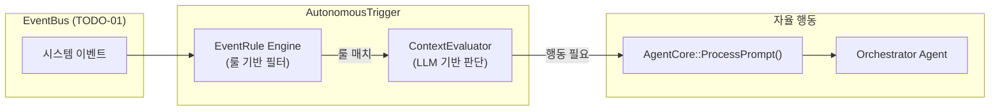
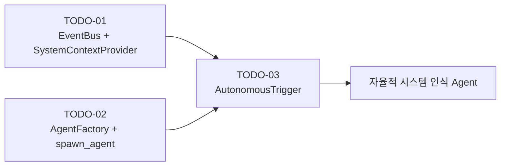

# TODO-03: Autonomous System Context Awareness

> **Date**: 2026-03-14
> **Status**: Plan
> **Reference**: [ROADMAP_MULTI_AGENT.md](../docs/ROADMAP_MULTI_AGENT.md) | [TODO-01](TODO-01-event-bus-system-context.md) | [TODO-02](TODO-02-llm-self-creating-agents.md)

---

## 1. 문제 정의

TODO-01은 시스템 이벤트를 수집하여 LLM에 전달하는 **통로**를 만들고,
TODO-02는 LLM이 스스로 Agent를 생성하는 **능력**을 부여합니다.

하지만 두 기능만으로는 **"사용자 명령 없이 자율적으로 동작"**하는 것은 불가능합니다.
누군가가 이벤트를 보고 "이 이벤트에 대응해야 한다"고 판단하고 행동을 시작해야 합니다.

### 현재 상태 (ROADMAP_MULTI_AGENT.md에서 언급된 구상)
- `Environment Perception Agent`: EventBus 구독 → Common State Schema 유지 (개념만 존재)
- `Planning Agent (Orchestrator)`: 목표를 단계별로 분해 → 위임 (TODO-02에서 확장)
- **빠진 링크**: 이벤트 → "자율적 판단" → Agent 동작 시작

---

## 2. 설계

### 2.1 Autonomous Trigger System



### 2.2 Two-Phase 판단 모델

임베디드 환경에서 모든 이벤트를 LLM에 보내면 비용/지연이 과도하므로, **2단계 필터링**을 사용합니다.

#### Phase 1: Rule-based Filter (가볍고 빠름)
```json
{
  "trigger_rules": [
    {
      "name": "low_battery_alert",
      "event_type": "battery.level_changed",
      "condition": {"level": {"$lt": 15}},
      "cooldown_minutes": 30,
      "action": "evaluate"
    },
    {
      "name": "network_lost",
      "event_type": "network.disconnected",
      "condition": {},
      "cooldown_minutes": 5,
      "action": "evaluate"
    },
    {
      "name": "memory_critical",
      "event_type": "memory.warning",
      "condition": {"level": {"$eq": "critical"}},
      "cooldown_minutes": 10,
      "action": "evaluate"
    }
  ]
}
```

- **Cooldown**: 동일 이벤트의 반복 처리를 방지 (LLM 호출 비용 절감)
- **Condition**: 간단한 JSON 비교 (`$lt`, `$gt`, `$eq`)로 이벤트 데이터 필터링
- `"action": "evaluate"` → Phase 2로 전달
- `"action": "direct"` → Phase 2 건너뛰고 직접 프롬프트 실행 (단순 알림용)

#### Phase 2: LLM-based Context Evaluation (비용이 들지만 지능적)
```
EventRule이 매치된 경우에만 실행:

System Prompt (짧은 평가 전용):
"당신은 Tizen 디바이스의 환경 변화를 평가하는 판단 에이전트입니다.
다음 이벤트가 발생했습니다. 사용자에게 알리거나 자동 조치가 필요한지 판단하세요.

이벤트: {event_json}
현재 시스템 상태: {system_context}
사용자 이력(최근): {recent_memory}

응답 형식(JSON만):
{"action": "notify"|"execute"|"ignore", "reason": "...", "prompt": "..."}
```

- `notify`: 사용자에게 알림 (Telegram/Web Dashboard)
- `execute`: 자율적으로 실행 (Orchestrator에게 prompt 전달)
- `ignore`: 무시 (비용 절감)

### 2.3 핵심 클래스

#### `AutonomousTrigger` (`src/tizenclaw/core/autonomous_trigger.hh/cc`)

```cpp
struct EventRule {
  std::string name;
  std::string event_type;           // e.g. "battery.level_changed"
  nlohmann::json condition;         // {"level": {"$lt": 15}}
  int cooldown_minutes = 10;
  std::string action;               // "evaluate" | "direct"
  std::string direct_prompt;        // (for action="direct")
};

class AutonomousTrigger {
 public:
  AutonomousTrigger(AgentCore* agent,
                    SystemContextProvider* context);
  ~AutonomousTrigger();

  // Load trigger rules from JSON config
  bool LoadRules(const std::string& config_path);

  // Start/Stop subscribing to EventBus
  void Start();
  void Stop();

 private:
  // EventBus callback
  void OnEvent(const SystemEvent& event);

  // Phase 1: Rule matching
  bool MatchRule(const EventRule& rule, const SystemEvent& event) const;

  // Phase 2: LLM evaluation
  void EvaluateWithLlm(const EventRule& rule, const SystemEvent& event);

  // Execute autonomous action
  void ExecuteAction(const std::string& action,
                     const std::string& prompt,
                     const std::string& reason);

  // Cooldown tracking
  std::map<std::string, int64_t> last_trigger_times_;
  std::mutex cooldown_mutex_;

  AgentCore* agent_;
  SystemContextProvider* context_;
  std::vector<EventRule> rules_;
  int subscription_id_ = -1;
};
```

### 2.4 자율 행동의 출력 채널

자율 동작의 결과는 사용자에게 어떻게 전달될까요?

| 채널 | 조건 | 방법 |
|------|------|------|
| **Telegram** | Telegram 구성 시 | 기존 `TelegramClient::SendMessage()` |
| **Web Dashboard** | 항상 사용 가능 | WebSocket notification push |
| **Memory** | 항상 | `remember` 도구로 이벤트 저장 |
| **Audit Log** | 항상 | `AuditLogger` 기록 |

### 2.5 설정 파일

새 설정 파일: `data/config/autonomous_trigger.json`

```json
{
  "enabled": true,
  "evaluation_session": "autonomous",
  "max_evaluations_per_hour": 10,
  "notification_channel": "telegram",
  "trigger_rules": [
    {
      "name": "low_battery_alert",
      "event_type": "battery.level_changed",
      "condition": {"level": {"$lt": 15}},
      "cooldown_minutes": 30,
      "action": "evaluate"
    },
    {
      "name": "network_lost",
      "event_type": "network.disconnected",
      "condition": {},
      "cooldown_minutes": 5,
      "action": "direct",
      "direct_prompt": "네트워크 연결이 끊어졌습니다. 원인을 분석하고 사용자에게 보고해주세요."
    }
  ]
}
```

---

## 3. 수정 대상 파일

| 파일 | 변경 내용 |
|------|-----------|
| `src/tizenclaw/core/autonomous_trigger.hh` | **[NEW]** AutonomousTrigger 클래스 |
| `src/tizenclaw/core/autonomous_trigger.cc` | **[NEW]** AutonomousTrigger 구현 |
| `data/config/autonomous_trigger.json` | **[NEW]** 트리거 규칙 설정 |
| `src/tizenclaw/core/tizenclaw.cc` | AutonomousTrigger 초기화 |
| `src/tizenclaw/core/tizenclaw.hh` | AutonomousTrigger 멤버 추가 |
| `src/tizenclaw/CMakeLists.txt` | 새 소스 파일 추가 |
| `test/unit_tests/autonomous_trigger_test.cc` | **[NEW]** AutonomousTrigger 유닛 테스트 |
| `test/unit_tests/CMakeLists.txt` | 새 테스트 파일 추가 |
| `docs/ROADMAP_MULTI_AGENT.md` | AutonomousTrigger 설계 반영 업데이트 |

---

## 4. 의존성



- **TODO-01 필수**: EventBus가 있어야 이벤트를 구독할 수 있음
- **TODO-02 참조**: Orchestrator가 필요시 동적 Agent를 생성하여 복잡한 대응 가능

---

## 5. 검증 계획

### 5.1 Unit Test
- **AutonomousTrigger**: Rule matching, cooldown 동작, condition 평가
- **Integration**: EventBus.Publish() → AutonomousTrigger.OnEvent() → 평가 결과
- 명령: `gbs build` (내부 `%check`에서 ctest)

### 5.2 Functional Test (Emulator)
- `deploy.sh`로 빌드 및 배포
- `sdb shell dlogutil TIZENCLAW`에서 Autonomous trigger 관련 로그 확인
- 배터리 이벤트 시뮬레이션: 배터리 레벨을 변경하여 자율 알림 동작 확인
- `sdb shell tizenclaw-cli "자율 트리거 규칙 목록을 보여줘"` → 규칙 확인
