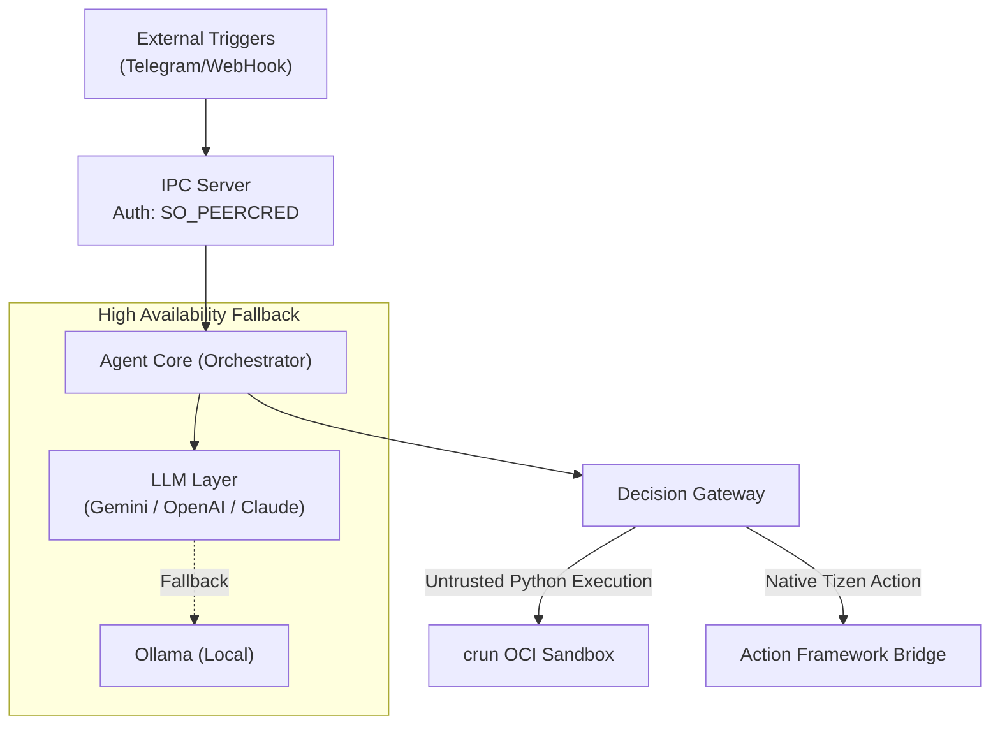

# TizenClaw Architecture & Engineering Analysis (gstack Review)

> **Generated**: 2026-03-24
> **Methodology**: gstack (`/plan-eng-review` principles applied)
> **Focus**: Multi-Agent MVP, Extensibility, Performance, and Test Completeness.

This document represents the engineering review of TizenClaw applying the 6 key principles of the gstack cognitive framework. The scope encompasses the entire daemon core, execution sandboxing, the LLM backend layer, and testing strategy.

---

## 1. State Diagnosis & Essential Complexity

**Current State**: Innovating & Repaying Debt (Moving to a Multi-Agent MVP).
- TizenClaw is transitioning from a monolithic Agentic Loop (AgentCore) to a decentralized 11-agent MVP set (Perception, Planning, Execution, Maintenance).
- **Essential Complexity**: High. The system natively handles local Tizen C-APIs, LLM integrations (5 providers), streaming, native OCI sandboxing (`crun`), and Unix Socket IPC. 
- **Accidental Complexity Check**: Favorable. The project consciously avoids bloated JVMs or heavy Node.js runtimes. It uses a `~812KB` stripped C++ binary and leverages standard Unix primitives (`libcurl`, `libsoup`), which are perfectly aligned with memory-constrained edge hardware.

## 2. "Boring by Default" & Innovation Tokens

> *"Every company gets about three innovation tokens. Everything else should be proven technology."*

TizenClaw allocates its innovation tokens efficiently around its core differentiators:
1. **On-device Hybrid RAG**: SQLite vector + FTS5 with local ONNX embedding. (Innovation token wisely spent)
2. **LLM-driven Action Framework Integration**: Dynamic MD schema caching and tool bridging via native C-APIs. (Innovation token wisely spent)

For all other infrastructure, it relies on **"Boring" (Proven) Technology**:
- **Containerization**: Standard OCI runtimes (`crun`) with `seccomp` over custom-built sandboxing alternatives.
- **IPC Protocol**: JSON-RPC 2.0 over standard abstract Unix Domain Sockets rather than inventing a custom binary format.
- **HTTP / Web**: `libcurl` and `libsoup` — standard battle-tested C libraries on Linux.
- **Verdict**: Excellent architectural discipline.

## 3. Blast Radius & System Boundaries

> *"Every decision evaluated through: what's the worst case?"*

TizenClaw's architecture exhibits an exceptionally strong blast radius instinct:
- **Skill Execution Sandbox**: Third-party Python skills run inside an OCI container equipped with a minimal Alpine rootfs (49MB). If a continuous-streaming skill misbehaves or contains malicious code, it cannot break out into the host OS or access unencrypted Tizen APIs directly.
- **UID Authentication**: IPC heavily restricts caller access using `SO_PEERCRED` to ensure only specific users (root, app_fw, system, developer) can invoke the daemon.
- **Tool Execution Policy**: Robust LLM loop detection (`tool_policy.json`), configurable risk-level overrides, and idle checks prevent agents from infinitely burning GPU cycles or API quotas.

## 4. Reversibility & Error Budgets

> *"Make the cost of being wrong low."*

- **OTA Updates with Rollback**: TizenClaw supports over-the-air updates for its skill system. Structurally, it has an automatic rollback mechanism. If an updated skill repeatedly crashes or fails validation, the system gracefully reverts to the prior local state.
- **Multi-LLM Fallback**: The `active_backend` combined with the `fallback_backends` priority list guarantees that if Gemini goes down, Anthropic, OpenAI, or Ollama seamlessly step in. LLM API reliability is treated as an error budget variable, absorbing downstream vendor failures without producing user-facing downtime.

## 5. Completeness Principle (Boil the Lake) & Testing Strategy

> *"Always do the complete thing when AI makes the marginal cost near-zero."*

- **Current Status**: 42 gtest files and ~7,800 LOC of unit testing.
- **Test Coverage Gap**: As the system transitions to the multi-agent orchestration pattern (Phase 17-20), E2E User Flows (e.g., Event Perception `sensor.changed` -> Supervisor -> LLM -> Sandboxed Action) require deterministic integration testing.
- **Action Plan (→E2E & →EVAL)**: The testing approach must "boil the lake." Introduce deterministic **LLM Evals** for the newly structured 11-agent MVP prompts. Prompt changes currently rely on developer intuition. An evaluation suite should be established to continuously test prompt robustness and tool-selection accuracy against a strict set of edge-case natural language inputs.

## 6. Architecture & Data Flow Visualized

## 7. Action Items & Next Steps (TODOs)

To elevate TizenClaw further, tracking these items in the backlog is recommended:

1. **[EVAL] Establish LLM Evaluations**:
   - Create a dedicated suite for Regression/Evaluation tests focused on checking prompt stability over version upgrades. Automate these via CLI CI scripts.
2. **[PERF] Audit SQLite Locking**:
   - As automated tasks (cron) and user requests scale, concurrent access to the `embedding_store.cc` might lead to `SQLITE_BUSY` locking overhead. Consider a WAL (Write-Ahead Logging) configuration if not already enabled.
3. **[PERF] Asynchronous Context Compaction**:
   - Accumulating long-term episodic memory inside the SQLite Markdown limits token-counts but introduces a heavy parsing burden. Ensure compaction runs completely out of band of the primary LLM inference thread to prevent blocking or perceived UX latency.

**Final Assesment**: The foundation of TizenClaw is structurally superior for edge execution. Prioritize closing out the Multi-Agent MVP using the above stability recommendations.
